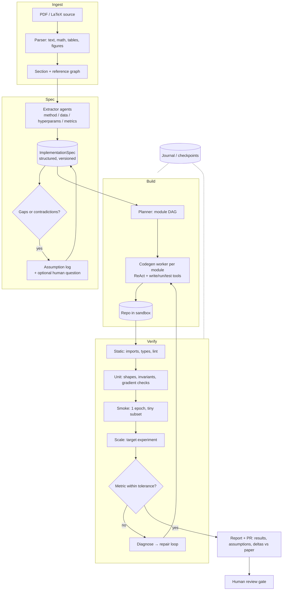

# AI Agent Patterns — Interview Preparation

Core patterns behind AI agents: how they reason, plan, and act across complex
tasks, and what it takes to make one reliable beyond a single LLM call.

Written as interview questions with answers you could actually say out loud.
Code is Python and only appears where it earns its place; the six runnable
prototypes live in [`agent-patterns/`](./agent-patterns/) and FastAPI shows up
exactly once, in the human-in-the-loop service, because that is the only place a
web API is genuinely part of the pattern.

**Contents**

1. [Foundations](#1-foundations) — what an agent is, and when not to build one
2. [Observe–Think–Act](#2-observethinkact-the-base-loop)
3. [ReAct](#3-react-reason--act)
4. [Plan and Execute](#4-plan-and-execute)
5. [The Ralph loop](#5-the-ralph-loop)
6. [Checkpoint and Resume](#6-checkpoint-and-resume)
7. [Human in the Loop](#7-human-in-the-loop)
8. [Choosing a loop](#8-choosing-a-loop)
9. [Cross-cutting concerns interviewers probe](#9-cross-cutting-concerns-interviewers-probe)
10. [Prototypes and Demonstrations: 6](#10-prototypes-and-demonstrations-6)
11. [System design: paper-to-code agent](#11-system-design-a-paper-to-code-agent)
12. [Rapid-fire question bank](#12-rapid-fire-question-bank)
13. [Glossary](#13-glossary)

---

## 1. Foundations

### Q. What is an AI agent, precisely?

**A.** A model in a loop with tools and a termination condition. Three properties
have to hold before I would call something an agent rather than a pipeline:

1. **The model chooses the next action** rather than a hard-coded flow choosing it.
2. **Actions have effects on the outside world**, and the results of those effects
   come back into the model's context as new information.
3. **The loop runs until a goal is reached**, not for a fixed number of steps.

Everything else — planning, memory, multi-agent, reflection — is a specialisation
of that. The single most useful sentence I know about agent design is: *the model
decides, the harness enforces.* Anything you cannot afford the model to get wrong
belongs in the harness.

### Q. Workflow or agent? How do you decide?

**A.** I start from the *control flow*, not the technology.

| | Workflow | Agent |
|---|---|---|
| Control flow | Known at design time | Discovered at run time |
| Steps | Fixed DAG | Model-chosen, variable length |
| Cost | Predictable | Bounded only by your budget guard |
| Debugging | Read the code | Read the transcript |
| Right when | The task decomposes the same way every time | Inputs are open-ended and the path varies per input |

If I can draw the flowchart and it doesn't change per input, I build the
flowchart and call the model at the nodes. That is cheaper, faster, testable, and
it fails in ways I can enumerate. I reach for an agent when four things are true
at once: the task is genuinely multi-step, the path varies by input, the value
justifies the cost and latency, and **errors are catchable** — there's a test, a
reviewer, or a rollback. Fail the last one and I go back to a workflow with a
human doing the risky part.

The failure mode I'd call out in an interview: teams build agents for tasks with
one obvious path, then spend months making the model reliably rediscover that
path. Just write the path down.

### Q. What are the components of an agent harness?

**A.** Six, and I'd expect a design discussion to touch all of them:

- **Model** — the decision-maker. Often more than one: a cheap one for extraction
  and classification, an expensive one for the hard reasoning.
- **Tools** — the action surface. Their design *is* the agent's design (see §9).
- **Context** — what the model sees this turn. Managed, not accumulated.
- **Loop** — the driver: call model → execute tools → append results → repeat.
- **Termination** — a goal predicate *and* budget guards (steps, tokens, wall
  clock, money). "Until done" is not a stop condition.
- **State** — what survives the process: transcript, plan, checkpoints, artifacts.

### Q. What does one turn actually look like on the wire?

**A.** Every pattern here reduces to this, so it's worth being able to write it
from memory. The manual loop, with the Anthropic Messages API:

```python
import anthropic

client = anthropic.Anthropic()
messages = [{"role": "user", "content": "Refund order ord-1191 if it was delivered damaged"}]

while True:
    resp = client.messages.create(
        model="claude-sonnet-5",
        max_tokens=4096,
        system=SYSTEM,
        tools=TOOL_SCHEMAS,
        messages=messages,
    )
    messages.append({"role": "assistant", "content": resp.content})  # verbatim

    if resp.stop_reason != "tool_use":
        break

    results = []
    for block in resp.content:
        if block.type != "tool_use":
            continue
        try:
            output = TOOLS[block.name](**block.input)
            results.append({"type": "tool_result", "tool_use_id": block.id, "content": output})
        except Exception as exc:
            results.append({"type": "tool_result", "tool_use_id": block.id,
                            "content": f"{type(exc).__name__}: {exc}", "is_error": True})

    messages.append({"role": "user", "content": results})   # ALL results, ONE message
```

Four things in there are load-bearing, and each is a question an interviewer can
follow up on:

- **`stop_reason == "tool_use"` is the loop condition.** Not a step counter.
- **The assistant message is appended verbatim.** Drop or edit a `tool_use` block
  and the next request is invalid.
- **Every `tool_use` id gets exactly one `tool_result`.** All of a turn's results
  go back in a *single* user message; splitting them across messages trains the
  model out of emitting parallel calls.
- **Tool failures come back as results with `is_error`, not exceptions.** An
  exception ends the run; an error observation lets the agent recover. This is
  the single highest-leverage line in most agent code.

In production I'd usually let the SDK's tool runner drive that loop
(`client.beta.messages.tool_runner`) and keep the per-turn hooks for approval
gates and logging — but I want to be able to write the loop by hand, because
every interesting bug lives in it.

### Q. How do you manage the context window over a long run?

**A.** Four levers, in the order I reach for them:

1. **Don't put it in.** Tool results are the main source of bloat. Return the 20
   rows the agent needs, not the 10,000-row table. A tool that returns a summary
   plus a handle to fetch detail beats one that returns everything.
2. **Prune.** Old tool results are usually dead weight — clear them and keep the
   assistant's conclusions. (`context_management` / `clear_tool_uses` does this
   server-side.)
3. **Compact.** Summarise the earlier conversation into a compaction block when
   you approach the limit, keeping the tail verbatim.
4. **Externalise.** Write findings to files or a scratchpad and re-read on
   demand. This is the Ralph loop's whole thesis (§5), and it's also what makes
   checkpointing cheap (§6).

Two things I'd add unprompted, because they're where the money goes: keep the
prompt *prefix* byte-stable so prompt caching actually hits — caching is a prefix
match, so a timestamp in the system prompt invalidates everything after it — and
never mutate the tool list mid-conversation for the same reason.

---

## 2. Observe–Think–Act: the base loop

> Prototype: [`p1_observe_think_act.py`](./agent-patterns/p1_observe_think_act.py)

### Q. Describe the Observe–Think–Act loop.

**A.** The general form every other pattern specialises:

```
        ┌──────────────────────────────────────┐
        │                                      │
   ┌────▼────┐      ┌───────┐      ┌───────┐   │
   │ OBSERVE │─────▶│ THINK │─────▶│  ACT  │───┘
   └─────────┘      └───────┘      └───────┘
   read the world   decide one     change the world
   fresh, now       next action    (or decide to wait)
```

Its lineage is Boyd's OODA loop and the sense–plan–act cycle from robotics, and
the robotics framing is the useful one: **the environment is the source of truth,
the transcript is not.** An agent supervising a system that changes underneath it
(infrastructure, markets, a build, a queue) must re-read state each tick, because
the world moves for reasons that have nothing to do with the agent.

### Q. How is it different from ReAct? They look the same.

**A.** They share a shape but differ in what closes the loop. In ReAct the loop
is closed by the agent's own tool calls — the observation is *the result of what
I just did*. In Observe–Think–Act the observation is *the current state of the
world*, whether or not I caused it. That distinction drives real design choices:

- OTA agents are usually **long-lived and tick-driven** (poll, or wake on event);
  ReAct agents are **request-scoped**.
- OTA agents must handle **effects they did not cause** — someone else rolled
  back, the incident resolved itself, another agent grabbed the work.
- OTA agents need **action de-duplication**: before acting, check whether the
  previous action is still in flight. The prototype's "rollback in flight, keep
  watching" branch is exactly this, and it's the bug interviewers look for. An
  agent that re-issues a rollback every tick because latency hasn't recovered yet
  is the agentic version of a retry storm.

### Q. What are the failure modes?

**A.** Four, all of which I'd design against explicitly:

| Failure | Symptom | Mitigation |
|---|---|---|
| Stale observation | Acting on a metric that has moved | Re-observe immediately before acting; include an observation timestamp and refuse to act on stale data |
| Oscillation | Scale up, scale down, scale up | Hysteresis: different thresholds for acting and un-acting, plus a cooldown |
| Action storms | Same remediation every tick | Track in-flight actions in state, not in the prompt |
| Observation flood | Context filled with metrics | Observe a *digest* — deltas and threshold crossings, not raw series |

### Q. Where does the model actually add value here?

**A.** Honest answer: often it doesn't, and saying so scores points. If the
decision table is small and stable, write the rules — they're faster, cheaper,
and auditable. The model earns its place when the *observation* is unstructured
(logs, tickets, a customer email, a screenshot) or the action space is large and
context-dependent. A good hybrid is rules for the decision and the model for
interpretation and for writing the human-facing explanation.

---

## 3. ReAct (Reason + Act)

> Prototype: [`p2_react.py`](./agent-patterns/p2_react.py)

### Q. What is ReAct and why did it matter?

**A.** ReAct (Yao et al., 2022) interleaves reasoning traces with tool calls in a
single loop: **Thought → Action → Observation → Thought → …** until the model
decides it can answer. The insight was that reasoning-only prompting
(chain-of-thought) hallucinates facts, and acting-only prompting flails without a
plan; interleaving them lets the reasoning steer the next action and each
observation correct the reasoning.

Practically it is *the* default agent loop, and modern tool-use APIs are ReAct
with the scratchpad formalised: the "thought" is the assistant's text (or its
thinking blocks), the "action" is a `tool_use` block, and the "observation" is a
`tool_result`. You rarely hand-write ReAct prompts any more — but you should be
able to explain that the loop you get from the API *is* ReAct.

### Q. Walk me through the control flow.

**A.** Sketch, matching the prototype:

```python
messages = [user(question)]
for _ in range(MAX_STEPS):                    # circuit breaker, not the driver
    reply = model.respond(SYSTEM, messages, TOOL_SCHEMAS)
    messages.append(reply.message)
    if reply.stop_reason != "tool_use":       # the model decided it can answer
        return reply.text
    messages.append({"role": "user", "content": [run(tc) for tc in reply.tool_calls]})
return "stopped: step budget exhausted"
```

The prototype's transcript makes the recovery visible:

```
THOUGHT     I need headcounts for both companies. Start with ACME.
ACTION      search({"query": "ACME headcount"})
OBS (error) LookupError: no profile matched 'ACME headcount'; try the registered name
THOUGHT     That query missed. The corpus is keyed on company names, so search the name itself.
ACTION      search({"query": "ACME Corp"})
OBSERVATION ACME Corp is a manufacturer founded in 1952. Headcount: 48200 employees.
```

That error line is the pattern working. The tool raised, the harness caught it,
turned it into an observation with a *hint about what to do differently*, and the
next thought used it. Tool error messages are prompt engineering — write them for
the model that has to recover from them.

### Q. When does ReAct break down?

**A.** Three places:

- **Long horizons.** Every step is in context, so a 60-step task carries 60 steps
  of history and both cost and confusion grow superlinearly. Mitigation: prune or
  compact, or switch to plan-and-execute with a separate executor context.
- **Loops.** The model repeats a failing action with cosmetic variations. Detect
  it — hash `(tool, args)` and intervene after N repeats — because the model
  frequently cannot detect it from inside the transcript.
- **Greedy local choices.** ReAct never commits to a global plan, so it can
  wander: three searches that each seemed reasonable and collectively answered
  nothing. This is exactly the gap plan-and-execute fills.

### Q. Interviewer: "Your ReAct agent works in the demo and is unreliable in prod. Debug it."

**A.** I'd work down this list, cheapest first:

1. **Read ten failing transcripts.** Not aggregate metrics first — transcripts.
   The failure is usually visible in one of them within a minute.
2. **Tool descriptions.** Under-described tools are the single most common cause
   of bad agent behaviour. Each description should say what the tool does, *when
   to call it*, what it returns, and what it does not return.
3. **Tool results.** Are they too big (context bloat), too terse (model can't
   act), or ambiguous on failure ("error" with no reason)?
4. **The action space.** Two tools with overlapping purposes make the model
   dither. Merge them or make the boundary explicit in both descriptions.
5. **Only then, the prompt.** And when I change it, I change one thing and
   re-run the eval set — otherwise I'm just moving the failure around.

---

## 4. Plan and Execute

> Prototype: [`p3_plan_execute.py`](./agent-patterns/p3_plan_execute.py)

### Q. What is plan-and-execute, and what does it buy over ReAct?

**A.** Split the agent in two. A **planner** turns the goal into an explicit,
ordered set of steps. An **executor** runs those steps mechanically — usually
with a cheaper model, or with no model at all when each step is a tool call. A
**replanner** is invoked only when a step fails or produces something the plan
didn't anticipate.

```
goal ──▶ PLANNER ──▶ plan ──▶ EXECUTOR ──┬──▶ done
           ▲                             │
           └────── REPLANNER ◀───────────┘  (only on failure/surprise)
```

Four concrete benefits I'd name:

1. **Cost and latency.** The prototype runs five steps on two model calls.
   ReAct would spend one call per step plus a growing context on each.
2. **Inspectability.** The plan is a data structure. You can print it, diff it,
   store it, show it to a user for approval, and resume from it. "Here is what I
   am going to do" before doing it is worth a lot in an enterprise setting.
3. **Global coherence.** The planner sees the whole goal at once, so step 4 is
   chosen knowing step 1 exists. ReAct decides step 4 having forgotten why step 1
   happened.
4. **Parallelism.** With dependencies in the plan you can run independent steps
   concurrently. A ReAct loop is inherently serial.

The cost: plans go stale. Every replan is an admission that the world disagreed
with the model, and replanning is where this pattern's bugs live.

### Q. How do you keep the planner from emitting garbage?

**A.** Treat the plan as untrusted input, because it is.

- **Make it structured.** Have the planner emit the plan through a tool call or
  structured output with a JSON schema, not prose you regex. In the prototype
  that boundary is `parse_plan()`, which rejects steps referencing unknown tools.
- **Validate against the real tool registry** — names, required arguments, types,
  and (for anything destructive) the risk policy.
- **Bound it.** Cap the number of steps. A 40-step plan for a 3-step job is a
  signal that the planner misunderstood the goal.
- **Don't let it invent capabilities.** If the plan needs a tool that doesn't
  exist, fail loudly at parse time rather than at step 7.

### Q. How does replanning work without redoing everything?

**A.** Replanning is scoped to the *remaining* work. The prototype keeps every
completed step with its result and replaces only from the failure point:

```python
revision = parse_plan(goal, model.respond(REPLANNER_SYSTEM, [context]).text)
plan = Plan(goal, [s for s in plan.steps if s.status == "done"] + revision.steps)
```

The replanner's context is: the original goal, the plan with results so far, and
the failure. Two guards matter. First, **`attempts_left`** — without a replan
budget, a permanently failing step produces an infinite planner spiral, which is
this pattern's signature production incident. Second, **completed steps keep
their results**, which is what lets plan-and-execute compose cleanly with
checkpointing: the plan *is* the checkpoint.

### Q. When would you not use it?

**A.** When the first step genuinely determines the rest — exploratory research,
debugging, anything where you cannot name step 2 until you've seen step 1's
output. Planning that up front produces a fictional plan that gets replanned
immediately, so you pay for planning and get ReAct anyway. The pragmatic middle
is a **coarse plan with ReAct inside each step**: plan at the level of
"investigate X", "fix Y", "verify Z", and let each step run its own small loop.

---

## 5. The Ralph loop

> Prototype: [`p4_ralph_loop.py`](./agent-patterns/p4_ralph_loop.py)

### Q. What is the Ralph loop?

**A.** Run the *same* prompt in a *fresh* agent context, in a loop, until the
world satisfies the spec. In its original form (named after Ralph Wiggum, from
Geoffrey Huntley's write-ups of the technique) it is literally:

```bash
while :; do
  cat PROMPT.md | your-agent-cli
done
```

It looks like a joke and works surprisingly well, for a reason worth stating
precisely: **the agent is stateless, the workspace is stateful.** Nothing is
remembered between iterations; the repository, the plan file, and the test output
carry everything forward. Convergence comes from the world getting closer to the
spec each pass, not from a growing transcript.

### Q. Why would anyone prefer that to one long agent run?

**A.** Four properties fall out of the fresh context:

1. **No context exhaustion.** Each iteration starts near-empty, so a 200-iteration
   run never hits the window. A single long ReAct run dies at hour three.
2. **Bounded blast radius per iteration.** A confused turn poisons one iteration;
   the next one starts clean. In a long transcript, one bad conclusion is quoted
   back to the model forever.
3. **Cheap prompt caching.** The same prefix every iteration.
4. **It's trivially resumable.** Kill it, restart it, it picks up from the files.

The trade-off is token spend: you re-read context every iteration and rediscover
things you already knew. It's brute force. That's fine for overnight,
non-interactive work where the objective is machine-checkable — port a codebase,
drive a test suite to green, migrate an API surface — and wrong for anything
where a human is waiting.

### Q. What do you have to write down for it to work?

**A.** Three files, and they're the whole design:

- **`PROMPT.md`** — the spec plus the loop instructions. Critically it says *pick
  the single most important unchecked item*, not "do the work". One unit per
  iteration keeps each pass inside the window.
- **`fix_plan.md`** — the checklist. This is the handoff between iterations, the
  filesystem standing in for memory. The agent ticks items and may add new ones.
- **`progress.log`** — append-only narrative, so a human (or the next iteration)
  can see what has been tried.

Plus one non-negotiable: a **machine-checkable exit condition**. The prototype's
is `tests/test_calc.py` exiting zero. Without an objective test, the loop cannot
know it's done and you're paying a model to decide it's finished — which it will
do, optimistically, at the wrong moment.

### Q. What stops it running forever and emptying the budget?

**A.** Four guardrails, all of them in `ralph()` in the prototype:

1. **Objective exit check** — tests pass → write `status.txt` → stop.
2. **Iteration cap** — hard stop after N passes (and I'd add a spend cap in
   dollars, checked from usage metering).
3. **Stall detection** — fingerprint the workspace before and after; two
   consecutive iterations that change nothing means it's stuck, so stop and
   escalate rather than spin.
4. **Small units of work** — enforced by the prompt, so no single iteration is
   both huge and abandoned halfway.

I'd also run it **in a container on a branch**, never against main, precisely
because it is unsupervised and permission-skipping by design.

### Q. Isn't this just an inefficient agent?

**A.** Yes, deliberately. It trades tokens — the resource that's getting cheaper —
for reliability properties that are otherwise hard to get: no context limit, no
error accumulation, trivial resumption. Whether that trade is right is an
economics question, and the answer changes with model price. What I'd resist is
the framing that it's unserious: the underlying idea, *externalise state to the
environment and keep the agent stateless*, is the same idea behind
checkpoint/resume and behind stateless web services.

---

## 6. Checkpoint and Resume

> Prototype: [`p5_checkpoint_resume.py`](./agent-patterns/p5_checkpoint_resume.py)

### Q. Why do agents need checkpointing more than ordinary services?

**A.** Because agent runs are long, expensive, and side-effecting all at once. A
run can span minutes to days; it accumulates real money in tokens; and by step 12
it may have charged a card, opened a PR, and sent an email. Losing that run is
not "retry the request" — it's "redo work that cost €4 and may repeat effects the
outside world has already seen."

They also get interrupted for many more reasons than a typical request: rate
limits, provider errors, deploys, OOM kills, a human going home mid-approval. So
resumption is not an edge case, it is the normal path.

### Q. What exactly do you checkpoint?

**A.** Everything needed to reconstruct the run without calling the model again:

| Checkpoint | Why |
|---|---|
| Run id + goal + config (model, prompt version, tool versions) | Reproducibility; a resumed run must not silently switch prompt versions |
| Message history (or a pointer to it) | The agent's memory |
| Plan and step statuses | Where we were |
| Each tool call: intent, arguments, idempotency key, result | The side-effect ledger |
| External identifiers returned by side effects (charge id, PR number) | So resume can reconcile rather than re-do |
| Cursor / budget counters | So a resumed run doesn't get a fresh budget |

And the granularity: **checkpoint after every tool result**, not after every
token. Tool results are where irreversible things happen.

### Q. How do you avoid repeating a side effect on resume?

**A.** Two mechanisms, and you need both.

**1. Write-ahead journalling.** Record intent (`started`) before the call and
outcome (`finished`) after. On resume, a step with `finished` is skipped; a step
with `started` and no `finished` is *in doubt* — you know exactly which one, and
it's exactly one.

**2. Deterministic idempotency keys.** The key must be derived from the run id
and step, never random, so the retry after a crash presents the *same* key:

```python
idem = f"{run_id}:{step_name}"        # same key across process restarts
```

The prototype's nastiest scenario is the one to volunteer in an interview: killed
*between* the provider call and the journal write. The charge happened; the
journal doesn't know. The retry re-calls with the same key, the provider returns
the original charge, and the ledger shows one charge:

```
SCENARIO B: killed *between* the charge and the journal write
  run     reserve_stock  -> reservation-ord-7781
  !! process killed mid-charge_card, before the result was journalled
  resuming run-9002: 1 step(s) already finished -> ['reserve_stock']
  RETRY   charge_card    (in doubt after crash; key=run-9002:charge_card)
  run     charge_card    -> ch_0002          # same charge, not a second one
```

Journal + idempotency key together give you **effectively-once** behaviour on top
of at-least-once delivery. Neither alone is enough: the journal can't help if the
crash lands in the gap, and the key can't help if the downstream API doesn't
honour it — which is why the prototype's courier API deliberately *doesn't*,
leaving you to compensate.

### Q. What if the tool has no idempotency support?

**A.** In order of preference: (a) make the operation naturally idempotent —
`PUT`-style writes keyed by your own id; (b) add a read-back — before retrying,
query whether the effect exists (`GET /bookings?ref=run-9002`); (c) wrap it in
your own dedupe table keyed by the idempotency key, which just moves the crash
gap to your database, where at least it's transactional with the journal; (d)
accept at-least-once and write a compensating action, saga-style. And (e), always
available: mark the step as in-doubt and route it to a human. For irreversible
external actions, "ask a person" is a legitimate engineering answer.

### Q. Snapshot or event log?

**A.** Event log (append-only), with periodic snapshots if replay gets slow.
Append-only gives you the audit trail for free, which agents need anyway — "why
did it do that?" is answered by replaying the events. Snapshot-only loses the
history and makes partial failures ambiguous. The prototype's `replay()` folds
events into current state; that's ordinary event sourcing, and saying so signals
that this isn't a novel agent problem, it's a distributed-systems problem that
agents happen to hit constantly.

### Q. Would you build this yourself?

**A.** For anything serious, no — I'd put the agent inside a durable execution
engine (Temporal, Restate, AWS Step Functions, or the managed-agent equivalent)
so the journalling, retries, and timers are the platform's problem. The reason to
know the mechanics anyway is that the *agent-specific* part doesn't come free:
deciding what a "step" is, keeping tool results deterministic enough to replay,
and handling the model itself being non-deterministic between attempts.

---

## 7. Human in the Loop

> Prototypes: [`p6_human_in_the_loop.py`](./agent-patterns/p6_human_in_the_loop.py),
> [`p6_api.py`](./agent-patterns/p6_api.py)

### Q. Where does the human belong in an agent loop?

**A.** Four distinct placements, and conflating them is a common mistake:

| Placement | When it fires | Example |
|---|---|---|
| **Human in the loop** | Blocks a specific action before it happens | Approve a refund over €50 |
| **Human on the loop** | Watches, can interrupt, doesn't block | Live trace with a stop button |
| **Human before the loop** | Approves the plan, not each step | "Here's my 6-step plan — go?" |
| **Human after the loop** | Reviews output before it ships | PR review; draft email |

Plan-level approval is underrated: one decision instead of six, and the reviewer
sees intent rather than a stream of context-free tool calls. I'd propose it
whenever the plan is stable enough to be meaningful.

### Q. How do you decide what needs approval?

**A.** Risk tiers evaluated in the harness, keyed on **reversibility, blast
radius, and cost**:

- **auto** — reversible and cheap: reads, drafts, anything scoped to a sandbox.
- **confirm** — irreversible or externally visible: payments, emails to
  customers, production writes, anything above a value threshold.
- **forbid** — never exposed to the agent at all: deleting accounts, changing
  permissions, moving money to new payees.

The design pressure is real: gate too much and you get **approval fatigue**, and
a reviewer who approves 200 things a day approves the 201st without reading it —
which is worse than no gate because it manufactures false assurance. So I'd tier
aggressively, batch approvals where I can, and measure the approve/deny ratio. If
it's 99% approve, the threshold is wrong.

### Q. Why can't the gate live in the prompt?

**A.** Because a prompt is a request, not a boundary. The model can be talked out
of it — by an ambiguous instruction, a long context, or by prompt injection
arriving inside a tool result (a web page, a ticket, a document the agent reads).
None of that reaches a policy function that runs *before* the tool executes:

```python
def risk_of(name, args):
    if name not in TOOLS:                    # not exposed at all
        return "forbid", f"{name} is not an exposed capability"
    if name == "issue_refund" and float(args["amount"]) > AUTO_APPROVE_LIMIT:
        return "confirm", f"refund of EUR {args['amount']:.2f} exceeds the limit"
    return "auto", "read-only or below the approval threshold"
```

Same principle as the foundations answer: the model decides, the harness
enforces. I'd say plainly in an interview that **the model is not a security
boundary**, and that any control which must hold under adversarial input has to
be code the model cannot reach.

### Q. What happens to the run while it waits?

**A.** It suspends as *durable state*, not as a blocked thread. The run's status
becomes `awaiting_approval` and the pending call is persisted with the tool, its
arguments, the reason, and a fingerprint of what the reviewer was shown. A human
may take three days; nothing should be holding a socket open. That's the same
machinery as §6 — an approval gate is a checkpoint with a person as the resume
trigger — which is why the HTTP layer is a thin shell over the engine:

```python
@app.post("/runs/{run_id}/decision")
def post_decision(run_id: str, body: DecisionBody):
    if run_id not in STORE:
        raise HTTPException(404, "no such run")
    try:
        run = decide(STORE[run_id], body.approved, body.reviewer, body.note, model())
    except ValueError as exc:
        raise HTTPException(409, str(exc)) from exc     # already decided / args changed
    return run.public()
```

Three details worth calling out in that handler. The **409** covers the
double-click and the two-reviewers-at-once race without extra locking. The
**engine has no idea HTTP exists**, so the same `decide()` can be driven from
Slack, an admin UI, or a cron job that auto-denies after 24 hours. And the
**decision is bound to a fingerprint** of the exact arguments shown — otherwise
an agent could get approval for €60 and execute €600.

### Q. What do you do with a denial?

**A.** Feed it back as a tool result with `is_error=True` **and the reviewer's
reason**, then let the agent continue. In the prototype the denial produces a
different, still-useful outcome rather than a crash:

```
DENY   b.jansen: no photo on file; escalate
answer: I can't authorise a full refund here. I've logged the damage report and
        a supervisor will call you within one business day about the EUR 189.00.
```

Two reasons that matters. The agent can adapt — offer the fallback, ask for the
missing evidence — instead of dead-ending on the customer. And the reason lands
in the transcript, so denials become training data for where the thresholds are
wrong and, eventually, for what the agent should stop proposing.

### Q. What does the reviewer need to see?

**A.** Enough to decide in under a minute without opening the transcript: the
action and its exact arguments, the *reason* the agent gives, the evidence it
used (the order lookup, the policy clause), what happens on approve and on deny,
and who else has already touched it. Approvals that require reading 40 turns of
context get rubber-stamped. I'd also always offer a third option beyond
approve/deny — "deny with instructions" — because most of the time the reviewer
doesn't want to stop the agent, they want to redirect it.

---

## 8. Choosing a loop

### Q. Given a task, how do you pick?

**A.** I ask four questions in order.

1. **Can I draw the flowchart?** → Don't build an agent. Build the flowchart.
2. **Is the path knowable up front?** Yes → plan-and-execute. No → ReAct.
3. **Is there a machine-checkable definition of done, and is a human waiting?**
   Checkable, nobody waiting → Ralph loop. Otherwise not.
4. **Does the world change independently of the agent?** → Observe–Think–Act.

Checkpointing and human-in-the-loop aren't alternatives to those — they're
orthogonal layers you add to whichever loop you picked, based on run length and
on how irreversible the actions are.

| Pattern | Model calls | Context growth | Best at | Signature failure |
|---|---|---|---|---|
| Observe–Think–Act | 1 / tick | flat (digest observations) | Supervising a live system | Action storms, oscillation |
| ReAct | 1 / step | linear, unbounded | Open-ended research, tool use | Loops, wandering, context death |
| Plan-and-Execute | 1 + replans | flat during execution | Known-shape multi-step jobs | Stale plans, replan spirals |
| Ralph loop | 1+ / iteration | resets every iteration | Long unattended grind work | Burning budget without an exit test |
| Checkpoint/Resume | — (layer) | — | Long, side-effecting runs | Duplicate side effects |
| Human in the loop | — (layer) | — | Irreversible actions | Approval fatigue |

### Q. Can you combine them?

**A.** Nearly always, and the combination is what a production system looks like.
The paper-to-code agent in §11 is one: plan-and-execute at the top, ReAct inside
each codegen step, a Ralph-style loop driving the repair cycle to green,
checkpointing under everything, and a human gate before anything leaves the
sandbox. The patterns are layers, not a menu.

---

## 9. Cross-cutting concerns interviewers probe

### Q. How do you evaluate an agent?

**A.** Three levels, and I'd want all three:

1. **End-to-end task success** on a fixed set of ~50–200 realistic tasks with
   programmatic graders where possible (did the test pass, was the refund
   correct, does the output match the schema). This is the number that matters.
2. **Trajectory quality** — steps taken, tools chosen, tokens, wall clock,
   duplicate actions. Two runs can both succeed while one costs 5× as much.
3. **Component evals** — the planner alone, tool-choice accuracy, extraction
   accuracy. These localise regressions when the end-to-end number drops.

Beyond that: build the eval set from **real failures**, so every incident becomes
a permanent test case; version prompts and treat a prompt change like a code
change; and expect **non-determinism**, so run each task N times and report a
success *rate* with a confidence interval rather than a single pass/fail. LLM-as-
judge is fine for subjective quality if you validate the judge against human
labels first — otherwise you've automated an opinion.

### Q. How do you control cost and latency?

**A.** Measure per-run cost first — most teams can't answer "what does one run
cost?", and everything else is guesswork until they can. Then:

- **Route by difficulty.** Cheap model for extraction, classification, and
  summarisation; expensive model for planning and hard reasoning. Most agent
  turns are not hard.
- **Cache the prefix.** Stable system prompt + stable tool list, volatile content
  last. Cache reads cost roughly a tenth of fresh input.
- **Cut tool output**, which is usually the biggest single lever.
- **Prefer plan-execute for known shapes** — one planning call beats N reasoning
  calls.
- **Parallelise independent steps** for latency; stream so the user sees progress.
- **Budget guards** as a hard stop: max steps, max tokens, max spend per run.

### Q. How do you make an agent observable?

**A.** Structured traces, one span per turn, with: model and prompt version, tool
calls with arguments and results, token usage and cost, latency, and the decision
points (why it stopped, what was gated). The agent-specific bit is that you need
the **transcript itself** to be retrievable per run id, because unlike a normal
service the "why" is not in the code, it's in the conversation. I'd also emit
counters for the things that predict trouble: repeated identical tool calls,
error-result rate, replan count, approval queue age.

### Q. Prompt injection — how do you defend?

**A.** Assume every tool result is attacker-controlled — web pages, tickets,
emails, PDFs, repository files. The defences that actually hold:

- **Least privilege on tools.** The agent that reads untrusted content should not
  hold the credential that moves money.
- **Policy in the harness**, so no instruction in a document can change what is
  allowed (§7).
- **Provenance separation.** Keep untrusted content clearly framed as data, never
  merged into the instruction channel. Operator instructions belong in the system
  channel, not injected into a user turn.
- **Constrain the action, not the words.** Allow-list domains for fetches, bound
  the amount on a payment, require an approval for anything outward-facing.
- **Detect after the fact.** Log every action with the content that motivated it,
  so a successful injection is at least discoverable.

### Q. When do you use multiple agents?

**A.** When the work fans out into independent pieces (research N sources, review
N files) or when a sub-task would flood the main context with reading. Each
subagent gets a fresh context, works in parallel, and returns a summary — the
coordinator's context stays small. That's the real argument: **context isolation**,
not role-play.

I'd push back on the common version of this — "a PM agent, an architect agent, a
developer agent" — because handoffs between personas lose information and
multiply cost without adding capability. Split by *context and tools*, not by job
title. And say the cost out loud: every delegation re-establishes context, so a
subagent that saves five tool calls but costs a re-briefing is a loss.

---

## 10. Prototypes and Demonstrations: 6

Six runnable programs in [`agent-patterns/`](./agent-patterns/), one per pattern.
Stdlib only (FastAPI optional for #6), no API key — the model is a deterministic
stub whose block shapes mirror the Messages API, so the loops are real loops.

```bash
cd docs/agent-patterns
python3 p1_observe_think_act.py     # observe/think/act until the service is healthy
python3 p2_react.py                 # thought/action/observation, with error recovery
python3 p3_plan_execute.py          # plan, fail, replan the remainder
python3 p4_ralph_loop.py            # stateless agent + stateful workspace, looped to green
python3 p5_checkpoint_resume.py     # crash mid-run; resume without double-charging
python3 p6_human_in_the_loop.py     # approval gate; --serve for the FastAPI queue
```

| # | Demonstrates | The line to point at |
|---|---|---|
| 1 | Re-observe, don't remember | The "rollback in flight" branch that prevents an action storm |
| 2 | Errors as observations | `is_error=True` → reformulated query on the next turn |
| 3 | Plans are cheap and inspectable | 5 executed steps, 2 model calls; replan preserves completed work |
| 4 | Filesystem as memory | `fix_plan.md` ticking across fresh contexts; four guardrails in `ralph()` |
| 5 | Effectively-once side effects | One charge per order across five attempts, including a mid-step kill |
| 6 | The gate is in the harness | `risk_of()` runs before any tool; denial returns as a tool result |

A ~12-minute walkthrough order, plus the limitations to volunteer before you're
asked, are in [`agent-patterns/README.md`](./agent-patterns/README.md). The short
version of the limitations: the model is scripted, so these prove the *harness*
is correct, not that a model behaves; state is in-process except in #5; and the
calculator in #2 uses `eval` behind an allow-list, which is a demo shortcut, not
a pattern.

---

## 11. System design: a paper-to-code agent

> *"Design an agent that takes an ML paper and produces a working implementation."*

A 45-minute design question. Below is the shape of the answer — the ordering
matters as much as the content: scope, then success criteria, then architecture,
then the loops, then failure modes and evaluation.

### 11.1 Clarify scope before designing anything

Questions I'd ask, with the assumptions I'd proceed on if the interviewer says
"you decide":

- **What counts as done?** Code that imports, code that runs on a toy input, or
  code that *reproduces the paper's headline number*? → **Assume: runs
  end-to-end on a small dataset and reproduces one reported metric within a
  stated tolerance.** This single choice drives the whole design.
- **Which papers?** Arbitrary arXiv, or a domain? → **Assume: ML papers with a
  clearly specified method, no required proprietary data, single-GPU-scale
  experiments.**
- **Is there reference code?** → **Assume: no.** If a repo exists, the problem is
  mostly retrieval and the interesting design disappears.
- **Who consumes the output?** → **Assume: a researcher who will review a PR**,
  so the deliverable is a repository with tests and a README, not a code blob.
- **Latency and budget?** → **Assume: hours per paper, tens of dollars, offline
  batch.** That makes it Ralph-friendly and rules out interactive-only designs.

**Success metric.** Fraction of papers in a held-out set where the agent produces
a repo that (a) installs, (b) runs the smoke experiment, and (c) reproduces the
target metric within tolerance — with human review time per paper as the
secondary metric. Say this number out loud early; it disciplines the rest.

**Non-goals:** novel research, multi-week training runs, papers whose method is
under-specified even for a human expert.

### 11.2 Why this is hard (name the real difficulties)

1. **Papers under-specify.** Initialisation, learning-rate schedules, tokenisation
   and preprocessing are routinely omitted. The agent must detect gaps, choose a
   defensible default, and *record the assumption* rather than silently guessing.
2. **The ground truth is a number, not text.** Correctness is empirical, so
   verification means executing code, not reading it.
3. **Long horizon.** Extraction → design → implementation → debugging → training →
   comparison is dozens of steps over hours. Context and crash-safety both bite.
4. **Feedback is slow and expensive.** A training run is minutes to hours, so the
   agent must be able to fail fast on cheap checks before spending compute.
5. **Executing generated code is dangerous** and needs real isolation.

### 11.3 Architecture



### 11.4 The pipeline, stage by stage

**1. Ingest.** Prefer LaTeX source from arXiv when available — it preserves
equations, algorithm blocks, and table structure that PDF extraction mangles.
Fall back to a PDF parser plus a vision model for figures and algorithm boxes.
Output: sections, equations with labels, tables, figure captions, and the
reference graph (which matters, because half the method is often "as in [12]").

**2. Spec extraction.** Several narrow extractors rather than one prompt, each
filling part of a schema. This is the most important artifact in the system —
everything downstream reads it, and a human can review it in ten minutes:

```python
@dataclass
class ImplementationSpec:
    paper_id: str
    task: str                       # "language modelling on WikiText-103"
    architecture: list[Component]   # layers, shapes, activations, init
    objective: str                  # loss, with the equation reference
    training: TrainingConfig        # optimiser, lr schedule, batch, epochs, seeds
    data: DataSpec                  # dataset, splits, preprocessing, tokeniser
    metrics: list[Metric]           # name, reported value, tolerance
    baselines: list[Metric]
    assumptions: list[Assumption]   # gap, chosen default, evidence, confidence
    citations: dict[str, str]       # every field -> section/equation it came from
```

Two design points I'd defend. **Every field carries a citation**, so a reviewer
can check the extraction against the paper without re-reading it, and the repair
loop can tell "the paper says X" from "we assumed X". And **gaps are first-class
`Assumption` records**, not silent defaults — high-uncertainty assumptions are
what a human should be asked about, and low-uncertainty ones just get logged.

**3. Planning.** The planner turns the spec into a dependency DAG of modules —
data loader, model components, loss, training loop, eval harness — each with its
own acceptance tests. Leaf modules are implemented in parallel. This is
plan-and-execute (§4), chosen because the shape *is* knowable from the spec, and
because the plan is exactly what a human should approve before compute is spent.

**4. Codegen.** One worker per module, running a ReAct loop (§3) with tools:
`read_spec`, `write_file`, `run_tests`, `run_python`, `search_docs`. Each worker
gets a fresh context containing only the spec slice and the interfaces of its
dependencies — context isolation, not role-play (§9). Interfaces are fixed by the
planner up front so parallel workers compose.

**5. Verification — the heart of the system.** A ladder, cheapest first, because
a training run is the most expensive way to discover a typo:

| Rung | Cost | Catches |
|---|---|---|
| Static: import, type-check, lint | seconds | Syntax, missing deps, obvious type errors |
| Unit: shapes, dtypes, invariants | seconds | Wrong dimensions, broadcasting bugs |
| Property: gradient flow, loss decreases on 10 samples, overfit a single batch | ~1 min | Detached graphs, wrong loss sign, dead layers |
| Smoke: 1 epoch on a subset | minutes | Data pipeline errors, NaNs, config mistakes |
| Scale: the target experiment | hours | The actual reproduction question |

"Overfit a single batch" deserves a mention on its own: it's the highest-signal
cheap test in ML engineering, and an agent that runs it catches most silent
correctness bugs before touching real compute.

**6. Repair loop.** On failure, diagnose → hypothesise → patch → re-verify, with
the cheapest failing rung re-run first. This is where a Ralph-shaped loop earns
its place (§5): fresh context per repair attempt, a `findings.md` carrying what's
been ruled out, tests as the exit condition, and a stall detector so it stops
rather than thrashing. Crucially, the repair loop is allowed to **revise the
spec** — "the paper's stated learning rate diverges; we used 3e-4" is a legitimate
outcome, provided it's recorded as an assumption rather than quietly applied.

**7. Report.** The deliverable is a PR containing the repo, the reproduction
table (paper vs achieved, per metric), the assumption log ranked by impact, a
list of deviations, and the failed attempts. A reviewer's first question is
always "what did you have to guess?", so answer it in the artifact.

### 11.5 Where each pattern lands

| Stage | Pattern | Why |
|---|---|---|
| Spec extraction | Structured single calls, not an agent | Fixed shape; a loop adds nothing |
| Planning | Plan-and-execute | Shape is knowable; the plan is the approval artifact |
| Module codegen | ReAct, one context per module | Path depends on what the tests say |
| Repair to green | Ralph loop | Machine-checkable exit, unattended, long |
| Whole run | Checkpoint/resume | Hours long, expensive, restartable |
| Before compute spend and before publishing | Human in the loop | Cost gate and a correctness gate |

### 11.6 Sandboxing and safety

Generated code is untrusted by construction. Everything executes in a container
with: no network by default (an allow-listed package mirror only), a read-only
mounted dataset cache, CPU/GPU/memory/wall-clock quotas, no cloud credentials in
the environment, and a per-run scratch volume destroyed afterwards. The
orchestration layer holds credentials and the agent never sees them. Model
weights and datasets are fetched by the harness from a pinned allow-list, not by
code the agent wrote.

### 11.7 Orchestration and scale

Work is a queue of paper jobs; each job is a durable workflow with the journal
from §6, keyed by `(paper_id, spec_version)`. Steps are idempotent — a repeated
"train" step reuses the existing checkpoint rather than starting over. GPU work
goes to a separate pool with its own admission control, so a hundred queued
papers don't all try to train at once. Cheap stages fan out wide on CPU; the
expensive stage is deliberately the bottleneck, and the verification ladder
exists to keep bad code from reaching it.

Model routing: a small model for extraction and classification, a strong one for
planning and codegen, and the strong one again for diagnosis — which is where
capability pays for itself, because bad debugging burns GPU hours.

### 11.8 Failure modes and mitigations

| Failure | Mitigation |
|---|---|
| Silently wrong implementation that trains fine | Property tests derived from the paper's own equations; compare intermediate quantities (loss at init, parameter count) against values stated in the paper |
| Agent "fixes" the test instead of the code | Tests generated from the spec are write-protected in the repair phase; changing them requires a spec revision with a recorded reason |
| Reproduction fails for legitimate reasons (undisclosed tricks, different hardware) | Report the gap and the assumption log rather than chasing the number; "could not reproduce, here's what we tried" is a valid, valuable output |
| Repair loop thrashing | Stall detection on the workspace fingerprint, attempt cap, escalation with the findings file |
| Spec drift | Spec is versioned; every code artifact records the spec version it was built from |
| Cost blowout | Per-job token and GPU-hour budget, checked at every stage boundary; hard stop with a partial report |
| Prompt injection from a malicious paper | Paper content is data, never instructions; the sandbox has no credentials and no network |

### 11.9 Evaluation

Build a benchmark of ~50 papers with known-good reference implementations,
stratified by difficulty. Report reproduction rate, human review minutes per
paper, cost per paper, and — most informative — **which rung of the verification
ladder failures die on**, because that tells you where to invest next. Every
failure becomes a regression case. And I'd expect the first version to be far
below the naive expectation: for arbitrary papers, "reproduces the headline
number unattended" is genuinely hard, and a design answer that claims otherwise
is not credible.

### 11.10 What I'd build first

**MVP (weeks, not months):** one paper family (say, a small vision architecture),
LaTeX ingestion only, hand-written spec schema, single codegen agent, verification
up to the smoke rung, no repair loop, human review at the end. This tests the one
assumption everything else rests on — that a structured spec can be extracted
well enough to build from.

**Then, in order:** the verification ladder up to scale; the repair loop with
stall detection; checkpointing; parallel module codegen; the assumption/question
gate for humans; broader paper coverage. Coverage last, deliberately — a system
that handles one family reliably teaches you more than one that half-handles ten.

---

## 12. Rapid-fire question bank

**Q. Your agent works 70% of the time. How do you get to 95%?**
Read the 30%. Cluster the failures. Most will be tool-surface problems (missing
capability, bad description, unusable error message), not reasoning problems.
Fix the top cluster, re-run the eval set, repeat. Add a verification step that
catches the residual class, and route what's left to a human rather than
pretending the agent handles it.

**Q. How do you stop an agent looping forever?**
Step budget, token budget, wall-clock budget, and spend budget — all four, all
enforced by the harness. Plus repeat detection on `(tool, args)` hashes and a
workspace-fingerprint stall check for filesystem agents. When a guard trips, stop
and escalate with the transcript; never silently return a partial answer as if it
were complete.

**Q. Should the agent write its own tools?**
Rarely, and never with the credential it would need to be dangerous. Generated
tools defeat the tool-review boundary that most of your safety rests on. The
supported version is: the agent writes *code* in a sandbox (which is a tool),
rather than adding new capabilities to its own action surface.

**Q. How do you version an agent?**
Prompt version, tool schema version, and model id are all part of the run
configuration, recorded in the journal. Changing any of them is a deployment.
Pin the model — an unpinned alias silently changes behaviour under you — and
re-run the eval set on every change, including model upgrades.

**Q. Streaming or not?**
Stream for anything a human watches; it converts latency into perceived progress.
Batch for unattended work. Streaming complicates tool-call handling and
mid-stream errors, so don't pay for it where nobody is looking.

**Q. What's your view on memory?**
Distinguish three things: *context* (this run), *state* (this task — plan,
checkpoints, files), and *memory* (across runs — preferences, learned facts).
Most systems that "need memory" need better state. Cross-run memory needs a write
policy, a review path, and an expiry, or it accumulates confident wrong facts
that poison every future run.

**Q. Single agent with many tools, or many specialised agents?**
Single agent until the tool list gets large enough to confuse tool selection or
one sub-task would flood the context. Then split by context and tools, not by
persona. Tool search / deferred loading handles a big catalogue without splitting.

**Q. How would you test an agent in CI?**
Deterministic tests against a stubbed model for the harness — exactly what the six
prototypes are — plus a nightly eval suite against the real model reporting
success rate, cost, and step count with a regression threshold. Harness bugs are
deterministic and belong in CI; model behaviour is statistical and belongs in a
scheduled eval.

**Q. The model returns a tool call with invalid arguments. What happens?**
Validate against the schema in the harness, return a `tool_result` with
`is_error=True` and a message naming the offending field and the expected type.
The model corrects itself the vast majority of the time. Never execute unvalidated
arguments, and cap the correction attempts.

**Q. What's the most common mistake you see in agent projects?**
Building an agent for a task that was a workflow, then spending the project
making the model reliably rediscover a fixed path. The second most common is
putting safety in the prompt instead of the harness.

---

## 13. Glossary

| Term | Meaning |
|---|---|
| **Agent** | A model in a loop with tools and a termination condition |
| **Harness** | The non-model code around the loop: tools, policy, state, budgets |
| **Tool / function calling** | Model emits a structured call; the harness executes it and returns a result |
| **`stop_reason`** | Why the model stopped; `tool_use` is what drives the loop |
| **Scratchpad** | The reasoning trace the agent accumulates within a run |
| **ReAct** | Interleaved Reason + Act loop (Yao et al., 2022) |
| **Ralph loop** | Same prompt, fresh context, repeated until the workspace satisfies the spec |
| **Idempotency key** | Deterministic key making a retried side effect a no-op downstream |
| **Effectively-once** | At-least-once delivery + dedupe = each effect happens once |
| **Compaction** | Summarising earlier context to stay inside the window |
| **Context editing / pruning** | Clearing stale tool results rather than summarising them |
| **Risk tier** | auto / confirm / forbid classification applied before a tool runs |
| **Approval fatigue** | Reviewers rubber-stamping because the gate fires too often |
| **Trajectory** | The full sequence of steps a run took; the unit of trace analysis |
| **LLM-as-judge** | Using a model to grade outputs; requires validation against human labels |

### Further reading

- Yao et al., *ReAct: Synergizing Reasoning and Acting in Language Models* (2022)
- Shinn et al., *Reflexion: Language Agents with Verbal Reinforcement Learning* (2023)
- Wang et al., *Plan-and-Solve Prompting* (2023)
- Anthropic, *Building Effective Agents* — the workflow-vs-agent framing in §1
- Geoffrey Huntley's write-ups on the Ralph technique
- Any durable-execution documentation (Temporal, Restate) for §6 — the agent
  problem is the distributed-systems problem
