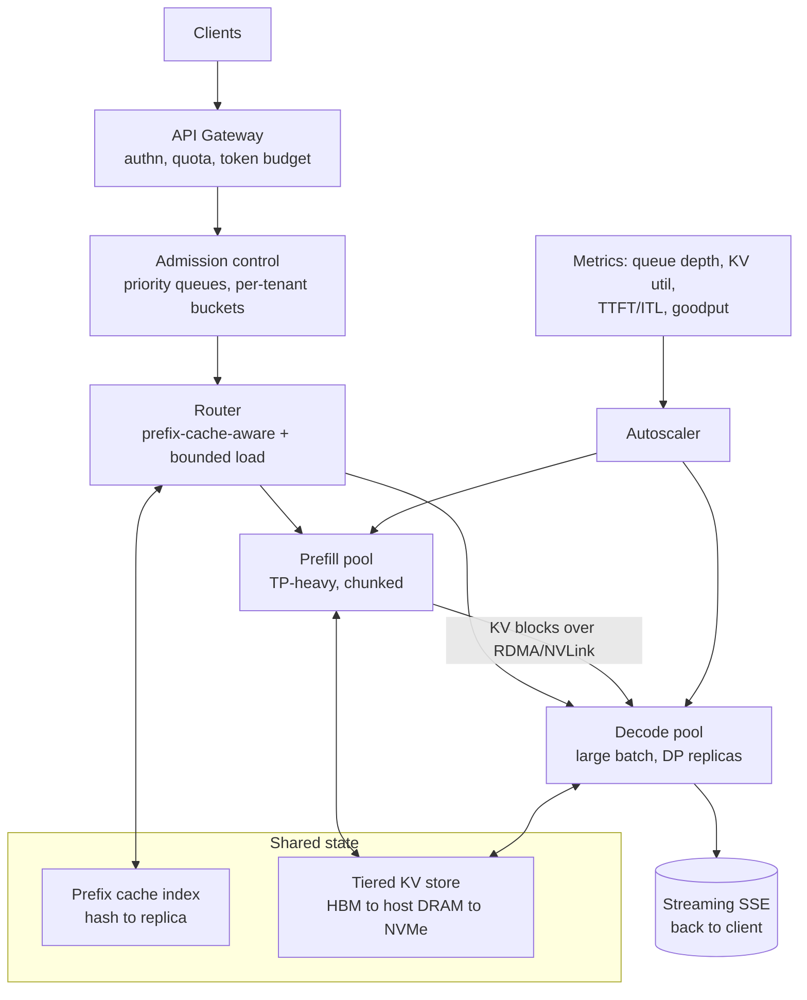

# Designing an LLM Inference Serving Platform

A system design for serving open-weight LLMs at scale: KV cache management, continuous
batching, quantization, and autoscaling.

All concrete numbers below are illustrative order-of-magnitude figures for an H100-class
fleet. They exist to show the *shape* of the arithmetic — measure your own hardware and
model before committing to any of them.

## 0. The running example: a travel-booking assistant

Abstract inference design goes vague fast, so everything below is grounded in one concrete
system — an **Expedia-style online travel agency (OTA)** adding LLM features to its booking
funnel. It's a useful example because it exercises every mechanism in the document, and it
does so for reasons that are visible in the product rather than invented for the exercise:

- **Enormous prefix reuse.** Every trip-planning conversation carries the same multi-thousand-token system prompt, tool schemas (search flights, price hotels, check availability), and policy text. Every conversation about one property re-reads the same hotel description and review corpus. This is the single strongest argument for prefix caching in the whole design.
- **Long prompts, short outputs.** "Find me a 4-star hotel in Lisbon under €200 with a pool" injects search results, availability, and pricing — tens of thousands of prompt tokens — and answers in 150. The fleet is **prefill-dominated**, which changes what you scale and in what ratio.
- **Brutal diurnal and seasonal traffic.** Booking traffic swings ~5× between 04:00 and 20:00 local, and January and summer-holiday booking peaks are multiples of the trough season. It is also highly *forecastable*, which is exactly the condition under which predictive autoscaling beats reactive.
- **Thin margins on a high-volume funnel.** The assistant sits in front of a search product where the revenue per interaction is cents. $/M tokens is not a nice-to-have metric; it decides whether the feature ships to 100% of traffic or stays in an experiment.
- **Multilingual, and correctness matters.** Prices, dates, cancellation policies, and availability in 30+ languages. A quantization recipe that quietly degrades non-English output or JSON tool-call adherence is a booking-integrity bug, not a benchmark regression.

---

## 1. Requirements

### Workloads

The platform serves three classes of traffic that want different things from the same GPUs:

| Class | Example (OTA) | Dominant SLO | Shape |
|---|---|---|---|
| **Interactive** | trip-planning chat, "is this hotel good for toddlers?" | TTFT p95, inter-token latency | bursty, multi-turn, long shared prefix |
| **Agentic** | itinerary builder calling search/pricing/availability tools in a loop | end-to-end wall clock | long prompts (10k–200k), short outputs, very high prefix reuse |
| **Batch / offline** | review summarization for 2M properties, listing enrichment, eval runs | throughput and $/token | latency-insensitive, schedulable overnight |

The agentic tier is the interesting one: a single "plan me a week in Portugal" request may
issue 10–20 model calls, each re-sending a growing conversation plus fresh tool output. The
user perceives *one* latency budget covering all of them, so per-call TTFT is roughly 10×
more valuable here than the raw number suggests.

### SLOs (interactive tier, the binding constraint)

- **TTFT** (time to first token) p95 ≤ 500 ms at 8k prompt — anything slower and the assistant feels worse than the existing search box it's competing with
- **ITL / TPOT** (inter-token latency) p95 ≤ 40 ms → ~25 tok/s per stream, comfortably above reading speed
- **Agentic end-to-end** p95 ≤ 8 s for a full multi-tool itinerary turn
- **Availability** 99.9% monthly; graceful degradation (queue + shed, fall back to classic search results) rather than 5xx storms
- **Goodput**, not throughput, is the headline metric: *requests/s that met both TTFT and ITL targets*. Raw tok/s can go up while goodput goes down — that trade is the entire scheduling problem.

### Non-goals

Training, fine-tuning pipelines, and model quality work. The platform serves whatever
checkpoints it is handed; it owns latency, throughput, and cost.

---

## 2. The one mechanism everything else follows from

Autoregressive decoding has two phases with opposite performance characteristics. Nearly
every design decision in this document is a consequence of that split.

**Prefill** processes the whole prompt in one forward pass. It is a big GEMM over `n`
tokens — **compute-bound**, and attention is O(n²) in prompt length. One 8k-token prefill
saturates a GPU by itself.

**Decode** generates one token per sequence per step. Each step reads *every weight in the
model* to produce a handful of tokens — a GEMV with arithmetic intensity near 1. It is
**memory-bandwidth-bound**, and a batch of 1 leaves the tensor cores ~99% idle.

The floor on a decode step for a dense model is therefore:

```
step_time ≥ (model_bytes + kv_bytes_read) / HBM_bandwidth
```

For a 70B model in FP8 (70 GB) sharded TP=8 across H100s (3.35 TB/s each), each GPU reads
~8.75 GB per step → ~2.6 ms floor, so ~380 tok/s single-stream in theory and perhaps
100–150 tok/s in practice after kernel launch, all-reduce, and sampling overhead.

The crucial consequence: **that weight read is amortized across the whole batch.** Going
from batch 1 to batch 64 costs almost nothing in step time but yields 64× the tokens.
Throughput is roughly linear in batch size until either (a) KV cache reads start to rival
weight reads, or (b) you cross into compute-bound territory.

The crossover point — the *critical batch size* — is the hardware's FLOP:byte ratio. An
H100 does ~989 dense BF16 TFLOPS against 3.35 TB/s, i.e. ~295 FLOP per byte. So you need
roughly **256–512 tokens in flight** before decode stops being bandwidth-starved. Below
that you are buying GPU time and throwing it away.

> **Everything below is in service of one goal: keep several hundred tokens in flight per
> GPU without blowing the KV cache budget or violating the latency SLO.**

---

## 3. Architecture



**Gateway** — auth, per-tenant rate and token-budget enforcement, request normalization,
`max_tokens` capping. Cheap, stateless, CPU-only, scales trivially.

**Admission control** — the layer that protects the SLO. It holds priority queues and
decides *when* a request is allowed onto a GPU, based on measured queue wait and KV
headroom. Without it, a traffic spike degrades every in-flight request instead of a few.

**Router** — picks a replica. Not round-robin: see §4.3.

**Engine pool(s)** — vLLM / SGLang / TensorRT-LLM processes, one model per pool, each
owning its GPUs and its KV cache. Optionally split into prefill and decode pools (§5.4).

**Control plane** — model registry (checkpoint + quantization recipe + engine config,
versioned together), rollout controller, autoscaler.

---

## 4. KV cache

### 4.1 Sizing — the number that governs concurrency

```
kv_bytes_per_token = 2 (K,V) × layers × kv_heads × head_dim × dtype_bytes
```

| Model | Layers | KV heads | head_dim | FP16 per token | 8k context |
|---|---|---|---|---|---|
| 8B, GQA-8 | 32 | 8 | 128 | 128 KiB | 1.0 GiB |
| 70B, GQA-8 | 80 | 8 | 128 | 320 KiB | 2.5 GiB |
| 13B, full MHA | 40 | 40 | 128 | 800 KiB | 6.3 GiB |

Note the third row. **Grouped-query attention is a ~5–10× KV reduction** and is the single
largest lever on concurrency; models with full MHA are dramatically more expensive to serve
at long context than their parameter count suggests. Multi-head latent attention (DeepSeek
style) compresses further by caching a low-rank latent instead of full K/V.

Concretely, on 8×H100 (640 GB) serving 70B in FP8: ~70 GB weights, ~40 GB activations and
workspace and fragmentation → ~530 GB left for KV → ~1.6M tokens of KV → ~200 concurrent
requests at 8k context. That number *is* your per-replica concurrency limit, and it is what
the autoscaler ultimately scales.

### 4.2 Paged allocation

Never allocate a contiguous per-request buffer sized to `max_tokens`. That was the original
sin of first-generation servers: reserving for the worst case wasted 60–80% of the cache to
internal fragmentation.

Instead, **PagedAttention**: KV lives in fixed-size blocks (typically 16 tokens), a per-request
block table maps logical positions to physical blocks, and attention kernels gather through
that indirection. Fragmentation drops to <4%, and blocks become shareable.

Sharing is what makes it more than an allocator:

- **Copy-on-write for parallel samples** — `n=4` completions share the prompt's blocks until they diverge.
- **Prefix caching** — a radix tree over token-ID prefixes lets a new request adopt existing blocks by reference. For a system prompt of 2k tokens reused across every call, or a 100k-token document that an agent queries repeatedly, this turns a multi-second prefill into a lookup. Cache-hit prefill is the difference between a 3 s and a 200 ms TTFT on long-context agent loops.

**Why this dominates the OTA design.** Structure the prompt so the shared part comes *first*
and the volatile part last — prefix caching matches on exact token prefixes, so a single
early-inserted timestamp or user ID invalidates everything after it:

```
[ system prompt + tool schemas + policy text ]   ~3k tokens   shared by 100% of traffic
[ destination / property context, reviews    ]  ~20k tokens   shared by everyone querying that property
[ conversation history                       ]   variable     shared across turns of one session
[ live availability + pricing + user query   ]   ~2k tokens   unique, must be last
```

Three tiers of reuse fall out of that layout: the system block is cached fleet-wide, the
property block is cached per popular destination (and travel demand is extremely Zipfian — a
few hundred destinations cover most traffic), and the history block makes turn *n+1* of a
conversation nearly free. In an agentic loop, each of the 10–20 calls appends to a prefix the
replica already holds, so only the newest tool result needs prefilling. That is the
difference between an 8-second itinerary turn and a 40-second one, and it costs nothing but
prompt discipline.

### 4.3 Cache-aware routing

Prefix caching only pays off if the request lands on the replica that holds the prefix.
Round-robin routing destroys most of the benefit.

Route on a hash of the request's prefix (system prompt + conversation history + document
ID), with **bounded-load consistent hashing**: prefer the cache-owning replica, but fall
through to the next when it exceeds ~1.25× mean load. This keeps hit rates high without
letting one popular prefix hotspot a single GPU. Sticky sessions for multi-turn chat are a
special case of the same idea.

The bounded-load part is load-bearing here rather than theoretical: on an OTA, destination
popularity is Zipfian *and* seasonal, so "everyone is asking about Lisbon this week" is a
routine event. Naive prefix hashing would pin that entire spike to one replica while the rest
of the fleet idles. Bounded load lets the hot prefix replicate across several replicas under
pressure and re-converge when it cools.

Otherwise, prefer **least-outstanding-tokens** over least-connections — requests are wildly
unequal in cost, so counting them is nearly meaningless.

### 4.4 Eviction, tiering, and pressure

- **Eviction** — LRU over reference-counted blocks; never evict blocks belonging to a running sequence.
- **Tiering** — spill cold prefix blocks HBM → host DRAM (~50 GB/s over PCIe) → local NVMe. Recomputing a 100k-token prefill costs seconds of GPU time; re-reading 30 GB of KV from NVMe costs ~3 s and no GPU. Worth it for large, reused contexts; not worth it for short prompts, where recompute is cheaper than transfer.
- **Preemption under pressure** — when the cache fills, the scheduler must evict a running sequence. Two options: **swap** its KV to host memory, or **drop and recompute** on resume. Recompute usually wins for short sequences (prefill is fast and parallel); swap wins for long ones. Either way, *preemption count is a first-class alert metric* — a steady preemption rate means admission control is letting in more work than the cache can hold, and the system is burning GPU on repeated work.
- **KV quantization** — FP8 KV roughly doubles concurrency for a small quality cost and is close to free on Hopper+. INT4 KV is riskier; if you do it, quantize K per-channel and V per-token, and validate on long-context retrieval tasks, where KV error compounds worst.

### 4.5 Free the cache aggressively

An underrated source of waste: a client that disconnects mid-stream while the server keeps
generating. Propagate cancellation from the HTTP layer all the way to the scheduler and free
the blocks immediately. On a chat product with a "stop" button, this can be several percent
of total GPU spend.

---

## 5. Continuous batching and scheduling

### 5.1 Iteration-level scheduling

Static batching — collect N requests, run them to completion together — is pathological
here, because outputs vary from 5 to 4000 tokens. The whole batch runs at the speed of its
longest member and the GPU drains to a trickle as sequences finish.

**Continuous (in-flight) batching** reschedules at every decode step: finished sequences
leave the batch immediately and queued ones join in their place. The batch composition
changes every ~20 ms. This alone is typically a 5–20× throughput improvement over static
batching at the same latency, and it is the single highest-leverage thing in the serving
stack.

### 5.2 Chunked prefill — the prefill/decode interference problem

Prefill and decode compete. A newly arrived 32k-token prompt occupies the GPU for hundreds
of milliseconds; every sequence already decoding stalls for that entire window, and their
ITL spikes. Users see the stream "stutter" whenever someone else asks a long question.

**Chunked prefill** (Sarathi-style) splits the prompt into fixed token chunks (512–2048) and
co-schedules one chunk alongside the decode batch each iteration, under a global per-step
token budget:

```
tokens_this_step = decode_tokens (1 per running seq) + prefill_chunk_tokens ≤ budget
```

This is the mechanism that makes the batch *compute-efficient* as well: decode alone rarely
reaches the critical batch size, but decode + a prefill chunk does, so the "free" tensor-core
capacity during decode is spent on prefill instead of being idled.

The trade-off is explicit and tunable: bigger chunks → better TTFT, worse ITL; smaller
chunks → smoother streams, slower first token. Set the budget from your SLO ratio, and
consider serving latency-sensitive and throughput-sensitive tiers with different budgets.

### 5.3 Admission control and queueing

Scheduling policy is where fairness and SLOs live:

- **Queue discipline** — FCFS is predictable and avoids starvation; priority classes (interactive > agentic > batch) with aging to bound worst-case wait. Shortest-job-first is tempting but you don't know output length in advance, and estimating it invites starvation of long generations.
- **Admission** — reject or queue when projected TTFT already exceeds SLO. Failing fast at the door is strictly better than admitting a request that will miss its target *and* degrade everyone else's.
- **KV reservation** — admit only if the request's expected KV footprint fits with headroom. Optimistic admission plus preemption works, but only with a preemption budget; unbounded optimism produces thrash.
- **Per-tenant token buckets** — rate-limit on *tokens per second*, not requests per second. A request is not a unit of cost.

### 5.4 Prefill/decode disaggregation

At large scale, run prefill and decode on **separate pools** and ship KV blocks between them
over NVLink/RDMA. Justification:

- They have different optimal parallelism (prefill likes tensor parallelism for latency; decode likes data-parallel replicas with big batches for throughput).
- They have different SLOs (TTFT vs ITL) and different scaling curves against traffic — a workload with long prompts and short outputs needs far more prefill capacity than decode.
- It eliminates interference structurally rather than papering over it with chunk-size tuning.

The cost is a KV transfer per request (tens to hundreds of MB) and real operational
complexity: two pools, two autoscalers, a transfer path to keep healthy. **Don't start
here.** Chunked prefill on a unified pool covers most of the benefit until you're past a few
dozen GPUs or have a strongly prefill-heavy workload.

The OTA workload is precisely that prefill-heavy case — 20k prompt tokens against 150 output
tokens is a ~130:1 ratio, so prefill FLOPs dominate and the two pools want sizing ratios that
have nothing to do with each other. It is the strongest realistic argument for
disaggregation. But note the interaction with §4.2: a high prefix-cache hit rate *removes*
most of that prefill work, and cheap prompt discipline should be exhausted before buying a
second pool and a second autoscaler. Measure the post-caching prefill:decode ratio, not the
raw one.

### 5.5 Speculative decoding

A small draft model (or n-gram lookup, or EAGLE/Medusa heads) proposes `k` tokens; the target
model verifies them in a single forward pass and accepts the longest correct prefix. Because
verification is one pass over the weights, accepting 3 tokens costs roughly what generating 1
did — a 2–3× single-stream latency win at acceptance rates of 70–80%.

The critical caveat, and a good interview discriminator: **speculation spends spare compute.**
It helps exactly when you are memory-bound — low batch, latency-critical, off-peak. At high
batch you are already compute-bound, and speculation's wasted verification FLOPs on rejected
tokens make throughput *worse*. So gate it dynamically on current batch size rather than
enabling it globally.

---

## 6. Quantization

### 6.1 Match the format to the bottleneck

The mistake is treating quantization as one dial. Three distinct things can be quantized, and
they buy different things:

| What | Saves | Helps which phase |
|---|---|---|
| **Weights** | HBM capacity + per-step read volume | decode (bandwidth-bound) |
| **Activations** | enables low-precision tensor cores | prefill (compute-bound) |
| **KV cache** | HBM capacity | concurrency, i.e. everything |

Hence: **W4A16** (INT4 weights, BF16 activations — AWQ/GPTQ) shrinks weights 4× and is
excellent for low-batch decode and for fitting a big model on fewer GPUs. But it must
dequantize to BF16 inside the kernel, so at high batch — where you're compute-bound — it can
be *slower* than FP8. It is a latency/capacity optimization, not a throughput one.

**W8A8 FP8** (E4M3, per-tensor or per-channel scales) is the current default for production
serving on Hopper: 2× on both weight bytes and tensor-core throughput, near-lossless with
light calibration, and supported natively so there's no dequant tax. On Blackwell,
block-scaled 4-bit formats (NVFP4/MXFP4) extend the same "helps both phases" property down to
4 bits, which shifts the calculus meaningfully.

A reasonable default policy: **FP8 weights + FP8 activations + FP8 KV** for interactive
serving; INT4 weight-only when the goal is fitting a larger model on smaller/cheaper GPUs or
serving at low concurrency.

### 6.2 Getting it right

- **Granularity** — per-tensor is fastest, per-channel (weights) / per-token (activations) is more accurate. Group-wise (g=128) for INT4. Finer granularity costs scale-lookup overhead in the kernel.
- **Outliers** — a handful of activation channels have huge dynamic range and dominate the error. AWQ keeps the most salient ~1% of weight channels in higher precision; SmoothQuant migrates activation scale into weights. This is why naive round-to-nearest INT4 falls apart and the published methods don't.
- **Calibration** — use a few hundred samples drawn from *your* traffic distribution, not WikiText. A model calibrated on generic English and served on 30 languages of hotel policy text, date arithmetic, and price formatting will quantize badly in exactly the places you care about. Sample the calibration set from real traffic, weighted by language mix.

### 6.3 Validating it — where teams get burned

Perplexity is a **necessary but wildly insufficient** check. Quantization damage concentrates
in the tails: long-context retrieval, multi-step reasoning, structured/JSON output adherence,
and non-English performance degrade well before perplexity moves.

The acceptance gate should be:

1. Task evals relevant to production (not just MMLU) with confidence intervals — a 0.5 point move on a 1000-item eval is noise.
2. Long-context probes (needle-in-a-haystack at your max supported length) — this is where KV quantization fails first. For the OTA case the probe should be the real failure mode: *given 20k tokens of reviews and availability, does it still find the one line saying the pool is closed for renovation?*
3. Format/tool-call adherence rate on real request shapes — a malformed `search_flights` call is a broken product, and this degrades before perplexity does.
4. A **paired A/B against the BF16 baseline on replayed production traffic**, greedy decoding, scored by an LLM judge or preference model. This catches "it got subtly worse at the thing our users actually do", which no public benchmark will.
5. Domain-correctness assertions that are cheap and non-negotiable: prices and dates quoted in the response must match the injected tool output exactly. Quantization damage shows up as numeric drift long before it shows up as bad prose, and on a booking funnel a hallucinated price is the most expensive possible failure.
6. Explicit sign-off that a quantized checkpoint is a *distinct model version* in the registry — it ships through the same canary process as a new checkpoint, because it is one.

---

## 7. Parallelism and placement

- **Tensor parallelism (TP)** — splits every layer; an all-reduce per layer means it wants NVLink. Use it to fit the model and to cut single-stream latency. Beyond one NVLink domain (typically 8 GPUs), communication dominates.
- **Pipeline parallelism (PP)** — splits layers across stages, tolerates slower interconnect, but introduces bubbles and hurts latency. Use it to cross node boundaries when TP alone can't fit the model.
- **Data parallelism (DP)** — independent replicas. The best throughput-per-dollar option whenever the model fits, and the unit the autoscaler manipulates.
- **Expert parallelism (EP)** — for MoE, distribute experts across GPUs. Introduces load imbalance across experts as a new failure mode, needing an expert-balancing/rebalancing story.

Rule of thumb: **smallest TP that fits the model with room for a healthy KV cache, then scale
out with DP replicas.** Reaching for TP=8 on a model that fits in TP=2 buys latency you may
not need and costs you throughput and blast radius.

---

## 8. Autoscaling

### 8.1 Scale on the right signal

GPU utilization is a **bad** autoscaling signal for LLM serving. Decode keeps the GPU nominally
"busy" at low arithmetic efficiency, so utilization sits high and flat while headroom varies
enormously. Scaling on it produces both under- and over-provisioning.

Scale on the signals that actually predict SLO violation, in priority order:

1. **Queue wait time** (p95 time from arrival to first scheduled step) — the leading indicator; it rises before latency does.
2. **KV cache utilization %** — when this approaches ~85–90%, preemption and admission rejection are imminent.
3. **Running batch size vs. configured max concurrency** — how much of the replica's capacity is committed.
4. **SLO burn rate** (fraction of requests missing TTFT/ITL) — the lagging ground truth; use for alerting and as a scaling backstop.

### 8.2 Capacity model

Derive `concurrency_per_replica` empirically: load-test until p95 TTFT or ITL hits the SLO and
record the concurrency at that knee. It's a function of model, quantization, context length,
and chunk budget — re-derive it whenever any of those change, and store it alongside the
engine config.

Then it's Little's Law:

```
required_replicas = ceil( (λ_peak × avg_service_time) / (concurrency_per_replica × target_util) )
```

with `target_util ≈ 0.7` to absorb burst and rolling deploys. Note that λ should be measured in
*tokens*, not requests — mixing a 200-token and a 100k-token workload under one request-rate
number will mis-size the fleet by an order of magnitude.

Cost sanity check:

```
$/M_tokens = (GPUs × $/GPU-hour) / (aggregate_output_tok/s × 3600) × 10^6
```

8×H100 at ~$2.50/GPU-h serving ~3,000 output tok/s ≈ **$1.85 per million output tokens** —
which is the number that tells you whether your batching and quantization work is worth
anything. Track it as a first-class SLI alongside latency.

#### Worked example: sizing the OTA assistant

Say the peak is **2,000 assistant conversations/minute**, each averaging 4 turns, each turn
20k prompt tokens and 150 output tokens.

```
turns/s        = 2000 × 4 / 60                    ≈ 133/s
raw prefill    = 133 × 20,000                     ≈ 2.7M prompt tok/s
after caching  = 2.7M × (1 − 0.9 hit rate)        ≈ 270k prompt tok/s
output         = 133 × 150                        ≈ 20k output tok/s
```

The 90% prefix-cache hit rate is the whole ballgame: it turns 2.7M into 270k prompt tokens/s,
a **10× reduction in fleet size**, and it comes from prompt layout and cache-aware routing
rather than from buying anything. No other lever in this document is worth as much on this
workload — which is why §11 puts caching in phase 1 and disaggregation in phase 3.

Sizing against a measured ~50k prefill tok/s and ~3k output tok/s per 8×H100 replica: prefill
needs ~6 replicas, decode ~7, so ~8 replicas (64 H100s) at 70% target utilization. At
$2.50/GPU-h that's ~$160/h at peak, and with a 5× diurnal swing plus autoscaling the daily
average lands nearer $60–70/h. Against booking volume that's the difference between a feature
that pays for itself and one that doesn't — and the arithmetic above is the argument you
bring to that conversation.

### 8.3 Cold start is the hard part

A new replica is not useful for **2–5 minutes**: pull the image, load 70–140 GB of weights,
allocate and warm the KV pool, capture CUDA graphs, JIT/compile kernels. Traffic spikes
arrive in seconds. The gap is the whole problem, and no amount of HPA tuning closes it. What
does:

- **Model weights on node-local NVMe**, pre-warmed by a DaemonSet, not pulled from object storage per pod (10 GB/s vs ~1–5 GB/s, and no cross-AZ egress).
- **Weights out of the container image** — a 140 GB image is an unpullable image.
- **Warm pool / headroom** — keep N spare replicas running, or low-priority placeholder pods that get evicted instantly to make room. You are trading ~10–20% idle GPU for the ability to absorb spikes; on interactive traffic that trade is almost always correct.
- **Predictive scaling** on the daily/weekly curve for the base load, with reactive scaling only for the residual. LLM traffic is extremely diurnal and quite forecastable — and travel is the best case for this: the ~5× daily swing is smooth and regular, the booking-season peaks are known months ahead, and the genuinely spiky events (a fare drop, a destination going viral, a weather disruption stranding travellers) are exactly the residual that reactive scaling plus a warm pool should cover. Scale the predictable 80% on a forecast and leave headroom for the rest; don't try to react your way through a curve you can already see coming.
- **Asymmetric thresholds** — scale up fast and aggressively (seconds, low threshold), scale down slowly (10–15 min stabilization). Flapping is expensive when each start costs minutes of GPU time.
- **Queue-based backpressure** as the shock absorber that covers the scale-up latency: a bounded queue with fast rejection above the bound converts an overload into a few explicit 429s instead of a fleet-wide latency collapse.

### 8.4 Scaling the tiers

- **Prefill and decode pools scale independently** when disaggregated — different signals (prefill: queue depth and prompt token rate; decode: KV utilization and running batch).
- **Batch tier on spot/preemptible** with checkpointing and drain-on-preemption; interactive tier on on-demand. This is often the largest single cost lever available, ahead of any kernel optimization. On the OTA fleet it also composes neatly with the diurnal curve: review summarization and listing enrichment are perfectly happy to run at 04:00 on the capacity the interactive tier just gave back.
- **Follow the sun.** Booking traffic peaks in local evening, so a multi-region fleet sees its regional peaks staggered by hours. Either let each region scale independently against its own curve, or route overflow across regions where data residency permits — the second is cheaper but adds cross-region latency to TTFT, so it should be a spillover path, not the default.
- **Scale-to-zero** only for cold, non-interactive models, where a multi-minute first-request latency is acceptable. Never for interactive traffic.
- **Multi-model fleets** — prefer LoRA multiplexing (one base model, many adapters swapped per-request) over a replica per fine-tune. It is the difference between N GPUs and N×adapters GPUs.

---

## 9. Observability

Instrument per-phase, not per-request-total, or you can't tell *which* mechanism regressed:

- **Latency split**: queue wait, prefill, per-token decode, detokenize, network — as separate histograms. A TTFT regression is one of these and the split tells you which.
- **Goodput**: requests/s meeting both SLOs, sliced by tenant and prompt-length bucket.
- **KV**: utilization, prefix-cache hit rate, preemptions/s, swap bytes/s.
- **Batch**: running batch size histogram, per-step token budget occupancy. If the histogram sits below the critical batch size, you are paying for idle tensor cores.
- **Cost**: $/M tokens, tokens/GPU-hour, idle GPU fraction.
- **Quality**: sampled output logging with an offline judge, so a bad quantization or checkpoint rollout is caught by data rather than by users.

Load test with **realistic prompt/output length distributions** replayed from production.
Benchmarks with fixed 128-in/128-out tell you nothing about a system whose behavior is
dominated by length variance.

---

## 10. Failure modes and runbook

| Symptom | Likely cause | Response |
|---|---|---|
| ITL spikes, TTFT fine | long prefills interfering with decode batch | reduce prefill chunk size; cap per-step prefill tokens |
| TTFT climbing, ITL fine | queue backlog; under-provisioned | scale out; tighten admission; check for a cache-routing hotspot |
| Throughput collapses under load | KV thrash, preemption loop | lower max concurrency, enforce KV reservation at admission |
| OOM at high concurrency | optimistic KV admission + long outputs | cap `max_tokens`, reserve headroom, enable preemption budget |
| One replica hot, others idle | prefix-cache routing degenerate | enable bounded-load fallback; check for one dominant system prompt |
| Autoscaler flapping | symmetric thresholds, short windows | asymmetric up/down, longer scale-down stabilization |
| Quality regression after deploy | quantization or checkpoint change | roll back on the registry version; the quantized build is a distinct version for exactly this reason |
| Cost per token creeping up | batch sizes falling (traffic shape shift) | inspect batch histogram; retune chunk budget; consolidate replicas |
| **Fleet-wide TTFT doubles after an unrelated prompt edit** | someone put a timestamp, user ID, or A/B flag near the *front* of the prompt, invalidating every cached prefix | treat prompt templates as versioned, cache-affecting artifacts; alert on prefix-cache hit rate as a release gate, not just a dashboard |
| Latency fine in staging, bad at peak in one region | regional diurnal peak, not global | scale per region against local curve; check cross-region spillover isn't adding TTFT |

---

## 11. Rollout plan

**Phase 1 — get the fundamentals right (weeks).** Single pool per model on a mature engine
(vLLM/SGLang/TRT-LLM). Continuous batching + PagedAttention + prefix caching + chunked
prefill. FP8 weights/activations/KV. Least-outstanding-tokens routing. HPA on queue depth and
KV utilization with a warm pool. *This configuration captures the large majority of the
available performance.*

Also in phase 1, and cheaper than any of it: **fix the prompt layout** (stable prefix first,
volatile suffix last) and put prefix-cache hit rate on the release gate. On a prefix-heavy
workload that single change outweighs everything else on this list.

**Phase 2 — routing and tiering.** Prefix-cache-aware routing with bounded load. Priority
classes and per-tenant token buckets. Batch tier on spot, scheduled into the overnight
trough. Speculative decoding gated on batch size. LoRA multiplexing for fine-tunes.

**Phase 3 — specialize, if the numbers justify it.** Prefill/decode disaggregation. Tiered KV
offload to DRAM/NVMe for long-context reuse. Predictive autoscaling. Per-workload engine
tuning.

The ordering is deliberate: every phase-3 item adds a moving part and an on-call burden, and
none of them beat getting phase 1 right. The most common expensive mistake in this space is
building the disaggregated, tiered, speculatively-decoded architecture before measuring that
the simple one was insufficient.

---

## 12. Quick reference

**Formulas**

```
kv_bytes_per_token   = 2 × layers × kv_heads × head_dim × dtype_bytes
decode_step_floor    = (model_bytes + kv_read_bytes) / HBM_bandwidth
critical_batch       ≈ peak_FLOPS / HBM_bandwidth        (H100 ≈ 295)
replicas             = ceil(λ × service_time / (concurrency × 0.7))
$/M_tokens           = (GPUs × $/GPU-h) / (tok/s × 3600) × 1e6
```

**Talking points**

- Prefill is compute-bound, decode is memory-bound — every design choice follows from this.
- Batching is free for decode until the critical batch size (~256–512 tokens in flight).
- PagedAttention cut KV fragmentation from ~60–80% to <4% and made prefix sharing possible.
- Continuous batching is a 5–20× win over static batching; it's the highest-leverage change.
- GQA/MLA is a 5–10× KV reduction — the biggest lever on concurrency.
- W4A16 helps decode, not prefill; FP8 helps both. Match the format to the bottleneck.
- Speculative decoding helps at *low* batch and can hurt at high batch.
- Never autoscale on GPU utilization; use queue wait and KV utilization.
- Cold start is minutes; warm pools and node-local weights, not clever HPA tuning.
- Optimize for goodput and $/M tokens, not raw throughput.
- On a prefix-heavy workload (the OTA case), cache hit rate is worth more than every kernel optimization combined — a 90% hit rate is a 10× fleet-size reduction, bought with prompt layout.
- Put the stable part of the prompt first and the volatile part last; a timestamp in the header invalidates the entire cache behind it.
