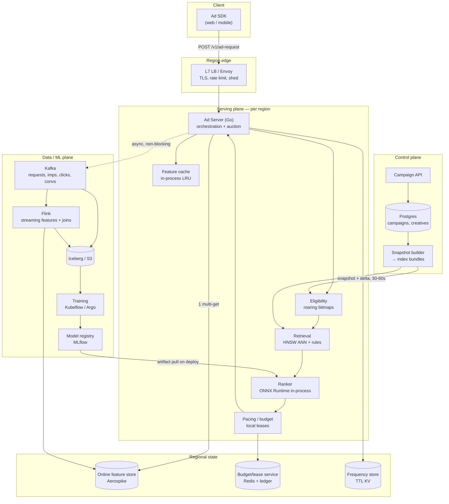
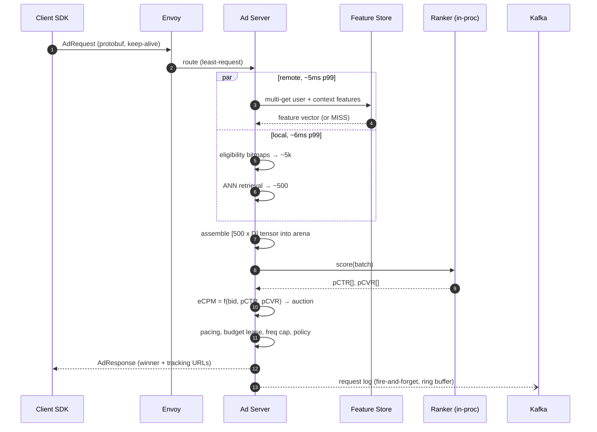

# 02 — High-Level Architecture

## 2.1 Planes

The system splits into three planes with different SLOs, different deploy cadences, and different
failure tolerance. Keeping them separate is what allows the serving plane to be boring.

| Plane | Latency | Deploy cadence | If it dies |
|---|---|---|---|
| **Serving plane** — ad decision path | ms | weekly, canaried | revenue stops → highest priority |
| **Control plane** — campaigns, budgets, targeting | seconds | daily | serving continues on last-known state |
| **Data/ML plane** — logs, features, training | minutes–hours | continuous | serving continues, models go stale |

**Rule: the serving plane never makes a synchronous call into the control or data plane.**
It consumes their output asynchronously (change streams, artifact pulls, cache warms) and always
holds a locally-valid snapshot. This is the difference between "the campaign DB is down" being an
incident and being an outage.

## 2.2 System diagram

## 2.3 Request lifecycle (the 33 ms)

Two details that matter more than they look:

- **The feature fetch runs concurrently with eligibility+retrieval**, not before it. Retrieval
  needs the *user embedding*, which is either (a) cached from the last request within the TTL, or
  (b) computed from context-only features on a miss. So the critical path is
  `max(remote_fetch, local_filter) + assemble + score`, not their sum. When the feature store is
  slow the request degrades in *quality*, not in *latency* — see
  [11](./11-reliability-active-active.md#114-degradation-ladder).
- **Logging is fire-and-forget into a bounded ring buffer** drained by a background goroutine.
  If Kafka is unavailable the buffer overflows and drops with a counter — it never applies
  backpressure to the ad response. Billing-critical events (impression, click) take a different,
  durable path ([06](./06-auction-pacing-budgets.md#65-billing-integrity)).

## 2.4 Component responsibilities

| Component | Owns | Explicitly does *not* own |
|---|---|---|
| **Ad Server** | Orchestration, timeouts, degradation, response assembly | Model math, campaign truth |
| **Eligibility** | Hard targeting filters as set operations | Anything probabilistic |
| **Retrieval** | Getting from ~5k to ~500 cheaply and with recall | Final ordering |
| **Ranker** | pCTR/pCVR estimates, calibrated | Business rules, price |
| **Auction** | Price, winner selection, floors | Prediction quality |
| **Pacing/Budget** | Spend safety, smooth delivery | Ranking |
| **Snapshot builder** | Turning campaign DB state into immutable, versioned serving bundles | Serving |
| **Flink jobs** | Streaming aggregates, sessionization, label joins | Model training |

## 2.5 Why this shape (and the alternatives rejected)

**Monolithic ad server with in-process ML, rather than a microservice per funnel stage.**
Each network hop costs 1–3 ms p99 (and much worse at the tail under load). Four hops would consume
a third of the budget doing nothing but serialization. The stages are also *always* invoked
together in the same order — there is no independent-scaling argument. They are separate Go
packages with clean interfaces, so they can be split out later if a stage genuinely needs its own
hardware (the likely candidate: retrieval, if the ad corpus grows past what fits in RAM).

**Pull-based snapshots, rather than the serving tier reading Postgres.**
A snapshot bundle is immutable, versioned, and validated before any pod loads it. Bad campaign
data fails the build, not the request. Pods report the snapshot version they're serving; the
control plane can see propagation lag directly.

**Kafka as the single event backbone, rather than direct writes to the lake.**
One append-only log feeds streaming features, offline training, billing, and the console.
Replayability is what makes backfills and model re-training tractable; the alternative (writing
to N sinks from the ad server) makes the serving tier responsible for downstream availability.

**Per-region state with async cross-region reconciliation, rather than a global database.**
A cross-region synchronous read at 20–30 ms RTT is larger than the entire latency budget. State is
therefore classified by how much inconsistency it can tolerate, and each class gets a different
mechanism — see [11](./11-reliability-active-active.md#112-state-classification).

## 2.6 Technology choices

| Layer | Choice | Why | Rejected |
|---|---|---|---|
| Ad server | **Go** | Predictable sub-ms GC pauses, cheap concurrency, one static binary, good ONNX/CGO story | Rust (faster, slower to staff/iterate); JVM (GC tail risk needs tuning effort) |
| Inference | **ONNX Runtime in-process** | No hop, INT8, thread-pool control | Triton (separate process/GPU — see [05](./05-low-latency-serving.md#when-to-move-to-gpu)); Python serving (non-starter at this p99) |
| ANN | **HNSW (hnswlib/usearch)** | Best recall/latency at 1M vectors, in-memory | Faiss-IVF (better at 100M+, worse here); external vector DB (a network hop) |
| Online store | **Aerospike** | Predictable sub-ms p99, hybrid RAM/SSD, strong ops story at this size | Redis Cluster (fine, weaker at >RAM datasets); DynamoDB (latency variance, cost) |
| Stream | **Kafka + Flink** | Exactly-once sinks, event-time windows, mature | Kinesis (regional lock-in); Spark Streaming (micro-batch latency) |
| Lake | **Iceberg on S3** | Schema evolution, time travel, engine-agnostic | Raw Parquet (no atomic commits); Delta (fine too, ecosystem preference) |
| Orchestration | **Kubernetes + Argo Workflows/Rollouts** | Progressive delivery is a first-class need here | Nomad; managed-only ML platforms |
| Ops console | **React + TypeScript** | Matches the existing frontend stack in this repo | — |

---
Next: [03 — Candidate generation & ranking](./03-candidate-generation-and-ranking.md)
