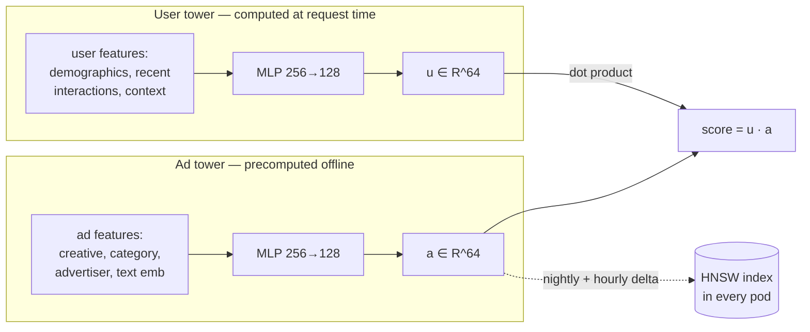

# 03 — Candidate Generation & Ranking

The ML core: how ~100k eligible ads become one served ad, and what each model actually predicts.

## 3.1 The funnel, and why it has these stages

```
        corpus          latency budget     job of this stage
──────────────────────────────────────────────────────────────────────────
100k    all ads
  │     ELIGIBILITY        ~2 ms          correctness (hard constraints)
  ▼
 5k     targetable
  │     RETRIEVAL          ~4 ms          recall (cheap, approximate)
  ▼
500     candidates
  │     RANKING           ~10 ms          precision (expensive, accurate)
  ▼
 20     ranked
  │     AUCTION            ~3 ms          money (price, pacing, policy)
  ▼
  1     winner
```

The funnel exists because **cost per candidate rises ~100× per stage while candidate count falls
~10×**. Scoring 100k ads with the ranker would cost ~2 s; filtering 100k with bitmaps costs 2 ms.
Each stage must be *cheap enough for its input size* and *good enough to not drop the eventual
winner*. That second property — **retrieval recall of the final winner** — is the metric that
governs stage tuning, and it is measured explicitly (§3.6).

## 3.2 Stage 1 — Eligibility (deterministic, in-process)

Hard constraints only: geo, device/OS, placement type, daypart, campaign status, flight dates,
advertiser exclusions, brand-safety category blocks, consent-derived restrictions.

Implemented as **precomputed roaring bitmaps**, one per attribute value, built by the snapshot
builder and shipped to every pod:

```
eligible = ads_by_geo["NL"]
         & ads_by_placement["feed_native"]
         & ads_by_device["ios"]
         & active_now_bitmap
         & ~excluded_for_user_segments
```

Intersecting a handful of roaring bitmaps over 1M bits is sub-millisecond and allocation-free.
`active_now_bitmap` is recomputed locally every second from campaign flight windows so activation
and pause take effect without a snapshot rebuild.

**Consent handling is a filter, not a special case:** without consent the personalized-targeting
bitmaps are simply not applied and only contextual ads remain eligible
([13](./13-privacy-and-compliance.md)).

## 3.3 Stage 2 — Retrieval

Three sources, unioned then deduped, each contributing to a ~500 quota:

| Source | Share | Mechanism | Purpose |
|---|---|---|---|
| **Two-tower ANN** | ~60% | HNSW over ad embeddings, query = user embedding | Personalized relevance |
| **Rule/targeted** | ~30% | Campaigns explicitly targeting this user's segments, sorted by historical eCPM | Advertiser guarantees, cold-start campaigns |
| **Exploration** | ~10% | Thompson sampling over low-impression ads | Break the rich-get-richer loop |

### Two-tower model



The towers are trained jointly with **sampled softmax + LogQ correction** (in-batch negatives
biased toward popular ads; the correction subtracts `log P(ad)` from the logit). Positives are
clicks; hard negatives are impressions-without-click from the *same* request, which teaches the
model to discriminate within an already-relevant set rather than against random ads.

**The user tower runs on the critical path** (~0.4 ms for a small MLP) but its input features come
from the possibly-slow remote store. Mitigation: the user embedding is cached in-process keyed by
`user_id` with a 5-minute TTL and invalidated by a Flink-emitted "user changed materially" signal.
Hit rate in a session-heavy workload is 70–85%; on a miss with no features available, a
context-only embedding (device/geo/placement/hour) is used — degraded but never blocking.

**Index freshness.** New ads must be servable within 2 minutes. HNSW does not love deletes, so:
one *base* index rebuilt nightly, plus a small *delta* index (flat, brute-force, ≤20k vectors)
searched in parallel and merged. Deletes are a tombstone bitmap applied post-search. Nightly
rebuild swaps both atomically behind an `atomic.Pointer` — readers never lock.

## 3.4 Stage 3 — Ranking

### What it predicts

A **multi-task** model with a shared bottom and per-objective heads:

| Head | Predicts | Loss | Used for |
|---|---|---|---|
| pCTR | P(click \| impression) | binary cross-entropy | all pricing models |
| pCVR | P(convert \| click) | BCE, click-conditioned | CPA campaigns |
| pView | P(viewable \| served) | BCE | vCPM, quality |
| (aux) dwell | regression | Huber | regularizes the shared bottom |

Multi-task is not fashion: pCVR has ~1/100th the label volume of pCTR, and sharing the bottom is
what makes it learnable at all. Heads are weighted with uncertainty-based loss balancing
(Kendall et al.) so the sparse task isn't drowned.

### Architecture

```
sparse ids (ad, advertiser, category, user segments, placement, hour-of-week)
    → hashed embeddings (dim 16–32, hash-trick to bound table size)
dense (counters, ratios, recency, price, historical CTR — see 04)
    → normalized (quantile transform, fitted offline, shipped with the model)

concat → [DCN-v2 cross layers ×2] → MLP 256 → 128 → 64 → heads
```

**DCN-v2 over plain MLP** for explicit low-order feature crossing (`user_segment × ad_category` is
exactly the interaction that matters here) at negligible cost. **GBDT (LightGBM) is the v0
baseline** and stays in the repo as the fallback model: it trains in minutes, needs no GPU, and
gives a genuine floor to beat. A DNN that can't beat the GBDT baseline by a meaningful margin
offline *and* in an A/B test should not ship.

### Calibration — the part that actually decides revenue

Ranking ordering can be right while probabilities are wrong; the auction multiplies pCTR by a bid,
so **miscalibration directly mis-prices inventory**. Two mechanisms:

1. **Negative downsampling correction.** Training downsamples negatives by rate `w` for tractability;
   serving-time probability must be corrected back:
   `p = p_sampled / (p_sampled + (1 - p_sampled)/w)`.
2. **Post-hoc isotonic regression** fitted per placement × pricing-model on a held-out recent
   window, shipped as part of the model bundle, applied in-process (a piecewise-linear lookup,
   ~50 ns).

Calibration is monitored in production as **Expected Calibration Error and observed/predicted
ratio per bucket**, alerting at >10% drift — this catches distribution shift faster than AUC does.

### Position & selection bias

Logged data only contains ads the *previous* model chose to show, at the position it showed them.
Uncorrected, models learn "what the old model liked".

- **Position bias:** train with position as a feature in a separate shallow tower
  (PAL / two-tower debiasing); at serving time fix it to a constant so ranking is position-free.
- **Selection bias:** the 10% exploration slot produces randomized-treatment logs; those rows get
  higher sample weight and are the only rows used for unbiased offline policy evaluation (IPS/
  doubly-robust — see [12](./12-observability-and-experimentation.md#offline-policy-evaluation)).

## 3.5 Stage 4 — Handoff to the auction

The ranker outputs calibrated probabilities only. It does **not** know prices. The auction
converts them:

```
eCPM = 1000 × bid × p(billable_event)
  CPM: eCPM = bid
  CPC: eCPM = 1000 × bid_cpc × pCTR
  CPA: eCPM = 1000 × bid_cpa × pCTR × pCVR
```

Keeping prediction and pricing separate means bid/pricing changes never require a model retrain,
and model changes never silently alter pricing semantics. Details in
[06](./06-auction-pacing-budgets.md).

## 3.6 Metrics that govern the funnel

| Metric | Definition | Target | Why it exists |
|---|---|---|---|
| **Retrieval recall@500** | fraction of requests where the *eventually served* ad was in the candidate set (measured by periodically ranking a superset offline) | > 0.98 | Detects retrieval silently capping revenue |
| Ranking AUC / PR-AUC | on held-out next-day data | tracked, not targeted | Ordering quality |
| **Calibration ratio** | Σpredicted / Σactual per bucket | 0.95–1.05 | Pricing correctness |
| Coverage | % of impressions from ads shown < 100 times | > 5% | Exploration is actually happening |
| **Revenue per mille (RPM)** | the business metric | ↑ | The only one that decides ship/no-ship |

Offline metric improvements that don't move RPM in an A/B test are treated as *not real* — a
policy worth stating explicitly, because it's the single most common way ML teams waste quarters.

## 3.7 Cold start

| Cold entity | Approach |
|---|---|
| New ad | Content-only ad tower embedding (creative text/image encoders, category, advertiser prior) → servable immediately with no interaction history; exploration slot guarantees traffic |
| New advertiser | Hierarchical prior: category-level historical CTR shrunk toward global mean (empirical Bayes) |
| New user | Context-only embedding; segment assignment from device/geo/entry-point; consent-permitting, warm up from first-session behaviour within ~60 s via streaming features |
| New placement | Guarded launch: fixed exploration budget, ranker score blended with placement-agnostic prior until ~10k impressions |

---
Next: [04 — Feature store](./04-feature-store.md)
