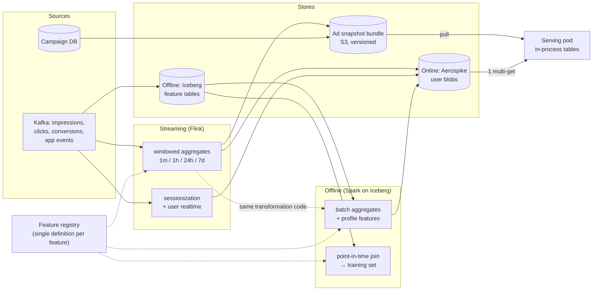

# 04 — Feature Store

The feature store is where most ad-ranking systems quietly lose either their latency budget or
their model quality. Two failure modes to design against: **the fan-out read** (fetching features
for 500 candidates) and **training/serving skew** (the offline and online definitions drifting).

## 4.1 Feature taxonomy

| Class | Example | Cardinality | Freshness need | Where it lives at serve time |
|---|---|---|---|---|
| **Ad-side static** | category, advertiser, creative size, text embedding | 1M ads | minutes | **in-process** snapshot |
| **Ad-side counters** | 1h/24h/7d impressions, clicks, CTR, spend rate | 1M ads | ~1 min | **in-process**, delta-refreshed |
| **User-side profile** | segments, tenure, historical category affinities | 10M users | hours | remote (Aerospike) |
| **User-side realtime** | last-30-min interactions, session depth, recent categories | 10M users | ~10 s | remote, written by Flink |
| **Context** | placement, device, hour, geo, referrer | — | request | from the request itself |
| **Cross** | user×category affinity, user×advertiser recency | 10M × K | ~1 min | remote (packed blob) |

## 4.2 Why ad features are *not* in the remote store

At 2,370 RPS × 500 candidates, putting ad features behind the network would mean **1.19M remote
key reads per second** — an order of magnitude more load than the user-side path, for data that is
identical across all users and changes slowly.

Instead: the entire ad-side feature table is materialized into every serving pod.

```
1M ads × ~400 B  ≈ 400 MB  (columnar, fixed-width, arena-allocated)
```

- Built by the **snapshot builder** into an immutable, versioned bundle (base, hourly).
- **Counter deltas** stream from Flink → a compacted Kafka topic → applied in-process every 30 s.
- Layout is **struct-of-arrays**: `impressions_24h[ad_idx]`, `ctr_7d[ad_idx]`, … so feature
  assembly for 500 candidates is 500 sequential-ish reads per feature column, not 500 pointer
  chases through a map. This alone is worth several milliseconds at p99.
- Swap is atomic: build the new table off-path, `atomic.Pointer` swap, old table freed after
  in-flight requests drain.

**The remote store is therefore read exactly once per request**, for one user, as a single
multi-get. That's the design decision that makes the latency budget work.

## 4.3 Architecture



## 4.4 Online store: access pattern & sizing

**One key per user, one value: a packed blob.**

```
key   = "u:{user_id}"
value = [header | schema_version | feature_bitmap | float16[] dense | varint[] sparse ids]
        ≈ 1.5–2 KB
```

Rationale: a multi-get of 40 individual keys costs 40 index lookups and 40 network round-trip
*slots*; one blob costs one. The cost is write amplification — any single feature update rewrites
the blob — which is acceptable because writes are Flink-batched (one write per user per ~10 s,
not per event) and reads outnumber writes ~10:1.

Sizing: 10M users × 2 KB = 20 GB, replication factor 2 → 40 GB; comfortably RAM-resident on a
3-node Aerospike cluster per region. p99 read target **< 3 ms**, enforced with:

- **Hedged requests:** if no response by p95 (~1.5 ms), fire a second read to another replica and
  take the first answer. Costs ~5% extra read load, cuts p99.9 dramatically.
- **Hard 5 ms timeout**, then serve from in-process LRU cache (5-min TTL, ~10k hot users), then
  context-only defaults. Each fallback is counted and tagged onto the response and the log row,
  so degraded traffic is visible and excludable from training.

**Cross-region:** each region has its own Aerospike cluster fed by its own Flink job reading the
*global* Kafka topics (mirrored). No cross-region reads on the serving path, ever. A user who moves
between regions sees at most a few seconds of feature lag.

## 4.5 Point-in-time correctness

The classic bug: training a model on a feature value that did not exist when the request happened
(e.g. joining today's `ctr_7d`), producing beautiful offline AUC and no online lift.

Two defences, and both are used:

1. **Log the features, don't recompute them.** Every ad request logs the *exact* feature vector
   used, referenced by `feature_snapshot_id` + the raw values for anything cheap to store. This is
   the primary training source. It costs ~1 KB/request (~130 GB/day compressed) — the correct
   trade: storage is cheap, silent skew is not.
2. **Point-in-time joins for backfills.** When a *new* feature must be added to historical
   training data, it is reconstructed with an as-of join against the versioned feature tables:

   ```sql
   SELECT r.*, f.value
   FROM requests r
   ASOF JOIN feature_history f
     ON f.entity_id = r.user_id AND f.valid_from <= r.request_ts
   ```

   `feature_history` is append-only with `valid_from`/`valid_to`, so "what did we know at 14:03
   yesterday" is answerable exactly.

## 4.6 Training/serving skew — prevented structurally

| Mechanism | What it prevents |
|---|---|
| **Single feature definition** in a registry (name, type, owner, transformation, default, TTL); Flink and Spark both execute the *same* transformation code, not two reimplementations | The most common skew source: two teams, two definitions of `ctr_7d` |
| Transformations (normalization, bucketization, hashing) compiled **into the model graph** (ONNX preprocessing ops) rather than living in serving code | Serving-side preprocessing drifting from training-side |
| **Daily skew job**: replay 100k logged requests through the offline feature pipeline, diff against the logged online vectors, alert if >0.1% of values differ beyond tolerance | Silent drift after a pipeline change |
| Shadow scoring: new model scores live traffic without serving; distributions compared to offline expectations | Feature availability differences (nulls, defaults) in production |

## 4.7 Failure modes

| Failure | Detection | Response |
|---|---|---|
| Online store slow (p99 > 5 ms) | Per-call histogram | Hedge → timeout → LRU → context-only; alert on degraded-request ratio > 1% |
| Online store down | Circuit breaker opens | 100% context-only ranking; RPM drops ~15–25%, service stays up |
| Flink lag | Consumer-lag + event-time watermark | Features go stale; freshness metric alerts at 5 min; stale features are still better than none |
| Snapshot build produces bad data | Validation gate in the builder (row counts, null rates, value ranges vs. previous) | Build fails, last-good snapshot stays; pods never see it |
| Pod pulls corrupt snapshot | Checksum + schema-version check on load | Refuse to load, keep serving previous, mark pod unready if too stale (>30 min) |
| Feature schema change | Registry versioning; `schema_version` in the blob | Serving reads old and new versions during the migration window |

---
Next: [05 — Low-latency serving](./05-low-latency-serving.md)
