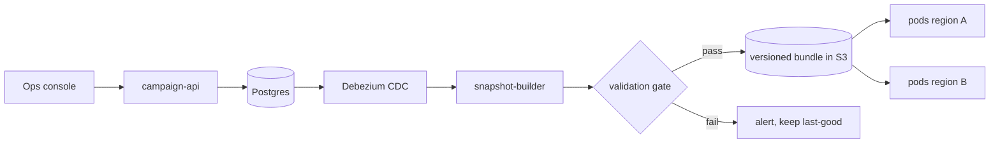

# 07 — Backend Low-Level Design

Concrete contracts, data structures, and concurrency for the serving plane. This is the level the
"LLD" half of the interview usually goes to.

## 7.1 Service inventory

| Service | Language | Scale | Deploy |
|---|---|---|---|
| `ad-server` | Go | 24 pods/region | Canary via Argo Rollouts |
| `event-collector` (beacons) | Go | 8 pods/region | Rolling |
| `budget-service` | Go | 3 pods/region + 1 global allocator | Rolling, leader-elected |
| `campaign-api` | Go/Kotlin | 3 pods | Rolling |
| `snapshot-builder` | Go | CronJob, every 60 s (delta) / nightly (base) | — |
| `flink-feature-jobs` | Java | 12 task slots | Savepoint-based |
| `ops-console` | React/TS | static + BFF | CDN |

## 7.2 Wire contracts

### `AdRequest` / `AdResponse` (protobuf over gRPC internally, HTTP/2+protobuf at the edge)

```protobuf
message AdRequest {
  string request_id      = 1;   // client-generated UUID, used for idempotency + tracing
  string placement_id    = 2;
  UserContext user       = 3;
  DeviceContext device   = 4;
  int32  num_slots       = 5;   // multi-slot placements
  int32  timeout_ms      = 6;   // client's deadline; server takes min(this, own budget)
  ConsentState consent   = 7;
  map<string,string> ext = 8;   // experiment overrides, debug flags (auth-gated)
}

message UserContext {
  string user_id   = 1;   // pseudonymous, salted+rotated; never a bank identifier
  string session_id = 2;
  repeated string page_categories = 3;   // contextual signals, consent-free
}

message AdResponse {
  string request_id = 1;
  repeated Slot slots = 2;
  ServingMeta meta  = 3;
}

message Slot {
  int32  index = 1;
  Ad     ad = 2;                 // absent = no-fill
  string ad_token = 3;           // HMAC(impression_id, campaign_id, price, exp)
  Tracking tracking = 4;         // impression, viewable, click, conversion URLs
  NoFillReason no_fill_reason = 5;
}

message ServingMeta {
  string model_version = 1;
  string snapshot_version = 2;
  repeated string experiment_ids = 3;
  DegradationLevel degradation = 4;   // FULL | REDUCED_CANDIDATES | FALLBACK_MODEL | SHED
  int32 server_latency_us = 5;
}
```

Design notes:

- **`degradation` is in the response.** The client doesn't act on it, but it lands in the log and
  makes "how much traffic was degraded, and what did it cost in RPM?" a query rather than a guess.
- **`timeout_ms` from the client** — the server's effective deadline is `min(client, server_slo)`.
  A client that can only wait 20 ms should get a degraded answer in 20 ms, not a perfect one in 40.
- **No prices on the wire to the client.** Price lives in the signed token and the server-side log.
- **Protobuf, not JSON**, on the hot path: ~3× smaller, ~5× faster to parse, and schema-checked.
  The public SDK endpoint accepts JSON and transcodes at the edge for browser convenience.

### Beacon endpoints (`event-collector`)

```
POST /v1/e/impression   body: {ad_token, view_ms, viewable, slot_geometry}   → 204
POST /v1/e/click        body: {ad_token, click_pos, ts}                      → 302 to landing URL
POST /v1/e/conversion   server-to-server, advertiser-authenticated           → 204
```

Verification order (fail fast, cheap first): HMAC signature → expiry → replay-cache lookup →
Kafka `acks=all` write → respond. The replay cache is a regional Redis set with the token's TTL;
duplicates return 204 (idempotent) but are not written.

## 7.3 Ad server internals

### Package layout

```
cmd/ad-server/main.go
internal/
  serve/        http/grpc handlers, deadline + degradation control
  eligibility/  roaring bitmap index, snapshot loading
  retrieval/    hnsw index, two-tower user encoder, exploration sampler
  features/     ad table (SoA), online-store client, in-process caches
  rank/         Scorer interface, ort backend, gbdt fallback, calibration
  auction/      ecpm, pricing rules, selection with reason codes
  pacing/       PID controllers, lease client, frequency caps
  logging/      ring buffer → Kafka producer
  snapshot/     bundle fetch, verify, atomic swap
```

### The hot path, in code shape

```go
func (s *Server) Decide(ctx context.Context, req *pb.AdRequest) (*pb.AdResponse, error) {
    ctx, cancel := context.WithTimeout(ctx, s.deadline(req))   // min(client, SLO)
    defer cancel()

    arena := s.arenas.Get()          // sync.Pool: candidate slice, tensor buf, scratch
    defer s.arenas.Put(arena)

    snap := s.snapshot.Load()        // atomic.Pointer[Snapshot] — lock-free, versioned

    // Remote and local work overlap.
    featCh := make(chan features.User, 1)
    go func() { featCh <- s.features.GetUser(ctx, req.User.UserId) }()  // hedged + fallback

    cands := s.eligibility.Filter(snap, req, arena.Cands[:0])           // ~2 ms → ~5k

    uf := <-featCh                                                      // ≤5 ms, never errors
    uemb := s.retrieval.UserEmbedding(uf, req)                          // cached or computed
    cands = s.retrieval.Select(snap, uemb, cands, s.level.Candidates()) // → ~500

    s.features.Assemble(snap, uf, cands, arena.Tensor)                  // [N x D] into arena
    preds := s.scorer.Score(ctx, arena.Tensor, len(cands))              // one ORT call

    win := s.auction.Run(snap, req, cands, preds)                       // eCPM + constraints
    resp := buildResponse(req, win, s.meta(snap, uf))

    s.logger.Enqueue(makeLogRow(req, cands, preds, win, uf))            // non-blocking
    return resp, nil
}
```

Properties worth pointing at in review:

- **No error return from `GetUser`.** Feature fetch failure is a *degradation*, handled inside the
  client (hedge → timeout → cache → defaults) and reported via a flag on the returned struct. The
  orchestrator has one less branch, and there is no path where a feature-store blip 500s a request.
- **`arena` eliminates per-request allocation** for the three big buffers. Target: <1 MB and
  <50 allocations per request, asserted in a benchmark in CI.
- **`snapshot.Load()` is a single atomic pointer read.** No locks anywhere on the read path;
  updates build a new snapshot and swap.
- **`s.level`** is the degradation controller from [05](./05-low-latency-serving.md#55-load-shedding--overload-behaviour) — it parameterizes candidate count and model choice.

### Key data structures

```go
// Struct-of-arrays: one contiguous slice per feature, indexed by dense ad index.
type AdTable struct {
    IDs        []uint64            // ad_idx → ad_id
    CampaignOf []uint32
    Ctr7d      []float32           // hot columns are float32, cache-friendly
    Imps24h    []uint32
    BidMicros  []uint64
    Embedding  []int8              // [numAds * dim], INT8, row-major
    dim        int
}

// Immutable, versioned; replaced wholesale.
type Snapshot struct {
    Version   string
    Ads       *AdTable
    Bitmaps   map[AttrKey]*roaring.Bitmap
    Index     *hnsw.Index          // base
    Delta     *flat.Index          // recent ads, brute-force
    Tombstone *roaring.Bitmap
    BuiltAt   time.Time
}
```

### Concurrency model

- One goroutine per request; **no shared mutable state** on the hot path except atomics.
- ORT sessions: a pool of `N = GOMAXPROCS` sessions, each `intra_op_num_threads=1`; a request
  borrows one. Prevents thread explosion under concurrency.
- Log ring buffer: MPSC, fixed capacity (e.g. 100k rows), dropped-on-full with a counter, drained
  by 4 producer goroutines batching to Kafka (`linger.ms=20`, `compression=zstd`).
- Snapshot refresh: dedicated goroutine; download → verify → build → atomic swap. Old snapshot is
  garbage-collected once in-flight requests release it (`sync.RWMutex`-free via generation counting).

## 7.4 Control plane

`campaign-api` is a boring CRUD service over Postgres. What matters is the **snapshot boundary**:



Validation gate checks before any bundle is published: row-count delta within ±20% of previous,
no campaign with null targeting, all creatives have approved policy status, bitmap cardinalities
sane, index builds and returns sensible neighbours for a fixed probe set. **Bad campaign data
fails a build, never a request.**

## 7.5 Cross-cutting

| Concern | Approach |
|---|---|
| Auth (SDK → edge) | Publisher key + origin allowlist + per-key rate limit at Envoy |
| Auth (console/API) | OIDC, RBAC by advertiser org, all writes audit-logged |
| Idempotency | `request_id` for ad requests; `impression_id` for billable events |
| Rate limiting | Token bucket at Envoy per publisher key; per-user abuse limits in the collector |
| Config | Immutable image + versioned config bundle; dynamic *operational* flags (degradation thresholds, candidate counts) via a watched KV with a local default that survives KV loss |
| Schema evolution | Protobuf field numbers never reused; feature schema versioned in the blob header; snapshot bundles carry a format version |
| Secrets | Workload identity → cloud KMS; HMAC signing key rotated weekly with a 2-key verification window |

---
Next: [08 — Frontend](./08-frontend.md)
