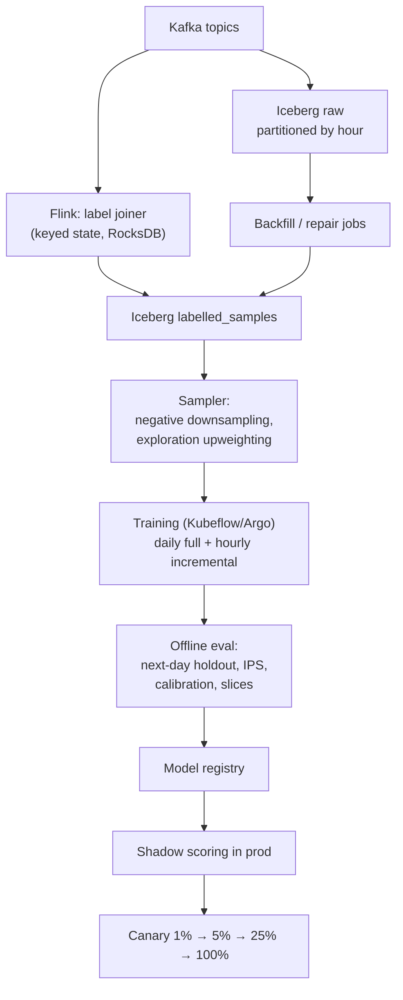

# 09 — Data & Training Pipeline

How ~300 GB/day of events become a model that is measurably better than the one it replaces.

## 9.1 Event model

| Topic | Volume | Key | Retention (hot) | Semantics |
|---|---|---|---|---|
| `ad_requests` | 2,370/s, ~1.5 KB | `request_id` | 7 d | at-least-once |
| `impressions` | ~1,300/s | `impression_id` | 7 d | **exactly-once for billing** (dedup by id) |
| `clicks` | ~16/s | `impression_id` | 7 d | exactly-once |
| `conversions` | ~1/s | `conversion_id` | 30 d | exactly-once, late-arriving |
| `campaign_cdc` | low | `campaign_id` | compacted | log-compacted, latest-wins |
| `feature_deltas` | ~5k/s | `ad_id` | compacted | latest-wins |

`ad_requests` carries **the feature vector actually used**, the candidate set (ids + scores,
truncated to top ~50), the auction outcome with reason codes, model/snapshot versions, and the
degradation level. That row is the training set — see
[04](./04-feature-store.md#45-point-in-time-correctness) for why features are logged rather than
recomputed.

## 9.2 Pipeline



### The label joiner

An impression's label isn't known when it happens; it arrives as a click seconds later or a
conversion days later. Flink keyed state joins them:

```
stream: impressions  ──keyBy(impression_id)──┐
        clicks       ──keyBy(impression_id)──┼─→ join with 30-min window → click label
        conversions  ──keyBy(click_id)───────┴─→ join with 7-day window  → conversion label
```

- Window sizes come from the **empirical attribution delay distribution**, not from a round number:
  ~95% of clicks land within 30 s, ~90% of conversions within 24 h, with a tail to 30 days.
- Late arrivals past the window go to a side output and are folded in by a nightly repair job that
  rewrites the affected Iceberg partitions (Iceberg's atomic commits make this safe — this is the
  concrete reason to use a table format instead of raw Parquet).
- State size: 1,300 imp/s × 30 min ≈ 2.3M keys for clicks, plus a 7-day conversion state
  (~800M keys, RocksDB-backed, incremental checkpoints to S3).

## 9.3 Delayed feedback

The problem, stated precisely: at training time, a *recent* impression with no conversion is
ambiguous — it may be a true negative, or a conversion that hasn't happened yet. Training on
"recent = negative" systematically under-predicts pCVR and starves CPA campaigns.

Three approaches, and the choice:

| Approach | Idea | Verdict |
|---|---|---|
| Wait for the window to close | Train only on impressions ≥7 d old | Simple, but the model is always a week stale. Used only for the nightly *teacher*. |
| **Delayed-feedback model** (Chapelle) | Jointly model P(convert) and the delay distribution; treat unconverted recent samples as censored, not negative | **Chosen** for pCVR. Handles the censoring correctly and keeps the model fresh. |
| Importance weighting / fake negatives | Insert a negative immediately, then a positive with a correcting weight when the conversion lands (Twitter/Criteo style) | Chosen for the *streaming/incremental* update path, where re-labelling isn't possible |

pCTR does not need this — click delays are seconds — which is another argument for the multi-task
split: different heads, different label pipelines, different freshness.

## 9.4 Sampling

Raw class balance is ~1.2% positive for CTR and ~0.1% for CVR. Training on all of it is wasteful.

- **Negative downsampling** at `w = 0.1` (keep 10% of negatives) → ~10× less data, ~10× faster
  iteration. Corrected at serving time by the calibration formula in
  [03](./03-candidate-generation-and-ranking.md#calibration--the-part-that-actually-decides-revenue).
  This correction is the single most-forgotten step in ad ML; get it wrong and every price is wrong.
- **Exploration rows upweighted** and tagged — they are the only unbiased sample and the basis of
  offline policy evaluation.
- **Degraded rows excluded** (`degradation != FULL`): a request served with default features is not
  evidence about the model's quality.
- **Recency weighting:** exponential decay with a ~2-week half-life, so the model tracks seasonality
  without forgetting.

## 9.5 Training cadence

| Cadence | What | Why |
|---|---|---|
| **Hourly** | Incremental update of embedding tables + last layers on the freshest hours (warm start) | Ad corpus and trends move fast; keeps freshness ≤ 1 h |
| **Daily** | Full retrain from the last 30–60 days | Prevents drift accumulation from incremental updates |
| **Weekly** | Teacher model (large) retrained; student distilled from it | Quality push without serving cost |
| **On demand** | Architecture/feature changes | Gated on the same eval bar as everything else |

Warm-start caveat: incremental updates compound bias, so the daily full retrain is the ground
truth and the hourly model is always evaluated *against* it — if the two diverge beyond a
threshold, hourly updates are suspended automatically.

## 9.6 Offline evaluation gate

A model may not be promoted to canary unless **all** hold:

| Check | Bar |
|---|---|
| AUC on next-day holdout | ≥ current production − 0.001 |
| PR-AUC on next-day holdout | ≥ current production |
| Calibration (Σpred/Σactual) | within [0.97, 1.03] overall **and** per placement |
| Slice regression | no slice (placement, device, geo, top-20 advertisers, new-user cohort) worse than −2% relative AUC |
| IPS / doubly-robust RPM estimate on exploration rows | ≥ production, CI excluding a >1% loss |
| Feature importance stability | no single new feature >30% of total gain (a proxy for leakage) |
| Latency | p99 inference within budget on the benchmark harness |
| Skew | shadow-scored distribution matches offline within tolerance |

The **slice check** matters more than the aggregate: a model that gains 1% overall while losing 8%
on mobile new users is a bad trade that a single AUC number hides.

### Leakage tripwires

Every new feature is checked for: (a) does its value at request time depend on the outcome?
(b) does removing it collapse AUC to baseline? (c) is its offline distribution equal to its
logged online distribution? A feature that passes all three offline checks but improves AUC
implausibly (>0.02) is treated as leakage until proven otherwise.

## 9.7 Data quality

| Control | Mechanism |
|---|---|
| Schema enforcement | Protobuf + Iceberg schema; malformed rows quarantined, not dropped silently |
| Volume anomaly | Hourly row counts vs. 4-week seasonal baseline; alert at ±20% |
| Null/default rate | Per-feature; a spike means an upstream break, usually before any metric moves |
| Duplicate detection | Ledger dedup counters; a rising dedup rate means a client retry bug |
| Bot / invalid traffic | Heuristics + classifier; IVT rows excluded from training *and* billing |
| Backfill safety | All jobs idempotent, partition-scoped, and validated before the Iceberg commit |

---
Next: [10 — MLOps & CI/CD](./10-mlops-cicd.md)
