# 10 — MLOps & CI/CD

Two delivery pipelines with different risk profiles: **code** (reviewed, tested, deterministic) and
**models** (data-dependent, statistically evaluated, silently failing). They share deployment
machinery but not gates.

## 10.1 Repository layout

A monorepo — the feature definitions, the training code, and the serving code must move together
or they drift:

```
/services/ad-server/         Go
/services/event-collector/   Go
/services/budget-service/    Go
/services/campaign-api/
/frontend/ad-sdk/            TypeScript, no framework
/frontend/ops-console/       React + TypeScript
/ml/features/                feature definitions (registry, transformations)
/ml/training/                model code, configs, eval
/ml/pipelines/               Argo/Kubeflow DAGs
/streaming/flink-jobs/       Java
/proto/                      the single schema source of truth
/deploy/                     Helm charts, Argo CD apps, per-env values
/loadtest/                   replay harness, benchmark suites
```

`/proto/` generates the Go server stubs, the TS client types, and the log schemas from one
definition. `/ml/features/` generates both the Flink and the Spark transformations. **Anywhere two
components must agree, they generate from one source rather than both implementing it.**

## 10.2 Code pipeline

```mermaid
flowchart LR
  PR["Pull request"] --> L["lint + typecheck<br/>go vet, tsc, ruff"]
  L --> U["unit tests<br/>+ race detector"]
  U --> B["benchmarks<br/>p99 + allocs/op regression gate"]
  B --> I["integration<br/>docker-compose: kafka, aerospike, pg"]
  I --> C["contract tests<br/>proto compat check"]
  C --> IMG["build image<br/>SBOM + sign (cosign)"]
  IMG --> STG["deploy staging"]
  STG --> LT["shadow replay load test<br/>1x / 2x / 3x"]
  LT --> PROD["Argo Rollouts canary"]
```



Gates that are specific to this system and worth calling out:

- **Allocation regression gate.** `go test -bench -benchmem` on the hot path; a PR that raises
  allocations/request above threshold fails. Allocation growth is the leading indicator of GC-driven
  tail latency, and it's much easier to catch here than in production.
- **Proto compatibility check** (`buf breaking`) against the deployed schema — field reuse or type
  changes fail the build.
- **Nightly full load test** against staging with replayed production traffic; a >10% p99
  regression opens a ticket automatically and blocks the next release train.
- **Shadow replay** verifies the degradation ladder actually engages in order under 3× load. A
  fallback path that has never executed is not a fallback path.

### Progressive delivery

```
canary 1%  (10 min)  → guardrails → 5% (20 min) → 25% (30 min) → 100%
```

Guardrail metrics evaluated automatically at each step, per region:

| Guardrail | Abort if |
|---|---|
| p99 latency | > 45 ms or > +15% vs. baseline |
| Error rate | > 0.1% |
| Fill rate | < baseline − 1% |
| RPM | < baseline − 2% (statistically, not on noise) |
| Degradation-level mix | FULL share drops > 2 pp |
| Calibration ratio | outside [0.95, 1.05] |

Abort = automatic rollback to the previous ReplicaSet, plus a page. Rollback must be *faster* than
diagnosis; there is never a reason to debug a bad canary while it serves traffic.

## 10.3 Model pipeline

Models are data artifacts, so the pipeline differs in three ways: the input is not versioned by
git alone, the "test suite" is statistical, and the failure mode is silent.

```mermaid
flowchart LR
  D["data snapshot<br/>(Iceberg time-travel id)"] --> T["train<br/>(pinned image + config hash)"]
  T --> E["offline eval gate<br/>(09.6)"]
  E --> R["registry: MLflow<br/>status=candidate"]
  R --> Q["quantize INT8 + calibrate<br/>+ re-verify calibration"]
  Q --> BM["latency benchmark"]
  BM --> SH["shadow: score live traffic,<br/>serve nothing (24h)"]
  SH --> AB["A/B: 5% traffic<br/>(7 days or until power)"]
  AB --> P["status=production<br/>rollout via snapshot bundle"]
```



### Reproducibility

Every registered model records: git SHA, training image digest, config hash, **Iceberg snapshot
id of every input table**, random seeds, and the resulting metrics. Re-running the same triple
(code, config, data snapshot) must reproduce metrics within noise. This is not bureaucracy — it's
the only way to answer "was the model or the data responsible?" when a metric moves, which is the
question that comes up every time.

### Model artifacts are immutable, versioned bundles

```
model-bundle/
  model.onnx              # quantized graph, preprocessing fused in
  calibration.json        # isotonic knots per placement
  feature_schema.json     # names, order, defaults, transformations
  metadata.json           # version, metrics, training data snapshot, git sha
  checksum.sha256
```

Pods pull the bundle by version, verify the checksum and the feature schema against their own
build, run warm-up inferences, and only then report ready. A schema mismatch refuses to load
rather than serving garbage — **failing loudly at load beats failing quietly per request.**

### Shadow mode

The candidate model scores real live traffic in-process (on a sampled subset, to protect latency)
without affecting the response. What it catches that offline eval cannot:

- Feature availability differences (a feature that's 2% null offline and 30% null online).
- Latency under real batch-size and cache-hit distributions.
- Score distribution shift vs. offline expectation.
- Crashes on real-world inputs (missing embeddings, unseen ids, degenerate candidate sets).

## 10.4 Environments

| Env | Data | Traffic | Purpose |
|---|---|---|---|
| dev | synthetic | none | fast loops |
| staging | anonymized replay of production | replayed | integration + load |
| **shadow** | production | production (scored, not served) | model + code pre-verification |
| prod | production | live | — |

Staging uses **replayed real traffic**, not synthetic load. Synthetic traffic has the wrong
candidate-count distribution, the wrong cache hit rates, and the wrong tail — it will validate a
system that then falls over.

## 10.5 Infrastructure as code

- Terraform for cloud resources; Helm + Argo CD for cluster state (GitOps: the repo is the desired
  state, drift is detected and reported).
- One chart per service, per-region values files. The two regions' configs differ only in a values
  file — **any other divergence is a bug**, because a region that isn't a copy can't be a failover.
- Kubernetes: Guaranteed QoS (requests == limits), PodDisruptionBudgets, topology spread across
  AZs, HPA driven by in-flight concurrency and p99 latency (not CPU average), KEDA for
  Kafka-consumer scaling on lag.

## 10.6 Ownership and on-call

| Pipeline | Owner | Alert routing |
|---|---|---|
| Serving latency/availability | serving team | page immediately |
| Budget/billing correctness | serving + finance eng | page immediately |
| Model quality (calibration, RPM) | ML team | page during business hours, ticket otherwise |
| Data freshness/quality | data eng | page if >30 min stale, ticket otherwise |

Runbooks live next to the alerts, and every alert has to answer three questions or it gets deleted:
what broke, what's the user impact, what's the first action. An alert with no first action is a
notification, and notifications get ignored.

---
Next: [11 — Reliability & active-active](./11-reliability-active-active.md)
