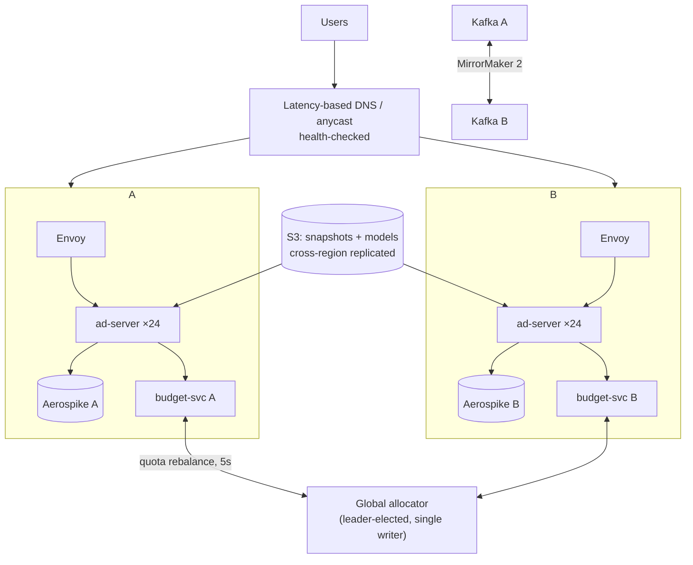

# 11 — Reliability & Active-Active

Two EU regions, both serving live traffic, each able to take 100% of peak alone.

## 11.1 Topology

**Routing:** latency-based DNS with health checks (60 s TTL) for coarse steering, plus client-side
retry to the alternate regional endpoint on hard failure. DNS TTLs are too slow to be the only
failover mechanism — the SDK holds both endpoints and fails over in ~1 request.

## 11.2 State classification

Every piece of state gets classified by how much inconsistency it can survive. This table *is* the
active-active design:

| State | Consistency needed | Mechanism | Failure cost of getting it wrong |
|---|---|---|---|
| Ad/campaign definitions | Eventual, ~1 min | S3 snapshot bundles replicated; pods pull | Serving a stale campaign for a minute |
| Model artifacts | Eventual, immutable | Versioned bundles in S3, pulled per region | None (versions never mutate) |
| User features | Eventual, ~seconds | Per-region Flink writes from mirrored Kafka | Slightly stale personalization |
| **Budgets** | **Strong-ish (bounded overspend)** | **Lease sub-allocation from a global allocator** | **Money. Fail closed.** |
| Frequency caps | Eventual, ~1–2 s | Async replication; over-delivery bounded by lag | One extra impression |
| Impression ledger | Exactly-once, durable | Kafka `acks=all` + dedup by `impression_id` | Billing disputes |
| Experiment assignment | Deterministic, no state | `hash(user_id, experiment_id)` computed identically in both regions | A user seeing both arms |

**Experiment assignment being *computed* rather than *stored* is the cheapest correctness win in
the whole design** — the same user hashes to the same bucket in both regions with zero
coordination, so a region failover cannot corrupt an experiment.

## 11.3 Failure scenarios

| Scenario | Detection | Behaviour | Recovery |
|---|---|---|---|
| **Single pod dies** | Readiness probe / LB health | Envoy removes it; requests retried on another pod (idempotent by `request_id`) | K8s reschedules; new pod warms up before taking traffic |
| **Region loses capacity** (AZ event) | Pod count + p99 | HPA scales; degradation ladder engages if it can't keep up | Autoscale, then traffic rebalance |
| **Region fully down** | Health check fails 3× | DNS steers away; SDK fails over immediately; surviving region runs at ~80% of its provisioned capacity | ~60–90 s to full shift, no cold start (both regions were already warm) |
| **Cross-region link down** (split brain) | Allocator heartbeat lost | Each region continues on its **last granted quota only**, which expires; conservative mode caps each region at 50% of remaining budget → total ≤100% | Reconcile from the ledger when the link returns |
| **Aerospike down (one region)** | Circuit breaker | Context-only ranking in that region; RPM −15–25%, latency *improves*; alert | Restore, then cache warms naturally |
| **Kafka unavailable** | Producer errors | Ring buffer fills and drops request logs (counted); **billing events return 5xx so the SDK retries** — this is the one place backpressure is correct | Drain buffered beacons; repair training data from the gap |
| **Bad model shipped** | Canary guardrails / calibration monitor | Auto-rollback to previous bundle in <10 min | Post-mortem on why offline eval missed it |
| **Bad snapshot** | Validation gate pre-publish; checksum at load | Never published; if published, pods refuse and keep last-good | Fix builder, republish |
| **Traffic spike 3×** | In-flight concurrency | Degradation ladder → shed with fast 503s at the top | HPA catches up in ~2 min |
| **Poison request** (crashes a pod) | Crash-loop detection | Panic recovery per request; the offending `request_id` is logged and the pattern is quarantined | Fix; add a regression fixture |

**Split-brain deserves the emphasis it gets above.** The rule that makes it safe: *when regions
cannot coordinate, each assumes the other is spending its full share.* The system under-delivers
during a partition rather than double-spending — an explicit, deliberately asymmetric choice.

## 11.4 Degradation ladder

An ad request should never return an error. It returns progressively cheaper answers:

| Level | Trigger | Behaviour | Expected RPM impact |
|---|---|---|---|
| **FULL** | — | Everything | baseline |
| **REDUCED** | p99 > 35 ms or util > 65% | 500 → 250 candidates, drop exploration | −1 to −3% |
| **NO_CVR** | p99 > 40 ms or feature store degraded | Skip pCVR head; CPA bids use a prior | −3 to −6% |
| **FALLBACK_MODEL** | ranker error / util > 85% | GBDT baseline, 100 candidates | −8 to −15% |
| **POPULARITY** | ranker unavailable | Static eCPM ordering from the in-process table | −25 to −40% |
| **HOUSE** | everything unavailable | Serve owned/house creatives, no auction | −100% (but no blank page) |

Levels are entered by a local controller in each pod, exited with hysteresis (enter fast, leave
slowly) so the system doesn't oscillate. **Every level is exercised in staging load tests** — an
untested fallback is worse than none, because it creates false confidence.

## 11.5 Capacity & disaster planning

- **Failover headroom is verified, not assumed:** monthly game day drains one region during peak
  and confirms the other holds SLO. If it can't, the capacity plan is wrong and we learn it on a
  Tuesday afternoon rather than at 3 a.m.
- **Chaos experiments** in staging on a schedule: kill pods, add 100 ms of latency to Aerospike,
  drop 10% of Kafka writes, corrupt a snapshot, expire all budget leases at once.
- **Backups:** Postgres PITR (campaign truth), Iceberg is append-only with time travel, Kafka
  retention 7 d hot / lake is the archive. The recovery drill is run quarterly — a backup that has
  never been restored is a hypothesis.
- **RTO/RPO:** serving RTO ≈ 90 s (DNS + SDK failover), RPO = 0 for billing events (durable write
  before ack), RPO ≈ minutes for request logs (acceptable — they are training data, not money).

## 11.6 What is deliberately *not* highly available

Being explicit about this is part of the design:

- The **ops console** and **campaign API** are single-region-active with a warm standby. If they're
  down for 10 minutes, no campaign edits happen and serving is unaffected. Making them
  active-active would add multi-master write conflicts for no user-visible benefit.
- The **training pipeline** has no HA. A missed training run means yesterday's model serves today —
  a quality cost measured in fractions of a percent.
- The **global budget allocator** is a single leader (with fast re-election). Its unavailability is
  survivable for minutes because regions hold leases; making it multi-master would reintroduce
  exactly the double-spend problem it exists to prevent.

---
Next: [12 — Observability & experimentation](./12-observability-and-experimentation.md)
