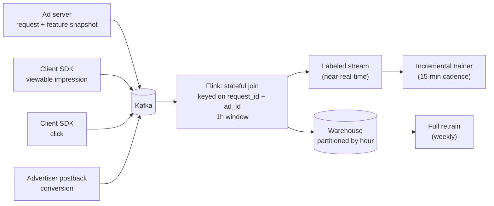
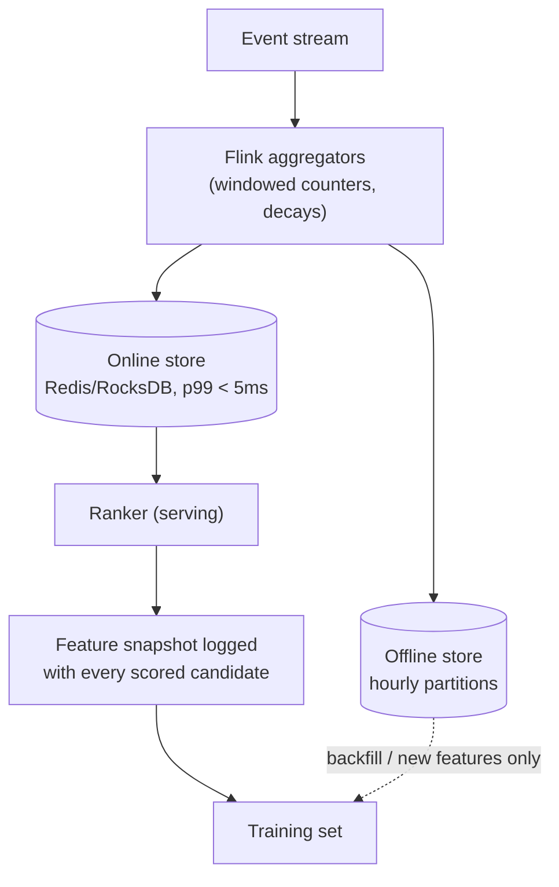
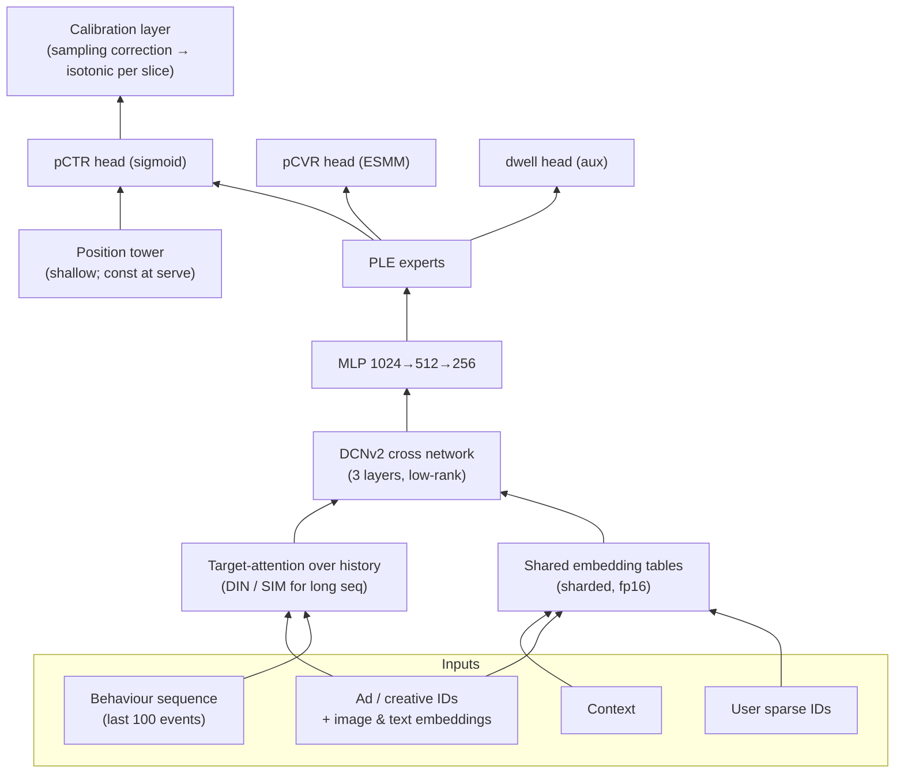
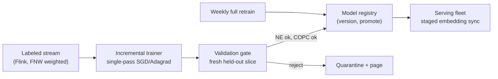

# Ad Click-Through Rate Prediction — ML System Design

Staff-level design walkthrough. The spine is the nine-step frame:
clarify → frame → metrics → data → features → model → serving → evaluation & rollout → monitoring.

Numbers below are worked for a mid-large ad platform (**100M DAU**). Every figure is derived, not
asserted — the point of a staff answer is that the interviewer can follow the arithmetic and push on
any single assumption without the design collapsing.

---

## Table of contents

1. [Clarify & scope](#1-clarify--scope)
2. [Frame as ML](#2-frame-as-ml)
3. [Metrics](#3-metrics)
4. [Data](#4-data)
5. [Features](#5-features)
6. [Model](#6-model)
7. [Serving](#7-serving)
8. [Evaluation & rollout](#8-evaluation--rollout)
9. [Monitoring & iteration](#9-monitoring--iteration)
10. [Roadmap, cost, and what I'd cut](#10-roadmap-cost-and-what-id-cut)
11. [Interview notes: the traps](#11-interview-notes-the-traps)

---

## 1. Clarify & scope

### 1.1 The business objective, stated honestly

CTR prediction is never the product. The product is an **auction**. pCTR is the input that converts
an advertiser's willingness-to-pay-per-click into an expected-value-per-impression the platform can
rank on:

```
eCPM_i  =  bid_i  ×  pCTR_i  ×  quality_i  ×  1000
```

The ad with the highest eCPM wins; under **GSP** pricing the winner pays the minimum bid that would
have kept its position:

```
price_i  =  eCPM_(i+1) / (pCTR_i × 1000)      # cost-per-click charged to winner i
```

Two consequences that drive the entire rest of the design:

- **pCTR enters the price, not just the ranking.** A ranking-only model can be monotone-wrong and
  still be fine. Here, a systematic +10% bias changes what advertisers are charged. **Calibration is
  a revenue correctness property, not a nice-to-have.** This is the single most important thing to
  say in the first two minutes.
- **The objective is a three-way constrained optimization**: platform revenue, advertiser ROI
  (they leave if pCTR is inflated and clicks don't convert), and user experience (ad load, relevance,
  long-term retention). Optimizing pure short-term revenue is the classic way to lose the account.

**Objective I'd write on the board:** maximize revenue per session subject to (a) user-side guardrails
on session depth / retention, (b) advertiser-side guardrails on delivered ROI, (c) latency and cost SLAs.

### 1.2 Questions I'd ask before designing anything

| Question | Why it changes the design | Assumption I'll carry |
|---|---|---|
| Which surface — feed, search, video pre-roll? | Search has query intent → text matching dominates. Feed has no query → user-history modeling dominates. | **Feed**, non-search |
| Billing model — CPC, CPM, CPA? | CPC makes pCTR revenue-critical. CPM makes it only a quality signal. CPA needs a CVR model too. | **CPC**, with a CVR follow-on |
| QPS and peak/avg ratio | Sizes the fleet, decides GPU vs CPU | **23k avg / 50k peak** ad requests/s |
| End-to-end latency SLA for the ad slot | Decides model depth and whether features are precomputed | **p99 ≤ 120ms** total, **≤ 40ms** for the ranker |
| Candidate pool size | Decides whether we need retrieval + pre-ranking at all | **~10M** eligible ads |
| Ads per request | Sizes the ranker batch and the log volume | **~4** slots, ~300 scored |
| Attribution window for a click | Decides label wait time and delayed-feedback handling | **1h** click window |
| Existing infra — feature store? streaming? GPU fleet? | Determines whether "online learning" is a paragraph or a year | Kafka + Flink + Spark, an offline FS, no online FS yet, small GPU fleet |
| Regulatory surface — EU users? ATT? | Decides on-device / aggregated-only paths | GDPR applies; consented-traffic only |

### 1.3 Back-of-envelope

**Traffic**

```
100M DAU × 20 ad requests/user/day  = 2 × 10⁹ requests/day
2e9 / 86,400                        ≈ 23k QPS average
peak ≈ 2.2×                         ≈ 50k QPS
```

**Funnel per request** (this is why it is two-stage — actually four-stage):

```
10M eligible ads
  → targeting + ANN retrieval        → ~10,000     (O(1ms), inverted index + ANN)
  → pre-ranking (two-tower + tiny MLP) → ~300       (~3ms, 10k cheap scores)
  → ranking (DCNv2 + behavior tower)   → ~300 scored (~25ms, one batched pass)
  → auction + pacing + policy          → 4 shown
```

**Ranker compute.** Input ≈ 1,000-dim after embedding concat; MLP 1024→512→256→1 ≈ 1.2M MACs ≈
2.4 MFLOP per candidate.

```
per request : 300 × 2.4 MFLOP        ≈ 0.7 GFLOP
at 50k QPS  : 0.7 GFLOP × 5e4        ≈ 35 TFLOP/s
```

An A100 at fp16 nominally does ~300 TFLOP/s but realizes **10–15%** on small-batch MLPs with heavy
embedding gather → ~35 TFLOP/s effective. So the *math* is ~1–2 GPUs. **The compute is not the
bottleneck — the embedding gather is.** 300 candidates × ~120 sparse features × 32-dim × 4B ≈ 4.6MB
of random-access reads per request; at 50k QPS that's ~230 GB/s of pure gather, i.e. HBM-bandwidth
bound. Real fleet is sized by memory bandwidth + redundancy + tail latency, landing at **~30–60
accelerators across 3 regions**, not 2.

**Embedding table**

```
user IDs      100M
ad/creative    10M
advertiser      1M
hashed crosses 2²⁸ ≈ 268M
──────────────────────
≈ 4 × 10⁸ rows × 32 dim × 4B (fp32) ≈ 51 GB
                        × 2B (fp16) ≈ 26 GB   ← fits in 2–4 GPUs, shard by feature
```

**Logging**

```
2e9 requests/day × 4 impressions = 8 × 10⁹ impressions/day
feature snapshot ≈ 400B compressed
                → 3.2 TB/day raw impression log
negatives downsampled 10:1 for training → ~350 GB/day trainable
90-day retention ≈ 290 TB (hot 7d on SSD, rest on object storage)
```

**Sanity check on labels:** at CTR ≈ 1%, 8e9 impressions/day → **80M positives/day**. Plenty of data;
the constraint is never sample count, it is *label quality, freshness and bias*.

---

## 2. Frame as ML

### 2.1 Label

**Binary click on an impression, attributed within a 1-hour window.**

The subtleties, which is where the staff signal lives:

- **Impression, not request.** The example only exists if the ad was actually rendered and viewable
  (MRC: ≥50% pixels, ≥1s). Training on served-but-never-viewed ads teaches the model to predict
  viewport behaviour, not interest.
- **Invalid traffic is stripped before labeling.** Bots have ~10× CTR and would dominate the
  positive class. IVT filtering happens upstream of the training set, and *the filter's decisions are
  logged* so we can measure how much data it removes and detect filter regressions.
- **De-duplicate rage-clicks / accidental clicks.** One click per (user, ad, session). Very short
  dwell after click (<2s bounce-back) is a strong negative signal — some platforms model it as a
  separate "quality click" head rather than dropping it.
- **Deletion of the label is not deletion of the example.** A GDPR erasure request removes the user's
  rows and their user-ID embedding, but aggregate counters survive.

### 2.2 Granularity of a training example

**One (request, candidate-ad, position, timestamp) tuple** — a single impression — with the features
**as they were at request time**.

That last clause is the whole ballgame. The example is built from a **feature snapshot logged
synchronously at scoring time**, not recomputed later from warehouse tables. Recomputation is the
number-one source of train/serve skew: the counter that read "37 clicks in 24h" at 14:02:11 will read
something else when the ETL runs at midnight, and the model learns a distribution that never exists at
serving time. Cost: ~400B/impression of log. Worth every byte.

```
example = {
  request_id, user_id, ad_id, position, ts,
  features: <snapshot blob, exactly the vector the model scored>,
  label: 0/1,  label_ts,
  propensity: p(shown | context),      # for IPS
  exploration_flag: bool,              # was this from the random-traffic slice
  model_version, sampling_weight
}
```

### 2.3 Loss

**Binary cross-entropy on the sigmoid output**, per-example weighted:

```
L = -(1/N) Σ  wᵢ · [ yᵢ log σ(zᵢ) + (1-yᵢ) log(1-σ(zᵢ)) ]
```

where `wᵢ` carries (a) negative-downsampling correction, (b) delayed-feedback importance weight,
(c) optionally an IPS position-debias weight.

Why logloss and not AUC-surrogates / pairwise ranking losses:

- **It is a proper scoring rule** — minimized exactly at the true probability. Pairwise/listwise losses
  (BPR, LambdaRank) are ranking-optimal but produce uncalibrated scores, which we established in §1.1
  is a pricing bug. If we ever add a ranking loss it goes in as an *auxiliary* head with the calibrated
  logloss head remaining the pricing path.
- **Focal loss / class rebalancing is usually wrong here.** People reach for it because CTR is 1%
  imbalanced. But focal loss deliberately distorts probabilities away from the true posterior. Imbalance
  is handled by downsampling + an analytic calibration correction (§4.3), which is bias-free.

**Multi-task extension** (once CVR matters): shared bottom → **MMoE/PLE** experts → per-task towers for
{CTR, CVR, dwell}. CVR is trained in the **ESMM** formulation — `p(click ∧ convert) = pCTR × pCVR`
optimized over the *full impression space* — because training pCVR only on clicked impressions is a
textbook sample-selection-bias trap: at serving time you apply it to unclicked impressions too.

---

## 3. Metrics

### 3.1 Offline

| Metric | Definition | What it catches | Target |
|---|---|---|---|
| **LogLoss** | `-1/N Σ y log p + (1-y) log(1-p)` | The optimization objective itself | ↓ |
| **NE** (normalized entropy) | `LogLoss / H(base CTR)` | LogLoss is unreadable across periods because base CTR moves; NE normalizes it out. **This is the headline offline number.** | < 1, ↓ |
| **AUC** | ranking quality, global | Coarse; a +0.001 AUC can be worth millions | ↑ |
| **GAUC** | `Σ nᵤ·AUCᵤ / Σ nᵤ`, per-user | Global AUC is inflated by trivially separating heavy users from light users. GAUC measures *within-user* ranking, which is what the auction actually does. **Report GAUC, not AUC.** | ↑ |
| **COPC** | `Σ clicks / Σ pCTR` | Calibration in one number. 1.0 = perfect | 0.98–1.02 |
| **ECE / calibration plot** | binned \|mean(y) − mean(p)\| | Where the miscalibration lives | ↓ |
| **PR-AUC** | | More informative than ROC-AUC at 1% positives | ↑ |
| **Sliced everything** | by placement, country, ad-vertical, new-vs-established ad, device, position | **Aggregate calibration hides compensating errors** — over-predict on new ads, under-predict on established, COPC = 1.00 and advertisers are being mispriced in both directions | per-slice COPC ∈ [0.95, 1.05] |

**NDCG@k / precision@k**: I'd report them, but flag the mismatch out loud. Both are relevance-ranking
metrics; the ad slate is chosen by *eCPM*, not pCTR, so a model that improves NDCG@4 on pCTR can lose
revenue. Where they earn their place is the **retrieval/pre-ranking stage**, where the job genuinely
is "did the top-300 contain the ads the ranker would have wanted" — measured as **recall@300 against
the full ranker's top-300**, which is the metric I'd actually put an SLO on.

**Evaluation split is temporal, always.** Random k-fold on ad data leaks the future: the same
campaign, same user, same hour appears on both sides. Train on days `[t-30, t-1)`, validate on `[t-1, t)`,
and re-run with the split walked forward several times to see variance. Any offline result from a
random split should be treated as unreported.

### 3.2 Online

| Tier | Metric | Note |
|---|---|---|
| **Primary** | Revenue per mille requests (RPM) | The decision metric |
| | Realized CTR | Should move with pCTR quality |
| **Advertiser** | Delivered CPA / ROAS, budget delivery %, spend Gini | If revenue is up but ROAS is down we borrowed from next quarter |
| **User** | Session depth, D1/D7 return rate, ad-hide & report rate, time-to-first-scroll-past | The long-term-damage detector |
| **Guardrails (hard fail)** | p99 latency, error rate, ad-load, policy-violation rate, COPC drift, per-country revenue | Any breach auto-halts the ramp |

**The offline→online gap is expected and should be predicted in advance.** State the belief before the
test: "−0.4% NE should give roughly +0.5–1% RPM." When online lands at +0.05%, the interesting work
starts, and the usual culprits are (a) the auction absorbing the gain, (b) position bias not actually
removed, (c) the model improving on impressions we never win.

---

## 4. Data

### 4.1 Sources and the join



The join is the piece that breaks in production. Impressions arrive within seconds; clicks arrive over
an hour; mobile clients buffer events and flush on next app-open, which can be **days**. So:

- Flink keeps a **1h window** keyed on `(request_id, ad_id)`; at window close, unmatched impressions
  emit as negatives.
- Late clicks past the window go to a **correction stream** that emits a `(example, y: 0→1)` repair
  used to reweight, not silently dropped — dropping them systematically under-predicts on
  slow-converting verticals.
- **Clock skew is real**: client timestamps are attacker- and bug-controlled. Order by server receive
  time; treat client time as a feature, not as truth.

### 4.2 Delayed feedback — the defining data problem

At window close, a "negative" is one of two things: a genuine non-click, or a click that hasn't
arrived yet. Training as if all are genuine biases pCTR **down**, and the bias is *not uniform* — it's
worst on exactly the verticals with the slowest click behaviour.

Three approaches, in the order I'd deploy them:

1. **Wait-and-weight (ship first).** Window at 1h, and importance-weight examples by
   `1/P(click observed by 1h)` estimated per vertical from the empirical delay CDF. Cheap, ~80% of the win.
2. **Fake-negative weighted (FNW).** Ingest every impression immediately as a negative; when the click
   arrives, ingest a *second* example as a positive. With importance weights
   `w⁻ = 1/(1+p)`, `w⁺ = (1+p)/p` the loss is unbiased for the true `p`. This is what you want for a
   streaming trainer, because it never stalls waiting for labels.
3. **Delayed-feedback model (Chapelle).** Jointly model `P(click)` and an exponential delay
   `P(delay | click)`; the survival term corrects the censoring analytically. Best accuracy, most
   machinery — worth it only after 1 and 2 are in place and measured.

### 4.3 Imbalance & sampling

Keep **all positives**, downsample negatives to `w = 0.1`. 10× less data, ~no AUC loss, and then
**undo the distortion analytically instead of hoping the model absorbs it.**

Downsampling scales the odds by exactly `w`, so inverting it is one line:

```
odds_true = w · odds_sampled
p_true    = (w · q) / (1 − q + w · q)         where q = model output
```

Check: `w=1 → p=q` ✓.  `w=0.1, q=0.5 → p = 0.05/0.55 = 0.0909` ✓ (odds 1 → 0.1).

Apply this **before** the auction and before any isotonic layer, so the learned calibrator only has to
fix real model error, not a known algebraic offset.

### 4.4 Leakage — the checklist I'd actually run

- **Temporal.** Any aggregate feature must be computed over a window strictly *before* `request_ts`.
  "Ad CTR over the last 24h" computed from a daily table that includes the current impression leaks
  the label directly and produces a spectacular offline AUC that evaporates online. This is the most
  common single cause of "great offline, flat online."
- **Point-in-time correctness.** Enforced structurally: the training set is built by *replaying the
  logged snapshot*, not by joining to current-state dimension tables. If a feature can't be logged at
  request time, it doesn't ship.
- **Label proxies.** `is_viewable`, dwell time, `post_click_*` — anything only knowable after the
  outcome. Audit: any feature whose single-feature AUC > 0.75 is guilty until proven innocent.
- **Group leakage.** Same user or campaign on both sides of the split. Temporal split mostly handles
  it; verify.
- **Feedback leakage.** Training on data generated by the current model, without exploration, means
  the model can only confirm itself. See §9.3.

### 4.5 Position & selection bias

Two distinct biases, often conflated:

**Position bias** — pCTR at slot 1 ≫ slot 4 for the same ad. Model it multiplicatively
(examination hypothesis):

```
P(click) = P(examine | position) × P(relevant | user, ad)
```

Implementation: a **shallow position tower** whose output is combined with the main tower and which is
fed a *constant* (position = 1) at serving. The main tower is then forced to learn position-free
relevance. Cheaper alternative: position as a plain input feature, held constant at inference — works,
but leaks position into the interaction layers.

**Selection bias** — we only ever observe outcomes for ads the current model chose to show. Fixed only
by **exploration**: a **1% randomized-slate traffic slice** where the ad set is chosen uniformly among
eligible ads. That slice is small in volume and enormous in value — it is the only *unbiased* dataset
in the building, and it's what makes IPS estimates and honest offline replay possible. I would fight
for this slice; it is the thing most teams skip and most regret.

Log the **propensity** `P(shown | context)` at serve time. You cannot reconstruct it later.

---

## 5. Features

### 5.1 The four families

| Family | Examples | Cardinality | Update cadence |
|---|---|---|---|
| **User** | user_id, demo bucket, country, device, tenure, lifetime CTR (smoothed), category affinities | 100M | daily + streaming counters |
| **Item (ad)** | ad_id, campaign, advertiser, vertical, creative embedding (image/text), bid, historical CTR by placement | 10M | on creation + streaming |
| **Context** | hour-of-week (cyclical), placement, slot position, app version, connection type, session index, is-cold-start | small | request time |
| **Interaction** | user×vertical CTR, user×advertiser prior impressions, time since last impression of this campaign, frequency-capping counters | huge (hashed) | streaming |
| **Sequence** | last 100 ads impressed/clicked, last 50 organic items engaged, as ID sequences with timestamps | — | streaming |

**The sequence features are where the modeling gains actually are.** Static user aggregates saturate
fast; the user's recent behaviour sequence, attended over by the candidate ad (DIN, §6.3), is the
feature that keeps paying.

### 5.2 Encoding

- **Hashing** every sparse ID into `2²⁵–2²⁸` buckets. Collisions are tolerable for tail IDs and
  disastrous for head IDs → **frequency-aware**: top-N IDs get dedicated rows, tail hashes into a
  shared space. Log the collision rate on head traffic as a monitored metric.
- **Mixed-dimension embeddings** — dim ∝ log(frequency). A 10k-impression ad does not deserve the same
  32 dims as a 10M-impression one; uniform dims spend most of the table on noise.
- **Count features get Bayesian smoothing**, never raw ratios:
  `CTR̂ = (clicks + α·prior) / (impressions + α)` with `prior` from the parent node in the hierarchy
  (ad → campaign → advertiser → vertical). This *is* the cold-start mechanism, and it degrades
  gracefully instead of cliff-edging.
- **Time decay** on counters — exponential with per-feature half-lives (~1d for context-level, ~7d for
  ad-level, ~30d for user-level). A 30-day-flat CTR is a lagging indicator of a campaign that changed
  creative yesterday.
- **Continuous features**: log1p + quantile-bucketize into embeddings rather than feeding raw. Ad-tech
  numerics are heavy-tailed; a raw bid value destroys the first layer's conditioning.

### 5.3 Feature crosses — the core of the whole problem

CTR is an *interaction* problem. Marginal `P(click | user)` and `P(click | ad)` are nearly useless
alone; the signal is `P(click | user × ad × context)`. How crosses are represented is the main axis
along which CTR architectures differ, and the reason the field moved as it did:

| Generation | Cross mechanism | Order | Cost | Limitation |
|---|---|---|---|---|
| LR + hashing | **Hand-crafted** conjunctions, hashed | 2–3 | trivial | Human-authored; combinatorial explosion; zero generalization to unseen pairs |
| FM / FFM | `⟨vᵢ, vⱼ⟩` over embeddings | 2 only | cheap | Generalizes to unseen pairs (the key advance over LR) but stuck at order 2 |
| Wide & Deep | Wide memorizes crosses, deep generalizes | 2 + implicit | moderate | Wide side is still hand-authored |
| DeepFM | FM order-2 + MLP | 2 + implicit | moderate | MLP crosses are *implicit* and empirically inefficient |
| **DCNv2** | Explicit `x₀ ⊙ (W xₗ + b) + xₗ`, low-rank W | **bounded degree L+1** | **low** | — |

Two points worth making explicitly, because they're the ones interviewers push on:

- **An MLP does not learn multiplicative crosses efficiently.** It's a universal approximator in
  theory; in practice approximating `xᵢ·xⱼ` with ReLU stacks takes many parameters and lots of data,
  and the empirical record (Wide&Deep → DCN) is that adding an *explicit* cross path beats making the
  MLP wider. This is why "just use a deep MLP" is the wrong answer.
- **Memorization and generalization are different jobs.** Hashed ID crosses memorize
  (`user_8471 × nike_creative_3` — high value, zero generalization); embedding dot-products generalize
  (unseen pairs get a sensible score from similar pairs). Production systems need both paths, which is
  exactly the Wide & Deep thesis and why the wide side never fully disappeared.

Practical cross engineering that still matters on top of DCNv2:
`user_country × ad_vertical`, `hour_of_week × placement`, `device × creative_format`,
`user_recent_category × ad_category`, `advertiser × user_tenure_bucket` — each hashed into its own
embedding space, frequency-thresholded so tail crosses (< ~50 impressions) fall back to the parent
feature rather than fitting noise.

### 5.4 Feature store & point-in-time correctness



**One definition, two stores, and the training set comes from the snapshot — not from the offline
store.** The offline store exists for *backfilling newly invented features* (where you accept the
skew knowingly for one training round, then switch to snapshots once the feature is live). Any team
that builds the training set by joining offline tables will ship train/serve skew forever and blame
the model.

Skew detection is a first-class job: replay a sample of logged requests through the offline pipeline
and assert feature-by-feature equality. Alert on mismatch rate > 0.1%.

---

## 6. Model

### 6.1 Baseline first — and mean it

**Logistic regression on hashed cross features, trained with FTRL-Proximal.** This is not a strawman;
it ran Google's ad system profitably for years.

Why it's the right first model:
- Trains in minutes, serves in microseconds, **perfectly calibrated by construction**.
- FTRL's L1 gives sparse weights → the model shrinks itself to what matters.
- It is the honest denominator. Every deep model must beat it on NE by a margin worth its serving cost.
- It establishes the entire *pipeline* — logging, labeling, calibration, A/B, rollback — which is 80%
  of the work and is where the project actually fails.

**Second rung: GBDT (or GBDT→LR).** Trees handle the dense/count features and heavy tails with no
feature engineering, and the Facebook GBDT-leaf-index→LR hybrid gives the sparse-cross benefit. But
trees cannot consume 100M-cardinality IDs or sequences — which is precisely the argument for going
deeper, and the argument should be made in those terms rather than "deep learning is better."

### 6.2 The justification for going deep

Three things GBDT structurally cannot do, each worth real money:

1. **High-cardinality ID embeddings** — learning that `user_8471` and `user_9932` behave alike is a
   representation-learning problem; trees can only split on it.
2. **Automatic high-order feature crossing** — hand-crafting `user_country × ad_vertical × hour` stops
   scaling at 3rd order; DCNv2 learns bounded-degree crosses in a parameter-efficient way.
3. **Variable-length behaviour sequences with target-dependent attention** — DIN's core insight: the
   *same* user history should produce a *different* user representation depending on which ad is being
   scored. A user's interest in running shoes is relevant when scoring Nike and irrelevant when scoring
   car insurance. No fixed-length user vector can express that.

### 6.3 Target architecture



Design choices worth defending:

- **DCNv2 over DeepFM/xDeepFM** — better accuracy/FLOP, low-rank cross weights cut parameters ~4×, and
  it's stable to train. xDeepFM's CIN is expensive for the marginal gain.
- **SIM/ETA for long histories.** DIN over 100 events is fine; over 1,000+ the attention cost is
  prohibitive at 300 candidates/request. SIM's two-stage (hard search by category → attention over the
  retrieved ~50) makes lifetime histories tractable — a large win for heavy users.
- **PLE over MMoE** for multi-task: MMoE still suffers seesaw between CTR and CVR because all experts
  are shared; PLE's task-specific + shared expert split largely resolves it.
- **Auxiliary heads regularize.** Dwell-time is dense signal where clicks are sparse; it stabilizes
  embeddings for tail ads even though it never ships to the auction.

### 6.4 Training

- **Full retrain weekly** on 30–60 days; **incremental update every 15 minutes** on the streaming
  labeled data. Ad distributions move hourly — campaigns launch, budgets exhaust, creatives rotate.
  A day-stale model is a measurably worse model, and freshness is usually a bigger win than
  architecture. Say this out loud; it's an underrated staff-level point.
- **Data-parallel dense + model-parallel embeddings** (TorchRec / HugeCTR style). Embedding tables
  sharded by feature across GPUs; all-to-all for the gather.
- **One epoch.** With 80M positives/day, multi-epoch training overfits ID embeddings hard. Streaming
  single-pass is both cheaper and better — a genuinely counterintuitive property of this domain.
- **Embedding hygiene:** TTL-evict IDs unseen for 30d, and require a minimum impression count before
  an ID gets its own row (until then it uses the hierarchy prior). Without eviction the table grows
  without bound and most of it is noise.
- **Guard against the online-learning failure mode:** an incremental model can drift into a bad state
  between full retrains. Every incremental checkpoint is validated on a held-out fresh slice with an
  auto-reject threshold on NE and COPC before it's promoted.

### 6.5 Online learning as a subsystem

"Retrain every 15 minutes" is one line in a design doc and a quarter of engineering. Treated properly:



The failure modes are specific and each needs an explicit control:

- **Silent divergence.** A single-pass online model can walk into a bad region and stay there — there
  is no epoch boundary to notice at. Control: every candidate checkpoint is scored on a **fresh,
  held-out, label-complete slice** and auto-rejected on NE or COPC regression. Nothing self-promotes.
- **Poisoning by an upstream incident.** A logging bug or a bot wave gets learned within minutes at
  this cadence — online learning converts a data incident into a model incident *fast*. Control:
  anomaly detection on the input stream (volume, CTR, feature nulls) that **pauses** the trainer rather
  than feeding it garbage; a paused-but-stale model is far cheaper than a poisoned fresh one.
- **Catastrophic forgetting of periodic patterns.** A model updated continuously on the last few hours
  over-fits the current hour and forgets weekend behaviour. Control: the **weekly full retrain is the
  anchor**; incremental updates are a delta on top of it, and drift between the two is monitored
  (predict both, compare distributions). If they diverge beyond a threshold, snap back to the anchor.
- **Learning-rate schedule.** There is no "end of training", so decaying to zero is wrong and a large
  constant rate is unstable. Per-coordinate adaptive methods (Adagrad/FTRL) with a **floor** on the
  effective rate for embeddings, so rare IDs stay learnable while head IDs stabilize.
- **Model/embedding propagation.** A 26 GB table can't be shipped every 15 minutes. Ship **delta
  updates** for touched rows, apply them atomically per shard, and version the whole thing so the
  pCTR cache and the calibrator invalidate together. Staged, region by region.
- **Reproducibility.** Continuous training destroys "rerun the training job" as a debugging tool.
  Control: retain the ordered input stream with offsets so any model version can be *replayed* exactly.

**When online learning is not worth it:** if the ad inventory is stable and traffic is low-volume,
daily retraining captures most of the value at a fraction of the complexity. The argument for 15-minute
updates is specifically that campaigns, budgets and creatives churn on the scale of hours. State the
condition, don't cargo-cult the cadence.

### 6.6 Calibration layer

Even a logloss-trained net drifts out of calibration after downsampling, distribution shift, and
online updates. So calibration is an explicit, separately-monitored component:

1. Analytic downsampling inversion (§4.3).
2. **Isotonic regression** fit on a rolling recent window (last few hours), **per major slice**
   (placement × country × ad-age-bucket) with hierarchical fallback when a slice is thin.
3. Refit every 15–30 minutes; monitor COPC per slice; alert outside [0.95, 1.05].

Isotonic over Platt because the miscalibration here is non-monotone-in-shape and we have abundant data;
Platt's single logistic is too rigid.

---

## 7. Serving

### 7.1 Request path & latency budget

```mermaid
sequenceDiagram
  participant C as Client
  participant G as Ad gateway
  participant R as Retrieval
  participant F as Feature store
  participant M as Ranker (GPU)
  participant A as Auction
  C->>G: ad request
  G->>R: targeting + ANN (10M → 10k)
  R->>G: candidates
  G->>F: batched user + ad feature fetch
  F->>G: vectors
  G->>M: pre-rank 10k → 300, then rank 300 (one batch)
  M->>G: pCTR[300]
  G->>A: eCPM = bid × pCTR × quality; GSP; pacing; policy
  A->>C: 4 ads
```

| Stage | p99 budget |
|---|---|
| Gateway, parse, auth | 5 ms |
| Retrieval (index + ANN) | 15 ms |
| Feature fetch (batched, parallel) | 20 ms |
| Pre-ranking (10k, two-tower) | 10 ms |
| Ranking (300, batched forward) | 25 ms |
| Calibration + auction + pacing | 10 ms |
| Serialization, slack | 15 ms |
| **Total** | **100 ms** (SLA 120) |

### 7.2 Precompute vs. real-time

| Component | Where | Why |
|---|---|---|
| Ad-side embeddings | **Precomputed**, refreshed on creative change | Ad set changes slowly; ~10M vectors is a cache, not a computation |
| User static embedding | **Precomputed** nightly + streaming patch | Expensive, changes slowly |
| User sequence attention | **Real-time** | It is target-dependent by construction — that's the entire point of DIN |
| Counters / frequency caps | **Real-time** from online store | Correctness-critical, changes per impression |
| Full pCTR | **Real-time** | 10M ads × 100M users is not a table you materialize |

The **two-tower pre-ranker** is what makes this affordable: the user tower is computed **once per
request**, the ad tower is **precomputed offline**, so scoring 10k candidates is 10k dot products
(~10 MFLOP — free). The heavy interaction model then only runs on 300. Note the deliberate
architectural asymmetry: the pre-ranker *cannot* have early user-ad interaction, or the ad tower stops
being precomputable. That constraint is the reason two-tower models look the way they do.

**Keeping the stages consistent** matters more than making each stage individually strong: distill the
pre-ranker from the ranker's scores (not from clicks), so it selects what the ranker would have wanted.
A pre-ranker optimized independently produces high recall@300 on the wrong 300.

### 7.3 Caching

| Cache | Key | TTL | Hit rate |
|---|---|---|---|
| Ad embeddings | ad_id | until creative change | ~100% |
| User features | user_id | 60s (session-local) | 70–85% |
| pCTR | (user, ad, placement) | **30–60s only** | 10–20% |

pCTR caching is deliberately short: frequency-capping and pacing state change per impression, and a
stale pCTR is charged for. **Never cache across a model version** — key the cache on model version so
a deploy invalidates it atomically.

### 7.4 ANN index

Retrieval is targeting-filter ∩ ANN. The hard part is that ad targeting is a **hard constraint**
(geo, age, budget, brand-safety, exclusions), and naive post-filtering of ANN results can return an
empty set for narrow targeting.

- **HNSW** with **filtered search** (filter evaluated during graph traversal), or partitioned indexes
  per major targeting cell (country × language) with brute-force for small cells.
- Rebuild incrementally; **new ads must be searchable within seconds**, not on the nightly build — a
  campaign that launches at 9am and enters the index at midnight is a lost day of advertiser spend and
  a support ticket.
- Budget-exhausted and paused campaigns must leave the index **immediately** — serving an ad that
  can't be charged is pure loss.

### 7.5 Auction, pacing & budget control

pCTR is consumed by a control system, and the interaction between them is where model wins get eaten.

**Ranking and pricing.** Rank by `eCPM = bid × pCTR^α × quality`. The exponent `α` is a real knob:
`α > 1` sharpens toward relevance (user-favourable, revenue-risky short-term), `α < 1` toward bid
(revenue-favourable, degrades experience). It's a business dial, tuned by A/B, not a model parameter —
and noticing that pCTR *isn't* consumed linearly is a good sign in an interview.

Reserve prices floor the auction. Under GSP the winner pays
`price = eCPM₂ / (pCTR₁ × 1000)` — note pCTR₁ in the **denominator**, so miscalibration moves revenue
in a direction that isn't obvious: over-predicting wins more auctions but charges less per click.
This is why COPC is a revenue metric.

**Budget pacing.** An advertiser with €1,000/day and enough demand to spend it by 09:00 must not: they
would buy only cheap morning traffic and miss the day's best users, and the platform loses the
opportunity to run a competitive auction all day. Two standard mechanisms:

- **Probabilistic throttling** — enter the auction with probability `p_pace ∈ (0,1]`.
- **Bid shading** — scale the effective bid by `λ ∈ (0,1]`.

Bid shading is generally preferable: throttling makes a campaign invisible for stretches, while
shading keeps it competitive on the impressions where it's most valuable. Both are driven by a
**feedback controller** (PID-style) over the spend curve:

```
target_spend(t) = daily_budget × traffic_fraction_elapsed(t)     # traffic-shaped, not linear-in-time
error(t)        = actual_spend(t) − target_spend(t)
λ(t+1)          = clip( λ(t) − Kp·error − Ki·Σerror , 0, 1 )
```

Shaping the target by *historical traffic distribution* rather than wall-clock is the detail that
matters — linear-in-time pacing systematically over-spends in low-traffic hours.

**Where this couples back to the model — the point of putting it in a CTR design doc:**

1. **Pacing is a control loop closed around pCTR.** A model that raises pCTR globally raises eCPMs,
   campaigns hit budget sooner, pacing throttles harder, and the measured revenue lift is *smaller*
   than offline replay predicted. Not a bug — the marketplace absorbing the gain. Expect it and say so.
2. **Pacing state is a feature** (`campaign_pacing_ratio`, `budget_remaining_pct`) and it is a
   **train/serve skew hazard**: it changes minute to minute, so it must come from the snapshot.
3. **Budget exhaustion creates distribution shift in training data.** Big spenders disappear from
   evening traffic, so evening data has a different ad mix. A model trained without time-of-day
   context learns the artifact.
4. **Frequency capping and pacing interact with A/B interference** (§8.3) — shared budget is exactly
   the shared state that couples the arms.

### 7.6 Degradation ladder

Never fail the ad request; ads are revenue. In order:

1. Feature-store timeout (>20ms) → serve with defaults/priors for missing features, flag the example
   (and **exclude flagged examples from training** — they teach the model the outage).
2. Ranker timeout/unhealthy → fall back to the **pre-ranker score**.
3. Pre-ranker down → fall back to **static historical CTR × bid**.
4. Everything down → house ads / no ad. Never a 500.

Each level is a monitored counter, because silent degradation that fires 5% of the time is a revenue
leak nobody sees.

---

## 8. Evaluation & rollout

Four gates, each cheap enough to run and strict enough to catch a class of failure the next one can't.

### 8.1 Offline replay

Temporal split, NE / GAUC / COPC, sliced. Then **counterfactual estimation** on the 1% exploration
slice, because "would this model have made more money" is a different question than "does it predict
clicks better":

```
IPS:  V̂ = (1/N) Σ  (π_new(a|x) / π_log(a|x)) · r
```

with **weight clipping** (~10) to control variance, and **doubly-robust** where a reward model is
available. Report the effective sample size — an IPS estimate with ESS of 200 is a number-shaped
opinion, not evidence.

Caveat to state before anyone asks: IPS estimates the *ranking* change but **not the auction
equilibrium** — advertisers rebid in response. Offline replay systematically overstates revenue gains,
which is a large part of why offline-to-online shrinkage is the norm.

### 8.2 Shadow

New model scores **100% of live traffic**, results logged, **nothing served**. Validates:
- Latency and cost at real peak load (the thing load tests miss).
- Train/serve skew: shadow-computed features vs. logged snapshot, feature-by-feature.
- Prediction distribution vs. control — a shifted histogram before any user is affected.

Run ≥24h to cover a full daily cycle. Shadow catches the boring failures, which are most failures.

### 8.3 A/B

**Randomization unit: user** (sticky hash), not request — request-level randomization leaks via
frequency capping and user-level counters.

**The interference problem, which is the hard part and where staff candidates separate themselves:**
advertisers have **shared budgets across arms**. If the treatment arm spends a campaign's budget
faster, the control arm sees fewer ads from it — the arms are not independent, and the naive estimate
is biased in the direction of exaggerating the treatment.

Mitigations, in increasing order of cost:
- **Budget-split testing**: split each campaign's budget proportionally to the arms.
- **Cluster/geo-level randomization** for large ramps — kills the interference, costs statistical power.
- **Switchback (time-sliced)** testing when marketplace effects dominate.
- Always **run an A/A first**. If A/A shows a significant difference, the framework is broken and every
  result from it is noise.

**Design**: power the test up front (Δ, α=0.05, 80% power → required N and duration), apply **CUPED**
with pre-period metrics for variance reduction (typically 30–50% shorter tests), run ≥1 full week to
cover weekly seasonality, and correct for multiple comparisons across the metric suite. Watch for the
**novelty effect** — a new model often shows an inflated first-days lift that decays.

### 8.4 Ramp

```
1% → 5% → 20% → 50% → 100%,  ≥24h at each step
```

with **automatic rollback** on any guardrail breach (p99 latency, error rate, COPC out of band,
revenue drop beyond CI, policy-violation rate). Model artifacts are versioned in a registry with a
one-command rollback; rollback must be **faster than roll-forward** and rehearsed, not theoretical.

Finally: a **long-term holdback** — 1% of users never see the new stack for a quarter. It's the only
way to see cumulative effects (ad fatigue, retention erosion) that a 1-week A/B is structurally blind
to. It costs a little revenue and it's the difference between knowing and hoping.

---

## 9. Monitoring & iteration

### 9.1 What's on the dashboard

| Layer | Signal | Alert |
|---|---|---|
| **System** | p50/p99/p999 latency, QPS, error rate, degradation-ladder counters, GPU util | page |
| **Data** | feature null-rate, cardinality drift, feature distribution PSI, join-success rate, event lag | page on join/lag |
| **Prediction** | pCTR histogram vs. yesterday (KS/PSI), mean pCTR, per-slice COPC | page on COPC band |
| **Model** | rolling NE, GAUC on fresh labels, calibration curves, embedding-table growth & collision rate | ticket |
| **Business** | RPM, CTR, ad-load, spend distribution, advertiser delivery %, new-ad share of impressions | page on revenue |
| **Skew** | logged-snapshot vs. recomputed feature mismatch rate | page > 0.1% |

**Prediction drift alerts before label drift** — pCTR distribution shifts within minutes of a bad
deploy, while NE needs labels to land. It's the fastest reliable canary you have.

### 9.2 Drift → retraining triggers

Retrain (or roll back) on any of:
- NE degradation > 2% relative vs. the post-deploy baseline over 6h.
- COPC outside [0.95, 1.05] on a major slice for > 1h **and** not fixable by refitting the calibrator.
- Feature PSI > 0.2 on a top-20-importance feature.
- New-ad share of impressions collapsing (cold-start path broken).
- Scheduled: incremental every 15 min, full weekly — floor, not ceiling.

### 9.3 Feedback loops — the thing that quietly rots the system

The model chooses what's shown; what's shown becomes training data; the model trains on its own
choices. Consequences: rich-get-richer on established ads, new ads never accumulating enough data to
escape their prior, and a slow narrowing of the served distribution that looks fine on every metric
because the metrics are computed on the narrowed distribution.

Countermeasures:
- **The 1% exploration slice** (§4.5) — unbiased eval data and unbiased training signal.
- **Uncertainty-aware exploration** for cold-start: Thompson sampling over a Beta posterior on the ad's
  CTR, or an ensemble/dropout variance estimate, so genuinely uncertain ads get boosted rather than
  every new ad being boosted blindly.
- **A guaranteed impression budget** for new campaigns (e.g. first 1,000 impressions at a boosted
  score), which is also a *marketplace health* requirement — advertisers won't stay on a platform where
  new campaigns can't get off the ground.
- **Regular audits of the served-ad diversity distribution** (entropy of the shown-ad distribution over
  time). A monotonically falling number is the loop tightening.

### 9.4 Position bias in production

Verify periodically that debiasing still works: on the randomized slice, the same ad in different
positions should show *equal debiased* pCTR. If the position tower silently stops binding (e.g. someone
changed the slot layout), the model relearns position as relevance and the whole ranking degrades in a
way no aggregate metric flags.

### 9.5 Privacy & policy, as engineering constraints

- **Consent-gated features.** Non-consented traffic runs a contextual-only model (no user IDs, no
  history). That's a *second model*, not a flag — plan for it, since in the EU it's a large share of
  traffic.
- **Right to erasure** must reach the embedding tables and log partitions, not just the user DB.
- **Retention limits** (e.g. 90d) bound the training window — an architecture requiring 2 years of
  history is not deployable in the EU.
- **Aggregated / on-device measurement** (ATT/SKAN, Privacy Sandbox) means conversion signal arrives
  noisy, delayed and k-anonymized. Design the CVR path to consume *aggregate* labels — this is the
  direction the whole industry is moving, and saying so demonstrates you're designing for 2026 and not
  2016.
- **Policy/brand safety** is a hard filter *before* ranking, never a soft score inside it.

---

## 10. Roadmap, cost, and what I'd cut

| Phase | Ship | Expected |
|---|---|---|
| **0 (wk 1–4)** | Logging + snapshot + label join, LR/FTRL, calibration, A/B framework, degradation ladder | The pipeline. Baseline NE. |
| **1 (wk 5–10)** | GBDT + hand-authored crosses w/ smoothing & decay, online feature store, pacing-state features, 15-min incremental + validation gate | −3–5% NE |
| **2 (wk 11–18)** | DCNv2 explicit crosses + embeddings, two-tower pre-ranker w/ distillation, position tower, exploration slice, `α` exponent tuning | −4–7% NE |
| **3 (q2)** | DIN/SIM sequences, per-slice isotonic, delayed-feedback weighting | −3–5% NE |
| **4 (q3)** | PLE multi-task + ESMM CVR, uncertainty-based cold-start | CVR path, advertiser ROI |

**Cost sanity.** ~40–60 accelerators + feature store + 3.2 TB/day logging lands in the low
single-digit millions/year. Against ad revenue at this scale that's small — but it's the number that
decides between DCNv2 and a 10× bigger model, so it belongs in the design, and "we chose the smaller
model because the marginal NE wasn't worth the serving cost" is a legitimate and senior answer.

**What I'd cut under time pressure**, in order: multi-task heads, long-sequence SIM, the DFM survival
model, xDeepFM-class architectures. **What I would not cut under any pressure**: feature snapshot
logging, the calibration layer, the exploration slice, and rehearsed rollback. Those four are cheap
now and unaffordable to retrofit.

---

## 11. Interview notes: the traps

Common failure modes in this question, and the answers that avoid them:

1. **Treating it as pure ranking.** pCTR sets the *price*. Lead with calibration; most candidates never
   mention it.
2. **Jumping to a transformer in minute three.** The baseline is not a formality — it's how you show
   you know that pipeline > architecture. Justify each rung by what the previous one *structurally*
   cannot do.
3. **Random train/test split.** Instant credibility loss. Temporal, always.
4. **Ignoring delayed feedback.** "Label is click" is only half an answer; the interesting half is what
   you do with the impression whose click hasn't arrived yet.
5. **Ignoring position bias.** If asked "why is offline great and online flat", position bias and
   temporal leakage are the first two hypotheses.
6. **Assuming A/B tests are independent.** Shared advertiser budgets couple the arms. Naming this
   unprompted is a strong staff signal.
7. **Forgetting cold start is a marketplace problem**, not just a modeling one — new advertisers who
   can't get delivery churn.
8. **No degradation story.** "What if the feature store is down?" should already be answered before it's
   asked.
9. **Handling imbalance with focal loss / SMOTE.** Distorts the probabilities you're being paid to get
   right. Downsample + invert analytically.
10. **Presenting freshness as an afterthought.** In ads, a 15-minute-fresh mediocre model routinely
    beats a day-stale excellent one.

---

### Selected references

Chapelle et al., *Simple and Scalable Response Prediction for Display Advertising* (2014) ·
Chapelle, *Modeling Delayed Feedback in Display Advertising* (KDD'14) ·
He et al., *Practical Lessons from Predicting Clicks on Ads at Facebook* (2014) ·
McMahan et al., *Ad Click Prediction: a View from the Trenches* (KDD'13) ·
Cheng et al., *Wide & Deep Learning* (2016) ·
Wang et al., *DCN V2* (2020) ·
Zhou et al., *Deep Interest Network* (KDD'18) ·
Pi et al., *Search-based User Interest Modeling (SIM)* (2020) ·
Ma et al., *ESMM* (SIGIR'18) · Ma et al., *MMoE* (KDD'18) · Tang et al., *PLE* (RecSys'20) ·
Ktena et al., *Addressing Delayed Feedback for Continuous Training* (RecSys'19) ·
Deng et al., *CUPED / variance reduction in online experiments* (WSDM'13)
