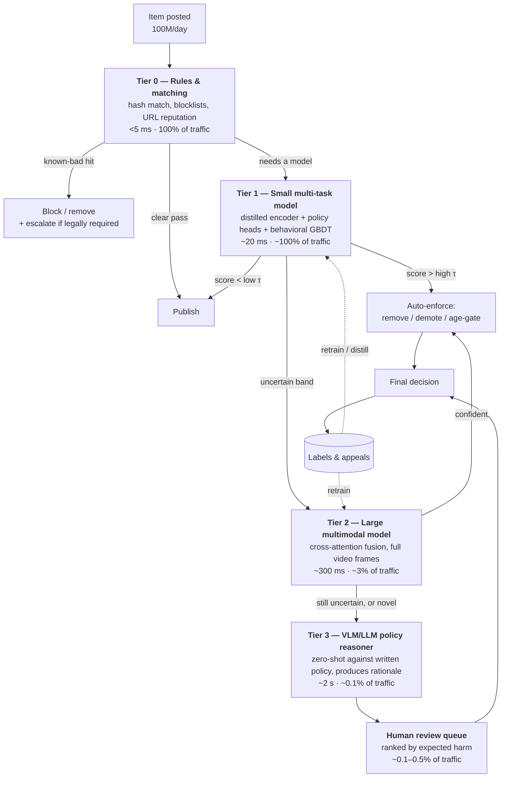
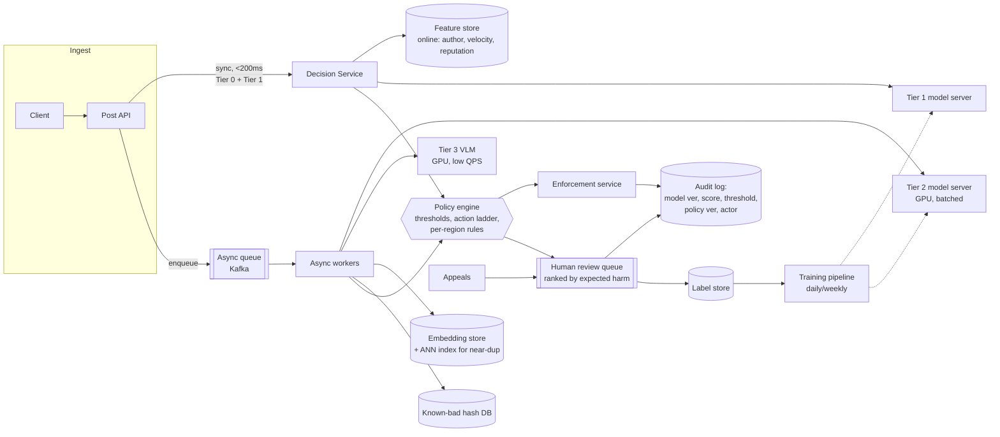

# Harmful Content Detection / Content Moderation — ML System Design

**Who this is for:** someone preparing for an ML system design interview who is *new to the domain* but expected to answer at a **staff engineer** bar. Every section has two layers:

- **Plain English** — what the thing actually is, no jargon assumed.
- **Staff-level move** — the sentence that separates a senior answer from a staff answer. These are the lines interviewers write down.

**How to read it:** skim §0 and §14 first (the 45-minute script and the memorized skeleton). Then read §1–§12 once slowly. Come back to §13 (trade-off table) and §15 (follow-up drills) the night before.

---

## Table of contents

0. [The 45-minute script](#0-the-45-minute-script)
1. [Clarify the problem](#1-clarify-the-problem)
2. [Frame it as an ML problem](#2-frame-it-as-an-ml-problem)
3. [Data and labels](#3-data-and-labels)
4. [Features and representations](#4-features-and-representations)
5. [Model architecture: the cascade](#5-model-architecture-the-cascade)
6. [Training](#6-training)
7. [Thresholds and the enforcement ladder](#7-thresholds-and-the-enforcement-ladder)
8. [Evaluation](#8-evaluation)
9. [Serving architecture](#9-serving-architecture)
10. [Back-of-envelope numbers](#10-back-of-envelope-numbers)
11. [Humans in the loop](#11-humans-in-the-loop)
12. [Monitoring, drift, and adversaries](#12-monitoring-drift-and-adversaries)
13. [Fairness, privacy, legal](#13-fairness-privacy-legal)
14. [Trade-off table + the memorized skeleton](#14-trade-off-table--the-memorized-skeleton)
15. [Follow-up drills](#15-follow-up-drills)
16. [If the interviewer anchors on fintech (bunq)](#16-if-the-interviewer-anchors-on-fintech-bunq)
17. [Glossary](#17-glossary)

---

## 0. The 45-minute script

Interviews fail on time management far more often than on knowledge. Budget:

| Minutes | Phase | What you must have produced |
|---|---|---|
| 0–6 | Clarify | Scope, scale numbers, latency budget, what "harmful" means here |
| 6–10 | Frame | ML objective, input → output, why multi-task |
| 10–16 | Data & labels | Sources, imbalance, label quality plan |
| 16–22 | Features | Per-modality, plus user/context features and fusion |
| 22–30 | Model | Baseline → cascade → why each tier exists |
| 30–36 | Serving | Diagram: sync vs async path, review queue, feedback loop |
| 36–42 | Evaluation | Offline metrics, online metrics, the prevalence holdout |
| 42–45 | Wrap | Failure modes, what you'd build first, what you'd cut |

**Rule:** draw the box diagram by minute 30 even if you have to abandon a branch of discussion. An interviewer cannot grade a system you never drew.

---

## 1. Clarify the problem

Do not start designing. Spend the first five minutes asking. Everything downstream — model size, latency, even whether ML is the right answer — is determined by these answers.

### Questions to ask (and the default assumptions to state if they say "you decide")

**Scope of "harmful"**
- Which policies? Assume a starting set: **violence & incitement, hate speech, harassment/bullying, adult nudity & sexual content, child sexual abuse material (CSAM), self-harm & suicide, regulated goods (drugs/weapons), spam & scams, terrorism/violent extremism, misinformation.**
- Is it one binary decision or per-policy decisions? → **Per-policy.** "Harmful" is not one concept; hate speech and spam share almost no signal.
- Do we only remove, or do we also *demote* and *label*? → Multiple actions, different confidence bars.

**Modality**
- Text only, or image/video/audio? → Assume **text + image + short video**, since real platforms are multimodal and the memes case is the interesting one.
- Languages? → Assume **global, 50+ languages**, most training data in English. This is a huge deal (§13).

**Where in the product**
- User posts, comments, DMs, profile bios, ad creative, payment notes? Each has different volume, different privacy posture, different latency budget.
- Is any of it end-to-end encrypted? If yes, server-side content models are *off the table* for that surface (§13).

**Scale and latency**
- Volume per day. Assume **100M items/day**, ~1.2k items/s average, ~3.5k/s peak.
- Latency: is it **pre-publish (synchronous)** or **post-publish (asynchronous)**?
  - Pre-publish blocking: budget **< 200 ms p99**. Only viable for the cheap tier.
  - Post-publish: seconds to minutes are fine, but *views accumulate while you think* — a viral post gets most of its reach in the first hour.

**Business objective**
- The thing you are actually optimizing: **reduce the number of times a user sees violating content**, without over-removing legitimate content, at a review cost the company can afford. Three-way tension. Say it out loud.

> **Staff-level move:** name the three-way tension (harm ↓, false positives ↓, human review cost ↓) and say that any single metric can be gamed by sacrificing another. Then propose the guardrail structure: *optimize prevalence subject to a false-positive ceiling and a fixed reviewer budget.*

### Functional vs non-functional requirements

**Functional**
- Score every item against every policy, produce a per-policy score + an action.
- Support pre-publish blocking for the highest-severity, cheapest-to-detect classes (e.g. known CSAM hash hits).
- Route uncertain items to human reviewers, ranked by expected harm.
- Support appeals; an overturned decision must become training data.
- Support emergency response: a new attack pattern must be blockable **within minutes** without retraining a model.

**Non-functional**
- Availability: the decision service is in the posting path — degrade open or closed? → **Degrade open for low-severity policies, closed for CSAM/terrorism.** Say this; it shows you think about failure.
- p99 latency budget for the sync path.
- Auditability: every enforcement decision must be reconstructable (model version, score, threshold, policy version). Regulators ask.
- Multi-region, data residency constraints.

---

## 2. Frame it as an ML problem

**Plain English:** we need to turn "is this post bad?" into something with a numeric input and a numeric output that we can measure.

**Input:** a content item — text, media, plus its context (author, audience, surrounding thread).
**Output:** for each policy *p*, a calibrated probability `P(item violates p)`, plus a severity estimate.

### Three ways to structure it

| Option | What it is | Pros | Cons |
|---|---|---|---|
| **A. One binary classifier** | "harmful or not" | Simplest, one threshold | Cannot apply policy-specific actions; can't explain to a user *which* rule they broke; different policies need different thresholds and different appeal handling |
| **B. N independent binary classifiers** | One model per policy | Each team owns its model; independent iteration | N× the training and serving cost; no shared learning; a 10-policy × 3-modality matrix is 30 models to keep alive |
| **C. Multi-task, single shared trunk** | One encoder, N lightweight heads (one per policy) | Shared representation transfers across policies; one inference pass; adding a policy = adding a head | Coupled release cycle; one bad task can degrade others (negative transfer); needs careful loss weighting |

**Recommend C**, with an escape hatch: rare/high-stakes policies (CSAM, terrorism) also get **dedicated specialist models and hash-matching**, because you cannot afford their recall to be a casualty of multi-task loss balancing.

> **Staff-level move:** justify C on *operational* grounds, not just accuracy. "One trunk means one inference pass per item at 1.2k QPS instead of ten, and it means a new policy ships as a head plus a labeling run rather than a new service." Then immediately carve out the exception: shared trunks are for the *body* of the policy set, not the tail where a miss is catastrophic.

### Why not just an LLM for everything?

You will be asked. The answer is not "LLMs are bad" — it's **cost and latency at the head of the distribution, quality at the tail.**

- 100M items/day through a large VLM is economically absurd (§10) and blows the pre-publish latency budget by two orders of magnitude.
- But an LLM/VLM is *excellent* on the 0.1% of ambiguous items, on brand-new harm categories where you have no labels (zero-shot from the written policy), and as a **teacher** to generate labels that you distill into the cheap tier.

That framing — LLM as tail-handler and teacher, small model as the workhorse — is the modern correct answer.

---

## 3. Data and labels

This is where most candidates go thin and where staff engineers spend their time. Say plainly: **in content moderation, labels are the bottleneck, not architecture.**

### Sources of labels

| Source | Volume | Quality | Bias to watch |
|---|---|---|---|
| **Human reviewer decisions** (existing enforcement queue) | High | Medium–high | Only covers items that *entered* the queue — heavily biased toward what the current model flags |
| **User reports** | Very high | Low (noisy, weaponized, brigading) | Reports cluster on popular content and on disliked-but-legal speech |
| **Specialist/gold labeling** | Low | Highest | Expensive; use for eval sets and adjudication, not bulk training |
| **Hash/known-bad databases** | Medium | Near-perfect | Only exact/near-duplicate matches |
| **Weak supervision / heuristics** (keyword lists, regexes, URL blocklists) | Very high | Low precision | Encodes exactly the biases you want to avoid — keyword lists over-fire on reclaimed slurs and on dialect |
| **LLM-generated labels** | High | Medium–high, policy-dependent | Inherits the LLM's own blind spots; must be validated against gold |
| **Appeals that were overturned** | Low | High signal | Pure gold for false positives — the hardest examples to get otherwise |

### The label quality plan (say all four)

1. **Write the policy as a rubric, not a word.** "Hate speech" is not a label; the rubric with edge cases and counter-examples is the label. Model quality tracks rubric quality.
2. **Multiple raters + adjudication.** 3 raters on ambiguous slices, majority vote, disagreements escalated. Track **inter-rater agreement** (Krippendorff's α / Cohen's κ) per policy.
3. **Gold questions seeded into reviewer queues** to measure and maintain rater accuracy over time.
4. **Your model cannot beat rater agreement.** If κ = 0.6 for "harassment," a model at 85% agreement with the majority label is at the ceiling. **When metrics plateau, audit labels before you touch the architecture.**

> **Staff-level move:** the sentence "your model cannot exceed your label agreement, so I'd measure κ per policy before promising a precision target" is the single highest-signal thing you can say in this section.

### Class imbalance

Prevalence varies by orders of magnitude:

| Policy | Rough positive rate in raw traffic |
|---|---|
| Spam | 1 in 10² |
| Adult nudity | 1 in 10³ |
| Hate speech | 1 in 10⁴ |
| Terrorism | 1 in 10⁵ |
| CSAM | 1 in 10⁶ or rarer |

Consequences:
- **Random sampling is useless** for the rare classes — you'd label a million items to find one positive.
- **Build the training set by stratified/active sampling**: oversample near the current model's decision boundary, oversample reported items, oversample from enforcement history, then **correct the sampling bias at scoring time** (§6).
- **Keep an unbiased random sample anyway** — small, expensively labeled — because it's the only way to measure true prevalence (§8).

### Data hygiene

- **Retention limits** and access controls; moderation data is among the most sensitive data a company holds.
- **CSAM never enters a general training corpus.** It is handled in a legally-restricted pipeline, matched by hash, and reported to the relevant authority (e.g. NCMEC in the US). Saying this unprompted signals real-world awareness.
- **Deduplicate before splitting train/test.** Viral content appears thousands of times; naive random splits leak and inflate offline metrics enormously.
- **Split by time, not randomly.** Harm is non-stationary; a random split measures a world that no longer exists. Train on weeks 1–8, validate on week 9, test on week 10.

---

## 4. Features and representations

### Text
- **Multilingual pretrained encoder** (XLM-R / mBERT family, or a distilled multilingual sentence encoder) rather than per-language models — cross-lingual transfer is how you cover the long tail of languages where you have almost no labels.
- **Normalization matters more than usual** because adversaries exploit it: leetspeak (`h4te`), zero-width characters, homoglyphs (Cyrillic `а` for Latin `a`), spacing (`h a t e`), emoji substitution. Normalize *and* keep the raw form — the obfuscation itself is signal.
- Character-level or byte-level tokenization is more robust to deliberate misspelling than pure word-piece.

### Image
- **ViT / CLIP-style image embedding** as the general representation.
- **Perceptual hashes (PDQ-style)** for near-duplicate matching against known-bad sets. Robust to resize/crop/recompression; a Hamming distance threshold gives you a cheap, near-zero-FP first line.
- OCR: an enormous fraction of image harm is *text inside the image* (memes, scam screenshots). OCR output feeds the text branch.

### Video
- Sample frames (e.g. 1 fps, plus keyframes), embed each, aggregate temporally (mean/attention pooling or a small temporal transformer).
- Cheap trick worth mentioning: run the image tier on **thumbnail + a few frames first**, escalate to full video only if the cheap pass is uncertain. Video is where the compute goes.

### Audio
- ASR → text branch (this catches most policy violations in speech), plus a raw audio embedding for non-speech signals (gunshots, distress).

### Non-content features — the ones beginners forget

These are often **more predictive than the content itself**, especially for spam, scams, and coordinated campaigns:

- **Author:** account age, verification status, prior violations (count, recency, severity), follower/following ratio, device/IP reputation, signup cohort.
- **Behavior/velocity:** posting rate, burstiness, near-duplicate posts across accounts, time-of-day pattern, how fast the account followed many users.
- **Network:** did this content come from a cluster of accounts created on the same day from the same subnet? Coordinated inauthentic behavior is a *graph* problem, not a text problem.
- **Context:** the parent post being replied to, the group/community norms, the audience (is this a private group of 4 or a broadcast to 4M?), and **reach** — engagement velocity in the first minutes.
- **Reports:** number and rate of user reports, and the reputation of the reporters (a brigading ring's reports should count for less).

> **Staff-level move:** "For hate speech, the content model dominates. For spam and scam rings, the account-and-graph features dominate — I'd expect a gradient-boosted model on behavioral features to beat a large language model on the spam policy, at 1/1000th the cost." Interviewers love this because it's true and it shows you won't reach for the biggest hammer.

### Fusion (multimodal)

- **Late fusion:** score each modality separately, combine the scores. Simple, modular, cheap. Fails on **memes** — a benign image plus benign text can be jointly hateful. Each unimodal model sees nothing wrong.
- **Early/cross-attention fusion:** joint encoder over image + text tokens. Catches the interaction. More expensive, needs multimodal labels.
- **Recommendation:** late fusion in the cheap tier (Tier 1), cross-attention fusion in the expensive tier (Tier 2), because the meme case is exactly the "hard, low-volume" case the cascade is designed to escalate.

---

## 5. Model architecture: the cascade

**Plain English:** you cannot afford to run your best model on everything. So you run a cheap model on everything, and progressively spend more compute only on the items that are still uncertain. This is the core architectural idea of the whole design.



### Why each tier exists (be able to defend every one)

- **Tier 0 — rules and hash matching.** Deterministic, auditable, instantly updatable. This is your **emergency lever**: when a new attack starts at 2am, you ship a rule in minutes, not a retrain in days. Also where known-CSAM hash matching lives, because it needs perfect precision and zero ambiguity.
- **Tier 1 — the workhorse.** Small distilled model, runs on everything, meets the pre-publish latency budget. Optimized for **high recall at the escalation boundary**, not for final precision — its job is to *safely discard the obvious 97%*, not to make hard calls.
- **Tier 2 — the accurate model.** Full multimodal cross-attention, more context features, longer sequence. Makes most of the automated enforcement decisions.
- **Tier 3 — the reasoner.** A VLM/LLM prompted with the actual policy text. Two unique capabilities: (a) **zero-shot on brand-new harm types** where you have no labels yet, and (b) it emits a **rationale**, which speeds up the human reviewer and can be shown (carefully) in enforcement notices. Also serves as the **teacher for distillation** into Tier 1.
- **Humans.** Ground truth, appeals, and the only acceptable decision-maker on the hardest and highest-stakes cases.

### The escalation policy is itself a design decision

Don't hand-wave "if uncertain." Options:

- **Fixed band:** escalate if `τ_low < score < τ_high`. Simple, works.
- **Expected-value escalation:** escalate if `predicted_reach × severity × uncertainty > cost_of_next_tier`. Better: a low-confidence post with 4 viewers isn't worth a GPU-second; the same post going viral is.
- **Model-disagreement escalation:** escalate when the text head and the image head disagree — that's the meme signature.

> **Staff-level move:** state that the cascade's tiers must be **calibrated jointly**. If Tier 1's low threshold is set by looking only at Tier 1's own precision-recall curve, you will silently drop items Tier 2 would have caught. The right objective is *end-to-end* recall at a fixed total compute budget — which makes Tier 1's threshold a function of Tier 2's capacity, not of Tier 1's ROC curve.

---

## 6. Training

### Loss

- Per-policy **binary cross-entropy**, summed over heads, with per-task weights.
- **Class imbalance:** class weighting or **focal loss** (down-weights easy negatives, which are 99.9% of your data). Say why it helps here specifically: without it, gradient signal is dominated by trivially-benign content.
- **Task weighting** in multi-task: uniform weights are a bad default when prevalence differs by 10⁴. Options: weight by validation loss, uncertainty weighting, or simply tune a handful of weights — and monitor **negative transfer** (does adding the spam head hurt hate-speech AUC?).

### Negative downsampling + calibration correction

You will not train on all 100M items/day. You downsample negatives, keeping a fraction `r` (e.g. 1%). This makes the model's outputs systematically **over-confident**, so correct them back:

```
odds_true = r × odds_pred                       # odds = p / (1 − p)

              r · p_pred
p_true = ───────────────────────
          r · p_pred + (1 − p_pred)
```

(Sanity check: with `r = 1` — no downsampling — this reduces to `p_true = p_pred`. With `r = 0.01`, a predicted 0.5 becomes ≈ 0.0099, which is what you'd expect after removing 99% of the negatives.)

Then verify with a **reliability diagram** on a *randomly sampled* (not downsampled) validation set. If you promise "we auto-remove above 0.95 probability," that number must mean something.

> **Staff-level move:** insist on calibration, and tie it to the business: "the thresholds in §7 are chosen from expected cost, and expected cost is only computable if the scores are calibrated probabilities. Uncalibrated scores mean the ops team is tuning thresholds by superstition." Also note that **calibration must be checked per language and per policy** — a model well-calibrated on English is usually badly calibrated on low-resource languages.

### Distillation

Tier 2 (and Tier 3's LLM labels) → **teacher**; Tier 1 → **student**, trained on soft labels over a large pool of unlabeled traffic. This is how Tier 1 gets much better than its label budget would allow, and it's cheap because unlabeled production traffic is free.

### Retraining cadence

- **Tier 0 rules:** minutes (on-call can ship them).
- **Tier 1:** daily-to-weekly incremental. Adversarial drift is fast.
- **Tier 2:** weekly-to-monthly full retrain.
- **Trunk/pretraining:** quarterly.

Always ship behind: **offline eval → shadow mode (score but don't act) → canary (1–5% of traffic) → ramp**, with automatic rollback on precision or review-queue-volume regressions.

### The bias in your own training data (important, often missed)

Your training data is drawn from items the *current* system surfaced for review. That means:

- Content the current model never flags is systematically absent from your positives → **you can only learn to find what you already find.**
- Content the current model removes never accumulates engagement → engagement-based features are missing-not-at-random.

**Fix:** an **exposure holdout** — a small random sample of traffic that bypasses automated enforcement (or is enforced but *also* independently reviewed) and is labeled by trained raters. It costs you a little harm exposure and buys you (a) unbiased prevalence measurement and (b) unbiased training data. Discuss the ethics of the holdout size honestly; you keep it small and you exclude the highest-severity categories from it entirely.

---

## 7. Thresholds and the enforcement ladder

**Plain English:** the model gives a probability. What you *do* with it depends on how bad the content is and how confident you are. Removal is not the only option — and treating it as the only option is a beginner tell.

| Action | Reversibility | Confidence bar | Typical use |
|---|---|---|---|
| Allow | — | — | Default |
| **Reduce distribution / demote** | Fully reversible, invisible | Low (~0.5) | Borderline, misinformation, clickbait |
| **Add interstitial / warning label** | Reversible | Medium | Graphic-but-newsworthy, sensitive topics |
| **Age-gate / restrict audience** | Reversible | Medium | Adult content, regulated goods |
| **Remove content** | Reversible via appeal, but visible | High (~0.95+) | Clear policy violations |
| **Restrict account** (rate-limit, temp-suspend) | Reversible | High + repeat-offense history | Persistent violators |
| **Ban account** | Painful to reverse | Very high, usually human-confirmed | Egregious/repeat |
| **Escalate to authorities** | Irreversible | Human-confirmed + legal review | CSAM, credible threats to life |

The key idea: **match the cost of being wrong to the confidence you demand.** Demotion at 0.5 is fine because being wrong costs a legitimate post some reach. Banning at 0.5 is not fine because being wrong destroys someone's account.

### Choosing the number

Expected-cost thresholding:

```
act if   P(violation) × Cost_miss(severity, reach)  >  (1 − P(violation)) × Cost_false_positive(action)
```

In practice you don't have clean costs, so you invert it: **fix a precision target per action** (e.g. automated removal must run at ≥95% precision, verified on a human-labeled sample), then read the threshold off the precision-recall curve — **per policy, per language, per surface**. One global threshold is a beginner answer.

Everything below the removal threshold but above the review threshold goes to humans, and the amount you send is set by **reviewer capacity**, not by the model.

---

## 8. Evaluation

### Offline

- **Not accuracy.** At 0.1% prevalence, "always benign" scores 99.9%. Say this once; it's a required box to tick.
- **Not ROC-AUC as the headline.** ROC-AUC looks flatteringly high under extreme imbalance because the false-positive rate denominator is enormous. Use **PR-AUC (average precision)** per policy.
- **The metric that actually drives decisions: recall at a fixed precision.** "Recall at 95% precision" is the number the product cares about, because precision is set by the enforcement bar (§7).
- **Slice everything:** per policy × per language × per modality × per surface × per author-tenure. A model that's great in English and useless in Dutch has a fine aggregate number and a real problem.
- **Calibration:** ECE / reliability diagrams, per slice.
- **Adversarial/robustness suite:** a fixed set of obfuscations (leetspeak, homoglyphs, crops, recompression, text-in-image) applied to known positives. Track "recall under perturbation" as a first-class metric.
- **Counterfactual fairness probes:** identical sentences with swapped identity terms should not swing scores. Track the max swing.

### Online (the ones executives read)

| Metric | Definition | Why it's the right one |
|---|---|---|
| **Prevalence** ⭐ | Violating *views* per 10,000 views, measured on a random human-labeled sample of views | The North Star. Weights harm by exposure — one viral violating post matters more than 1,000 unseen ones. Cannot be gamed by removing more benign content |
| **Proactive rate** | % of enforcements made before any user report | Measures whether the ML is ahead of users |
| **Appeal + overturn rate** | Appeals filed / enforcements, and % overturned | Your real-world false-positive estimate |
| **Time-to-action** | Post → enforcement latency, p50/p90, by severity | Viral harm is a race |
| **Review queue depth & SLA hit rate** | Backlog, wait time by severity | Operational health; a model change that doubles queue volume is a failed change |
| **Cost per 1k items** | Compute + human review | The constraint everyone forgets |

**Why prevalence rather than "number of removals":** removals go up when you get better *and* when you get more aggressive and wrong. Prevalence goes down only when users actually see less harm. State this contrast explicitly — it's a classic staff-level metric-design point.

### Online experiment design

- A/B by **user**, not by item, for anything that affects what people see; harm exposure is a per-user experience.
- Watch **guardrail metrics**: legitimate-content removal rate, appeal overturn rate, creator complaints, and engagement of non-violating users.
- Some things can't be A/B tested ethically (you don't run a "no CSAM detection" arm). Use **shadow mode + backtesting on historical labeled data** there, and say so.

---

## 9. Serving architecture



### Design points worth calling out

- **Two paths, one policy engine.** The synchronous path (blocking, cheap tiers only) and the asynchronous path (queued, expensive tiers) must produce decisions through the *same* policy/threshold component, or your enforcement becomes inconsistent and un-auditable.
- **The policy engine is config, not code.** Thresholds, action mappings, and regional rules change weekly and must be changeable without a deploy — with review, versioning, and rollback.
- **Feature store with online/offline parity.** Author reputation and velocity features must be computed identically at training and serving time, or you get train/serve skew that silently destroys the behavioral features. Point-in-time correctness matters: train on the reputation the author had *at post time*, not today's.
- **Embedding store + ANN index.** Once you embed everything, you get near-duplicate detection almost free: a new item whose embedding is within ε of a known violating item is very likely violating. This catches re-uploads of the same harmful video with a new crop, which hash matching sometimes misses.
- **Idempotency and replay.** Every decision is keyed by (item_id, model_version); you must be able to re-score history when a policy changes ("we changed the misinformation policy — re-run the last 30 days").
- **Degrade explicitly.** If the model server is down: allow-and-queue for low-severity policies, block for the CSAM/terror path. Write it into the design; interviewers notice.
- **Audit log is a first-class artifact**, not a debugging convenience. Regulators, transparency reports, and litigation all read it.

---

## 10. Back-of-envelope numbers

State your assumptions out loud, then do arithmetic on the whiteboard. Interviewers care that you *can*, not that you're right to three digits.

**Assumptions:** 100M items/day; 70% text-only, 25% image, 5% video; 3× peak factor.

**Throughput**
```
100M / 86,400 s  ≈ 1,160 items/s average
peak             ≈ 3,500 items/s
```

**Tier 1 (small distilled encoder, ~30M params, short sequences)**
```
Throughput on one modern inference GPU with batching:  ~2,000 short-text items/s
Need at peak: 3,500 / 2,000 ≈ 2 GPUs → 6 with 3× headroom + multi-region redundancy
```
Cheap. This is the point of Tier 1.

**Tier 2 (large multimodal, escalation rate 3%)**
```
3% × 1,160/s ≈ 35 items/s avg, ~105/s peak
At ~50 items/s per GPU → ~2–3 GPUs average, ~6–8 provisioned
```

**Tier 3 (VLM, 0.1%)**
```
0.1% × 100M = 100k items/day ≈ 1.2/s
At ~1.5k tokens per call → ~150M tokens/day
```
This is the tier whose bill you must sanity-check against a per-million-token price before promising it.

**Human review (0.2% of items)**
```
0.2% × 100M = 200,000 items/day
At ~300 reviewed items per reviewer-day → ~670 reviewer-days/day
→ ~800–1,000 reviewers with training, breaks, wellbeing time, QA sampling
```
**This dwarfs the compute cost.** Which is exactly why the *ranking* of the review queue (§11) is a higher-leverage ML problem than another point of AUC.

**Storage**
```
Embeddings: 100M/day × 768 dims × 2 bytes (fp16) ≈ 150 GB/day ≈ 55 TB/year
```
Tiered retention: hot ANN index for ~30–90 days, cold storage beyond.

> **Staff-level move:** finish this section with "the dominant cost is human review, so I'd spend my next engineer on queue ranking and on precision at the auto-action threshold, not on the trunk." Cost-aware prioritization is the staff signal.

---

## 11. Humans in the loop

### Queue ranking is an ML problem

Do not review in FIFO order. Rank by **expected harm prevented**:

```
priority ≈ P(violation) × severity(policy) × predicted_future_reach × urgency_decay
```

- `predicted_future_reach` is its own small model (early engagement velocity, author follower count, surface). A borderline post already accelerating is worth a reviewer *now*; the same post on a dormant account can wait.
- `urgency_decay` encodes that late review of a viral post has little value — the views already happened.
- Imminent-harm categories (credible threat, self-harm) jump the queue with a minutes-level SLA regardless of score.

### Sampling for measurement, not just enforcement

Reserve some reviewer capacity for **randomly sampled traffic** (the prevalence measurement from §8) and for **gold questions**. If 100% of reviewer time goes to model-flagged items, you have no unbiased view of the world.

### Appeals as a labeling engine

Appeals surface your **false positives** — the examples that are hardest to find by any other means, because by construction your model thought they were fine to remove. Route overturned appeals into training with high weight. Close the loop and say you did.

### Reviewer wellbeing

Mention it briefly and specifically: blurring/greyscale by default, exposure limits per shift, rotation off the worst queues, counseling access, and using ML to *reduce* the volume of the most graphic content a human ever sees (e.g. auto-action on high-confidence hash matches so no human re-reviews known material). This is both an ethics point and a retention/cost point.

---

## 12. Monitoring, drift, and adversaries

**The distinguishing property of this domain: your data distribution has an adversary in it.** Recommender systems drift; moderation systems are *attacked*.

### What to monitor

- **Input drift:** embedding-distribution shift, new-token rate, language mix, media-type mix.
- **Score drift:** per-policy score histograms. A sudden shift in the *shape* is an incident signal before any label arrives.
- **Escalation rate:** if the uncertain band suddenly grows, either an attack started or a model regressed. This is your best early-warning metric because it needs no labels.
- **Queue volume and reviewer overturn rate** (model vs. human disagreement) — rising overturn = the model is drifting from policy.
- **Per-slice regression alarms:** aggregate metrics hide a collapse in one language.

### Adversarial adaptation

| Attack | Countermeasure |
|---|---|
| Obfuscation (leetspeak, homoglyphs, spacing, emoji) | Normalization + char/byte-level models + train on augmented obfuscations |
| Media perturbation (crop, flip, overlay, recompress) | Perceptual hashing + embedding-space near-duplicate matching + augmentation |
| Text-in-image to dodge text models | OCR into the text branch |
| Coordinated campaigns / sockpuppets | Graph & velocity features; cluster detection, not per-item classification |
| Probing (attackers testing what gets through) | Rate-limit and detect probing patterns; avoid leaking the exact reason in enforcement notices |
| Trending novel harm with no labels | Embedding-space outlier + burst detection → route the cluster to Tier 3/humans → ship a Tier 0 rule → then retrain |

> **Staff-level move:** "I'd design the system so the *response time to a novel attack* is a first-class SLO — measured from first detection to first mitigation. Tier 0 rules exist to make that SLO minutes rather than a retrain cycle." Framing adversarial robustness as an *operational* SLO rather than a model property is the staff framing.

### Release safety
Shadow → canary → ramp, with automatic rollback triggers on: precision drop on the gold set, review-queue volume spike, appeal-rate spike, per-language regression.

---

## 13. Fairness, privacy, legal

**Fairness / bias**
- Well-documented failure mode: hate-speech and toxicity classifiers **over-flag African-American English and reclaimed slurs**, because raters without community context labeled them as offensive. This is a *labeling* problem that manifests as a model problem.
- Mitigations: rater pools with relevant cultural/linguistic context; rubrics with explicit reclaimed-language carve-outs; counterfactual identity-term probes in the eval suite; **per-group false-positive rate reported as a launch gate**, not a post-hoc audit.
- **Language equity:** performance in low-resource languages is usually far worse, and those are often the markets with the highest offline-harm stakes. Cross-lingual transfer + targeted labeling budget + per-language thresholds.

**Privacy**
- Data minimization and retention limits; strict access controls on moderation corpora.
- **End-to-end encrypted surfaces:** server-side content classification is impossible by design. What remains: metadata/behavioral signals, user reporting flows that attach the reported message, sender reputation, and optionally **on-device classification** — which is powerful and genuinely contested (client-side scanning is a live civil-liberties debate). The honest interview answer is to name the trade-off rather than pretend it's a pure engineering choice.

**Legal / regulatory**
- **Transparency reporting** — you must be able to report enforcement volumes, appeal outcomes, and error rates. That requirement is what makes the audit log non-negotiable.
- **Right to appeal and to a statement of reasons** (e.g. under the EU Digital Services Act) — enforcement notices need a human-readable reason tied to a policy version. This is a *product* requirement that lands on your ML design, because it means every automated decision must carry an explanation.
- **Regional policy differences:** legal-in-one-country, illegal-in-another. The policy engine must be region-aware; the model produces scores, the *policy layer* produces jurisdiction-specific actions. Keeping that split clean is a real architectural decision.
- **Mandatory reporting** for CSAM, with a legally-restricted pipeline.

---

## 14. Trade-off table + the memorized skeleton

### The trade-offs you will be asked about

| Decision | Option A | Option B | How to choose |
|---|---|---|---|
| Pre- vs post-publish | Block before publish | Publish then review | Severity + latency budget. Block only the cheap, high-severity, high-precision detections |
| One model vs per-policy | Multi-task trunk | N models | Multi-task for the body, specialists for catastrophic-tail policies |
| Big model everywhere | Simpler, accurate | Unaffordable | Cascade: cheap on all, expensive on the uncertain few |
| Precision vs recall | Fewer wrong removals | Less harm slips through | Set by *action severity*, not globally. Demote at low precision, remove at high |
| Auto-enforce vs human | Fast, cheap, scales | Accurate, accountable | Auto where precision ≥ bar and reversibility is high; human where irreversible |
| Late vs early fusion | Cheap, modular | Catches memes | Late in Tier 1, early/cross-attention in Tier 2 |
| Retrain often | Tracks adversaries | Instability, label lag | Fast rule layer absorbs urgency; models retrain on a stable cadence |
| Explainability | Rationales help reviewers & comply with DSA | Costs latency, can leak evasion hints | Generate for reviewers and notices; don't expose fine-grained model reasoning publicly |

### The 90-second skeleton (memorize this shape, not the words)

> "I'd scope it to per-policy decisions over text, image and short video, at ~100M items/day, with a sub-200ms synchronous path and an asynchronous path for anything expensive.
>
> I'd frame it as **multi-task binary classification** — one shared multimodal trunk with a head per policy — plus dedicated specialist paths for the catastrophic tail like CSAM.
>
> The architecture is a **cascade**: deterministic rules and hash matching on 100% of traffic, a small distilled model on 100%, a large multimodal model on the ~3% that's uncertain, and a VLM policy-reasoner plus human reviewers on the last fraction of a percent. The cascade exists because human review, not GPU time, is the dominant cost.
>
> The hard parts are **labels, not architecture**: policies are rubrics, rater agreement caps model quality, prevalence spans four orders of magnitude, and the training set is biased toward what the current model already catches — which I'd correct with a small randomly-sampled, human-labeled exposure holdout.
>
> Offline I'd track **recall at a fixed precision per policy, per language**, plus calibration and a robustness suite. Online, the North Star is **prevalence — violating views per 10k views** — with appeal-overturn rate and review-queue health as guardrails.
>
> The system has an adversary in it, so the response time from novel attack to mitigation is an SLO, and the rules tier exists to make that minutes rather than a retrain cycle."

---

## 15. Follow-up drills

Practice saying these in two sentences each.

**"Your model flags 10× more content after a deploy. What do you do?"**
Roll back first, diagnose second — queue overflow is a user-visible incident. Then check: score-distribution shift (model regression) vs input-distribution shift (real attack or a new surface sending traffic) vs threshold/config change. The escalation-rate and per-slice dashboards tell you which within minutes, without waiting for labels.

**"A new harm type appears tomorrow with zero labels. How fast can you respond?"**
Minutes via Tier 0 rules and hash/near-duplicate matching on the specific instances; hours via Tier 3 zero-shot prompting from the newly written policy text plus routing the cluster to human review; days via labeling the reviewed cluster and retraining Tier 1/2. The design's job is to make each of those steps independently shippable.

**"How do you handle content that's legal but awful?"**
Don't force a binary. Demote and label rather than remove — reversible, invisible, low confidence bar. This is why the enforcement ladder (§7) exists.

**"How do you know your labels are good?"**
Inter-rater agreement per policy, gold questions seeded into queues, adjudication of disagreements, and periodic expert re-labeling of a sample. And the rule: if model-vs-human agreement approaches rater-vs-rater agreement, the ceiling is the rubric, not the model.

**"Precision or recall?"**
Neither globally — per action. Removal needs high precision because errors are visible and harm legitimate users; demotion can run at much lower precision; the review-queue threshold is set by reviewer capacity, not by the curve.

**"Why is accuracy the wrong metric?"**
At 0.1% prevalence, predicting "benign" always gives 99.9%. Use PR-AUC and recall-at-fixed-precision, and report prevalence online.

**"How do you prevent the feedback loop where the model only learns what it already catches?"**
A small random exposure holdout that is human-labeled independently of model decisions — it's the only unbiased view of both prevalence and the missed-content distribution.

**"Text and image are each fine but together they're hateful. How?"**
Late fusion can't see it by construction. Cross-attention fusion in Tier 2, and use text/image head *disagreement* as an escalation trigger so those items reach Tier 2 in the first place.

**"How would you cut cost by 50%?"**
Tighten Tier 1's escalation band (fewer items to Tier 2/3), distill Tier 2 into a bigger student, cache decisions on near-duplicate embeddings (viral reposts are scored once, not a million times), and improve queue ranking so reviewers spend time on items where the decision actually changes.

**"What would you build first if you had one quarter?"**
Tier 0 + Tier 1 + human queue + audit log + prevalence measurement. That's a working system with a measurable North Star. Tier 2 and Tier 3 are upgrades to a loop that already exists; without the measurement loop, you cannot tell whether any upgrade helped.

---

## 16. If the interviewer anchors on fintech (bunq)

A bank has less user-generated content than a social network, but it has *harmful content* problems that are arguably higher-stakes, and framing them well is a differentiator:

- **Payment descriptions / notes as an abuse vector.** Free-text fields attached to €0.01 transfers are used for harassment and threats — the victim cannot block the message because it arrives inside their transaction history. Small volume, short text, very high user impact. Latency budget is generous (async), volume is trivially handled by Tier 1 alone.
- **Scams and social engineering.** Investment scams, romance scams, mule recruitment, phishing links in support chat or profile fields. Here the **behavioral and graph features dominate**: new account → sudden inbound from many unrelated payers → immediate outbound to crypto. The "content" model is a supporting signal.
- **Money-mule networks** are a graph-clustering problem with a moderation-like enforcement ladder (warn → limit → freeze → report).
- **Regulatory overlay is heavier, not lighter.** Freezing funds is far less reversible than hiding a post, so the confidence bar for automated action is higher and human review is mandatory earlier in the ladder. AML/KYC obligations mean some detections carry **mandatory reporting** duties, and every decision needs an audit trail for a supervisor.
- **Support-channel content moderation** (agent-facing): detecting distress/self-harm signals in chat and routing to a trained human quickly is a real, high-value application of the same cascade.

The transferable point: **same architecture, different cost matrix.** In social media the dominant cost is reviewer hours; in a bank the dominant cost is a false freeze on a legitimate customer's rent payment, so the thresholds move and the human-in-the-loop stage moves earlier.

---

## 17. Glossary

| Term | Plain English |
|---|---|
| **Prevalence** | How much violating content people actually *see*, e.g. violating views per 10,000 views. The industry North Star |
| **Proactive rate** | Share of enforcement the system found before any user reported it |
| **Precision** | Of the items we flagged, how many were really violating |
| **Recall** | Of the items that were really violating, how many did we catch |
| **PR-AUC / average precision** | Summary of the precision-recall trade-off; the right summary metric under heavy class imbalance |
| **Calibration** | Whether "0.9" really means "violates 90% of the time" |
| **Class imbalance** | Positives are rare (often 1 in 10³–10⁶), which breaks naive metrics and naive training |
| **Focal loss** | A loss that de-emphasizes the huge mass of easy negatives so the model learns from hard cases |
| **Multi-task learning** | One shared encoder, several output heads — one per policy |
| **Cascade** | Cheap model on everything, expensive model only on the uncertain remainder |
| **Distillation** | Train a small fast model to imitate a big slow one (or an LLM), using unlabeled traffic |
| **Perceptual hash (PDQ-style)** | A fingerprint of an image that survives resize/crop/recompression, so near-duplicates match |
| **ANN index** | Approximate nearest-neighbor search over embeddings; finds "content that looks like this" at scale |
| **Late vs early fusion** | Combine per-modality *scores* vs combine per-modality *representations*; only early fusion sees image-text interaction |
| **Shadow mode** | New model scores live traffic but takes no action, so you can compare before trusting it |
| **Exposure holdout** | A small random sample deliberately excluded from automated enforcement so you can measure the truth |
| **Train/serve skew** | Features computed differently in training and production — a silent, common, devastating bug |
| **Coordinated inauthentic behavior** | Networks of fake accounts acting together; a graph problem, not a per-item classification problem |
| **DSA** | EU Digital Services Act — drives appeal rights, statements of reasons, and transparency reporting |
| **NCMEC** | US clearinghouse that platforms are legally required to report CSAM to |
