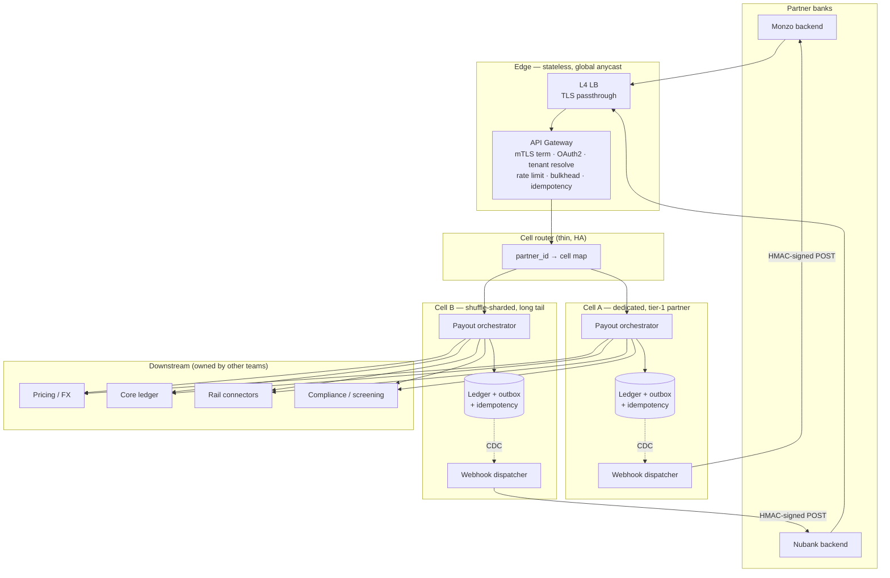
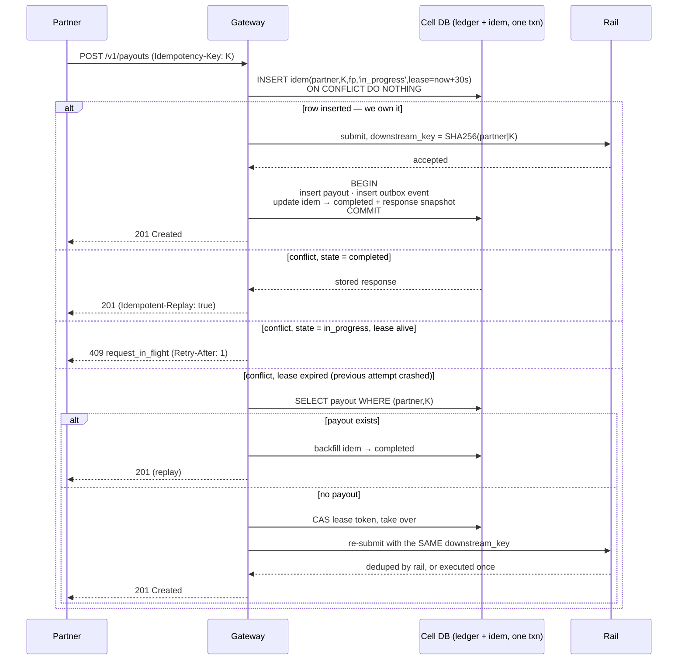
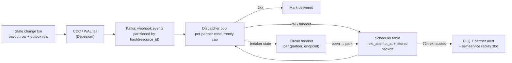

# B2B Partner API Integration Gateway

**Scenario** — design the core API platform that lets enterprise partner banks (Monzo, Nubank, N26) embed Wise payment infrastructure directly into their own mobile apps. Their customer taps "Send money abroad" inside the Monzo app; Monzo's backend calls us; we quote, execute and settle the cross-border payment; we tell Monzo what happened.

The partner owns the customer relationship and the UI. We own money movement, compliance and the contract that makes their integration reliable. That framing drives every decision below: **the partner's backend is our client, not our subordinate** — it can be slow, it can be down, it will retry badly, and it must never be able to hurt another partner.

---

## 1. Scope

**In scope**
- The synchronous partner-facing API (quotes, recipients, payouts, balances) and its edge: authn/z, tenancy, admission control.
- Idempotency semantics strong enough to protect money movement.
- Asynchronous webhook delivery of transaction status back to partner servers.
- Isolation between partners, and resiliency in both directions (them → us, us → them).

**Out of scope (named, so the boundary is deliberate)**
- The FX pricing engine, the ledger, the banking-rail connectors, KYC/AML screening. Treated as downstream services with contracts.
- The partner-facing SDKs and the developer portal UI (the portal's *API* is in scope, because self-service webhook replay is a load-bearing feature).

### 1.1 Actors

| Actor | Description |
|---|---|
| **Partner** | The enterprise bank. One legal entity, one contract, one set of credentials per environment. The tenant boundary. |
| **Program** | A product line within a partner (`monzo-personal`, `monzo-business`). Sub-tenant: separate limits, separate webhook endpoints, shared identity. |
| **End customer** | The partner's user. We hold KYC data on them but never speak to them. |
| **Rails** | Downstream banking partners / SWIFT / local ACH schemes that actually move the money. |

### 1.2 Service levels

| Metric | Target |
|---|---|
| Availability (payout initiation) | 99.99% monthly, measured per partner |
| `POST /v1/payouts` latency | p50 80 ms, p99 400 ms (excluding rail confirmation, which is async) |
| Read endpoints | p99 150 ms |
| Webhook delivery, partner healthy | p95 < 2 s from state change to `2xx` |
| Webhook durability | Zero loss. At-least-once, retried for 72 h, then DLQ with self-service replay for 30 d |
| Duplicate payout rate | Zero. This is a correctness invariant, not an SLO |

The last row is the one that matters. Everything else is an availability target we can miss and apologise for; a double payout is a financial loss and a regulatory incident.

### 1.3 Scale (back of envelope)

Assume 20 partners, ~50 M end customers, ramping to 100 M.

- **Payouts**: 5 M/day → 60 TPS mean. Diurnal + payday spikes → **~600 TPS peak**. One partner's marketing push can be 60% of that.
- **Reads** (quote, status poll, recipient lookup): ~10× writes → **6 k RPS peak**.
- **Webhooks**: each payout emits ~5 lifecycle events (`created → funds_converted → processing → outgoing_payment_sent → completed`), plus refunds/failures. 25 M events/day → 290/s mean, **~3 k/s peak**, +15% for retries.
- **Storage**: idempotency records 5 M/day × ~2 KB × 7 d ≈ 70 GB (hot). Webhook events 25 M/day × 1 KB × 30 d ≈ 750 GB + delivery-attempt log. Both trivially shardable by `partner_id`.

Nothing here is big-data scale. **The hard part is not throughput — it is isolation, exactly-once effects, and delivering to endpoints we do not control.**

---

## 2. Architecture



**Request path (`POST /v1/payouts`)**

1. **Edge** — L4 load balancer, TLS *passthrough* so the gateway sees the client certificate.
2. **Gateway** — terminates mTLS, resolves partner from the cert thumbprint, validates the OAuth2 token and checks it is bound to that certificate, enforces scope, applies the token bucket and the concurrency bulkhead, then performs the idempotency handshake.
3. **Cell router** — maps `partner_id` → cell. Thin, cacheable, no business logic; the mapping is a small config blob replicated everywhere.
4. **Payout orchestrator** — a saga: reserve funds → screen → convert → submit to rail. Each step writes state and an outbox row in one transaction.
5. **Webhook pipeline** — CDC tails the outbox, fans out to per-resource-ordered partitions, dispatchers deliver with retry + circuit breaking.

**Why a gateway at all, rather than sidecars on each service?** The three cross-cutting concerns here — tenancy, admission control, idempotency — must be enforced *before* any work is done and *identically* for every endpoint. A single enforcement point is auditable ("show the regulator where scope is checked") and is the only place that can shed load before it costs anything. The cost is a shared component in the hot path; we mitigate with a stateless design, cell-local deployment, and fail-open/fail-closed decisions made explicitly (§6.4).

---

## 3. Multi-tenancy and isolation

The requirement: **a traffic surge from Monzo must not degrade Nubank's p99.** Four layers, because any single one fails.

### 3.1 Layer 1 — Cell-based architecture (blast radius)

The whole stack — gateway, orchestrator, database, dispatcher — is deployed as a **cell**: an independent, capacity-bounded copy. Partners are assigned to cells.

- **Tier-1 partners get a dedicated cell.** Simple, expensive, and it makes the isolation guarantee contractual rather than best-effort. It also means we can pin a cell to a region for data-residency demands (Nubank/Brazil).
- **The long tail is shuffle-sharded** across cells: each partner is assigned a random 2-of-N subset, and its traffic is spread across those two. With N=8 cells and 2-cell shards there are 28 combinations — a single noisy partner degrades at most 2 cells, and the chance any given partner shares *both* of its cells with that one is ~3.6%. Compared with one shared pool, this converts "one partner takes down everyone" into "one partner degrades ~4% of tenants."
- Cells are capacity-bounded on purpose. A cell that cannot grow cannot be filled by one tenant; growth means more cells, and cell count is the scaling axis.

**Trade-off**: cells multiply operational surface — N databases to migrate, N deployments to roll. We accept it because the alternative (one global pool with quotas) has been repeatedly shown to fail under correlated load: quotas bound *rate*, not *tail latency*, and a shared connection pool or a shared database buffer cache leaks pressure across tenants no matter what the rate limiter says.

### 3.2 Layer 2 — Admission control (rate)

Per-partner **token bucket** at the gateway. Details in §6.1. Buckets are per `(partner_id, endpoint_class)` so a flood of cheap status polls cannot consume the payout budget.

### 3.3 Layer 3 — Bulkheads (concurrency)

Rate limiting alone does not bound resource usage: 100 RPS of requests that each hang for 10 s on a slow rail is 1 000 in-flight requests and an exhausted thread/connection pool. So each partner also gets a **concurrency semaphore** — a hard cap on in-flight requests per partner per cell — and its own downstream connection pool partition. Exceeding it returns `429` immediately rather than queueing.

This is the layer that actually saves the p99. Rate limits protect us from volume; bulkheads protect us from *slowness*, and slowness is what propagates.

### 3.4 Layer 4 — Fair queuing and load shedding

When a cell is genuinely saturated (rate and concurrency limits are per-partner, but the sum can still exceed capacity):

- **Weighted fair queuing** across per-partner queues, so the scheduler — not arrival order — decides who gets the CPU. A partner sending 10× its share waits 10× longer; everyone else is unaffected.
- **LIFO with a queue-age drop** (CoDel-style) rather than FIFO under overload. Under sustained overload FIFO serves requests whose clients have already timed out; LIFO keeps the freshest requests fast and sheds the stale ones, which is what the caller actually wants.
- **Priority classes**: `payout_execute` > `payout_read` > `bulk_export`. Shed from the bottom. A partner losing its nightly reconciliation export is an inconvenience; losing payout initiation is an outage.

### 3.5 Data isolation

- `partner_id` is the **leading column of every primary key and every index**, so queries are physically partitioned and a missing `WHERE partner_id = ?` is a planner-visible full scan, not a silent leak.
- **Row-level security** in Postgres with the partner set from a session variable derived from the authenticated principal — belt and braces, so an application bug cannot cross the boundary.
- **Envelope encryption with a per-partner data key** (KMS). Revoking a partner's key cryptographically shreds their data — useful for offboarding and for the "prove deletion" clause in the contract.
- Object storage (statements, bulk exports) uses per-partner prefixes with IAM policies scoped by prefix, and pre-signed URLs with short expiry.

**Test for it**: a nightly job runs cross-tenant probes — attempt to read partner B's payout using partner A's credentials at every layer (API, service, DB role) — and pages if any layer returns anything but a 404.

---

## 4. Idempotent API handshake

### 4.1 Contract

```http
POST /v1/payouts HTTP/1.1
Idempotency-Key: 5f2b8c1e-...        ; client-generated UUIDv4, required on all unsafe methods
Content-Type: application/json
```

- **Scope** is `(partner_id, idempotency_key)`. Not global — one partner's key choice must never collide with another's.
- We store a **fingerprint** = `SHA-256(method + path + canonical(body))`. Same key + same fingerprint → replay. Same key + *different* fingerprint → `422 idempotency_key_reuse`. This catches the genuinely dangerous client bug: reusing a key across two different payments.
- **Retention**: 24 h for the replay window (matches every partner's retry policy with room to spare). A separate, permanent unique index on `payouts(partner_id, idempotency_key)` is the backstop that survives cache expiry.
- Responses to a replay carry `Idempotent-Replay: true` so the partner can distinguish it in their logs.

### 4.2 The handshake



Three properties do the real work:

**(a) The idempotency record and the business record commit in one transaction.** They live in the same database, in the same shard, keyed by the same `partner_id`. If the key lived in Redis and the payout in Postgres, there is a window where the payout is committed but the key still says `in_progress` — a retry in that window double-pays. This is the single most common way idempotency implementations are wrong, and the fix is a co-location constraint, not more code.

**(b) The downstream key is derived, not generated.** `downstream_key = SHA-256(partner_id | idempotency_key | "payout")`. If we crash mid-flight and a second attempt takes over the lease, it re-issues a *byte-identical* request to the rail, which dedupes it. Without this, lease takeover is exactly the double-payout we were trying to prevent — we would have made the API safe and the money movement unsafe. Rails that do not support idempotency keys get a mandatory pre-submit "query by reference" probe plus a reconciliation sweep (§8).

**(c) The unique index is the last line of defence.** `UNIQUE(partner_id, idempotency_key)` on the payouts table means that even with every cache expired, every lease confused and every race lost, the second insert fails. We catch the violation and convert it into a replay.

### 4.3 What we deliberately do *not* do

- **We do not auto-generate keys server-side** from a body hash. Two genuinely distinct identical payments (customer sends £50 to Mum twice in a minute) would collapse into one. The client owns intent; the client owns the key. We reject the request without one rather than guess.
- **We do not make `409 in_progress` a retry-forever loop.** The lease is 30 s and `Retry-After: 1`; a partner hammering a live lease gets rate-limited like any other traffic.
- **We do not extend idempotency to `GET`.** Safe methods do not need it, and pretending they do teaches partners the wrong model.

---

## 5. Webhook infrastructure

### 5.1 Guaranteeing "the event exists"

The event is written by the **transactional outbox** pattern — same transaction as the state change, so an event can never describe a state that did not commit, and a committed state can never fail to produce an event. Dual writes (commit, then publish) lose events on crash; we do not use them anywhere in this system.



CDC rather than an application-level poller: no polling lag, no missed rows under concurrent commits, and it survives application deploys. The poller is kept as a fallback path for the outbox table (a `WHERE published_at IS NULL` sweep) because CDC pipelines do occasionally stall and silent event loss is unacceptable.

### 5.2 Delivery

```http
POST /wise-events HTTP/1.1
Wise-Signature: t=1755100000,kid=whsec_7f2,v1=9c4e...
Wise-Event-Id: evt_01HX...
Wise-Delivery-Attempt: 3
Content-Type: application/json

{"id":"evt_01HX...","type":"payout.completed","sequence":4,
 "occurred_at":"2026-08-14T09:12:03.114Z","api_version":"2026-04-01",
 "data":{"payout_id":"po_...","status":"completed", ... }}
```

- **Success = `2xx` within a 10 s timeout.** Anything else — 5xx, 4xx, TCP reset, TLS failure, timeout — is a retry. `410 Gone` is the one exception: it disables the endpoint and alerts the partner, because a permanently wrong URL should not be retried for three days.
- Every event carries the **full current resource state**, not a delta. The partner can process any single event without needing the ones before it — which is what makes at-least-once tolerable.

### 5.3 Retry, backoff, jitter

`delay = random(0, min(cap, base × 2^attempt))` — **full jitter**, not `base × 2^attempt ± noise`. Equal jitter still leaves a synchronised leading edge; full jitter is what actually flattens the thundering herd when a partner comes back and 400 k parked events all become eligible at once.

Schedule: 10 s, 30 s, 2 m, 10 m, 30 m, 2 h, 6 h, 12 h, then every 12 h to **72 h**, ~15 attempts. Then DLQ, a page to the partner's on-call via the alerting integration, and a self-service replay API (`POST /v1/webhook-deliveries/replay?from=…&to=…&type=…`) retained 30 days.

The **catch-up ramp** matters as much as the backoff: when the breaker closes we do not release the backlog at full rate. Concurrency ramps 1 → 2 → 4 → … per partner while success holds, and collapses on the first failure. Otherwise recovery re-kills the partner that just came back.

### 5.4 Circuit breaker per partner endpoint

State per `(partner_id, endpoint_url)`, in a shared store so all dispatchers agree:

- **Closed** → measuring. Rolling 30 s window; open at ≥50% failures over ≥20 requests (the volume threshold stops 1-of-2 failures tripping it).
- **Open** → *no delivery attempts at all.* Events are parked with `next_attempt_at` = the breaker's probe time. This is the point people miss: without the breaker, a partner down for six hours burns every event's retry budget in parallel, and each event independently DDoSes their recovering server. With it, one probe request represents the whole backlog.
- **Half-open** → a small fixed number of concurrent probes. All succeed → close and ramp. Any fails → open again with a longer window (30 s → 1 m → 5 m → capped 15 m).

The same breaker pattern wraps our *outbound* calls to rails and to the pricing service, with the same rule: **a breaker is only useful if the fallback is defined**. For webhooks the fallback is "park and retry later" (safe — we own the durable copy). For pricing it is "serve the last good quote if within tolerance, else fail the request" (never a stale price on a real payment). For the ledger there is no fallback: fail closed, because a payout we cannot record is a payout we must not make.

### 5.5 Ordering — stated honestly

We guarantee **at-least-once, not ordered**. Events carry a monotonic `sequence` per resource and `occurred_at`; partners apply last-writer-wins on `sequence` and ignore anything they have already seen (`Wise-Event-Id` is the dedupe key).

Kafka partitioning by `hash(resource_id)` means events for one payout do land in order in the pipeline; what we refuse to promise is *delivery* order, because preserving it across retries requires head-of-line blocking — event N failing must stall N+1 for the same resource. We offer that as **opt-in ordered mode per resource**, with the consequence documented: a stuck event stalls that payout's stream (only that payout's — never the partner's whole feed).

Making ordering opt-in rather than default is a deliberate call. The default should be the mode that degrades gracefully; ordering is the mode that turns one bad event into a stall.

### 5.6 Isolating slow partners from each other

Dispatchers are **partitioned per partner, not shared**: a per-partner in-flight cap (e.g. 50) and a per-partner consumer group. A partner responding in 10 s therefore achieves 5 events/s and builds a queue — *their* queue. No shared worker pool means no way for their latency to consume threads that Nubank's events need. Queue depth and oldest-unacked-age are per-partner alarms, and they are also exposed to the partner in the developer portal, which turns most "your webhooks are broken" tickets into self-service.

**Poll fallback**: `GET /v1/events?after=<cursor>` over the same durable log. Every partner integration is required to implement it. Webhooks are an optimisation over polling; when the push path is degraded, correctness does not depend on it.

---

## 6. Resiliency patterns

### 6.1 Token bucket, distributed

Per `(partner_id, endpoint_class)`: capacity `B` (burst), refill `r` tokens/s (sustained). Contractual: e.g. Monzo `r=500/s, B=1000` for payouts.

Naïve implementation is a Redis Lua script per request — one atomic CAS on one key. At 600 TPS against a single partner that key is a hot shard and adds a network round trip to the hot path.

**Local token leasing** instead: each gateway node leases a slice of the bucket (say 100 ms of tokens) from Redis, serves requests from the local slice with zero network cost, and refreshes asynchronously before it runs dry. Over-admission is bounded by `nodes × lease_size` and is tuned to a few percent — which is fine, because a rate limit is a business control with contractual headroom, not a correctness boundary.

**Fail-open**: if the limiter store is unreachable, nodes fall back to `global_limit / node_count` locally and we alert. Rate limiting protects availability; making it a hard dependency of the payment path would mean a Redis outage stops payments. That trade is only acceptable *because* the bulkheads (§3.3) are independent of Redis and still bound the damage.

Responses: `429` with `RateLimit-Limit`, `RateLimit-Remaining`, `RateLimit-Reset`, and `Retry-After`. Well-behaved clients back off; the headers make good behaviour possible.

### 6.2 Timeouts and retry budgets

- **Every** outbound call has an explicit timeout, and the sum of downstream timeouts fits inside the inbound one with margin. Deadlines propagate as a header so a service does not start work whose caller has already given up.
- **Retry budgets**, not retry counts: a service may spend at most ~10% of its request volume on retries, tracked over a sliding window. Per-call "retry 3 times" composes multiplicatively — three layers each retrying 3× is 27× amplification against a struggling dependency, which is how a partial degradation becomes an outage.
- **Retries only on idempotent operations.** Payout submission to the rail is retryable *only* because of the derived downstream key (§4.2b). Without it the correct behaviour is to fail and reconcile.
- **Hedged requests** for reads only (quote lookup), never for writes.

### 6.3 Load shedding and backpressure

Admission control at the gateway keyed on a real health signal — queue depth and CPU, not a static RPS number. Shed by priority class (§3.4), return `503` with `Retry-After`, and never accept work we will drop later: work accepted and dropped is worse than work refused, because the client already paid the latency.

### 6.4 Fail-open vs fail-closed, decided in advance

| Component down | Behaviour | Why |
|---|---|---|
| Rate limiter store | **Open** (degraded local limits) | Availability > perfect quota enforcement |
| Auth / token introspection | **Closed** | Never serve an unauthenticated request. Mitigate with short-TTL local JWT validation so introspection is not in the hot path |
| Idempotency store | **Closed** | Cannot guarantee no-double-pay; refuse the payment |
| Compliance screening | **Closed** | Regulatory. No screening, no payment |
| Pricing | **Degraded** — last good quote within tolerance, else fail | Never quote a stale FX rate on a real transfer |
| Webhook pipeline | **Open** — accept and queue | We own the durable copy; delivery is catch-up-able |

Writing this table *before* the incident is the point. Under pressure, "fail open or closed?" gets answered by whoever is loudest.

---

## 7. Security and auth

### 7.1 Transport — mTLS

- Each partner holds a client certificate per environment, issued by Wise's private CA (or their own cert, pinned by SPKI hash). Identity resolves from the **certificate thumbprint** in a registry — not from CN/SAN string matching, which is forgeable across CAs and a classic bypass.
- L4 passthrough to the gateway so the certificate survives to the point of authorisation.
- 90-day certs, automated rotation, overlapping validity, OCSP stapling, and an emergency revocation path measured in minutes (kill-switch by thumbprint at the gateway, not just CRL propagation).
- Internally, service-to-service is SPIFFE/SPIRE mTLS. The partner identity crosses service boundaries as a **signed internal claim**, never a mutable `X-Partner-Id` header — otherwise any service with network access can impersonate any tenant.

### 7.2 Authorisation — OAuth2 with certificate-bound tokens

- `client_credentials` grant. Short-lived (10 min) access tokens.
- Tokens are **certificate-bound** (RFC 8705): the token carries `cnf.x5t#S256` = the hash of the client cert. The gateway verifies the presented cert matches. A stolen token is useless without the corresponding private key — which turns token theft from a critical into a nuisance, and is the single highest-value hardening available here.
- **Granular scopes**: `payouts:create`, `payouts:read`, `quotes:create`, `recipients:write`, `webhooks:manage`, `balances:read`. Enforced at the gateway from token claims and **re-checked in the service** — defence in depth, because the gateway is one config mistake away from being bypassed.
- **Programs and delegation**: end-user-scoped operations use token exchange (RFC 8693) to mint a token carrying `program_id` and the partner's end-user reference, so authorisation is scoped to one customer rather than to the partner's whole book.

### 7.3 Non-repudiation — detached JWS on payment initiation

`POST /v1/payouts` carries a **detached JWS** over the canonicalised body, signed with a partner key that is separate from the TLS key and stored in their HSM. mTLS proves who opened the connection; it does not give us a durable, transferable proof of *what they instructed* after the connection closes. For a €2 M transfer under dispute, that difference is the entire conversation. Signatures are archived with the payout in WORM storage.

### 7.4 Webhook authenticity — HMAC

```
signed_payload = "{timestamp}.{raw_body}"
v1 = HMAC_SHA256(secret, signed_payload)
Wise-Signature: t=1755100000,kid=whsec_7f2,v1=<hex>
```

- Partners verify over the **raw body bytes** before parsing — re-serialising before verifying is the most common integration bug and it silently breaks every signature.
- **Constant-time comparison** (documented loudly in the integration guide; naive `==` leaks via timing).
- **Timestamp inside the signed payload** with a ±5 min tolerance → replay protection. A signature over the body alone is infinitely replayable.
- **Rotation without downtime**: two secrets active during overlap, both signatures sent (`v1=<a>,v1=<b>`); partner accepts either. `kid` lets them pre-stage.
- Tier-1 partners additionally get **mTLS outbound to their endpoint** (we present a Wise client cert) and IP allowlisting. Offered as an upgrade rather than the default because HMAC is universally implementable and mTLS to a partner's edge is an operational commitment on their side.
- Considered and rejected as default: asymmetric (Ed25519 detached JWS + published JWKS). Strictly better — the partner never holds a signing secret, so a leak of their config cannot forge our events — but it raises the integration floor. The right answer is HMAC now, asymmetric offered alongside, and a migration path via `kid`.

### 7.5 Data protection

PII minimised and tokenised at the edge; field-level encryption for names/addresses/account numbers with per-partner keys; card-adjacent data never touches these services. Every request is audit-logged with `partner_id`, principal, scopes, decision and `idempotency_key`, to append-only storage with hash chaining. Secrets in a vault with short-lived dynamic credentials — no long-lived DB passwords in config.

---

## 8. Failure modes

| Failure | Detection | Response | Residual risk |
|---|---|---|---|
| Partner webhook endpoint down 6 h | Breaker opens; queue depth alarm | Events park; single probe per interval; ramped catch-up on recovery | Backlog ~120 k events; catch-up ~10 min at ramped rate |
| Partner floods 20× their limit | Token bucket + bulkhead | `429` at the edge; other tenants untouched; account-manager alert | Their own p99 degrades — correct outcome |
| Rail times out *after* debiting | No terminal state within SLA | Idempotent re-submit with the same derived key; reconciliation sweep against rail statements; payout held in `processing`, never auto-failed | Customer sees "processing" longer; money never lost or doubled |
| Gateway crashes mid-payout | Idempotency lease expires | Retry finds the lease expired → checks for the payout → replays or takes over with the same downstream key | Bounded by the 30 s lease window |
| Redis limiter cluster down | Health check | Fail open to per-node local limits; alert | Brief over-admission; bulkheads still hold |
| Cell database failover | Replication lag / health | Cell drains; router evacuates to the partner's second shuffle-shard cell | Tier-1 dedicated cells have no second cell — they get a hot standby in-region instead |
| Duplicate webhook delivered | By design | Partner dedupes on `Wise-Event-Id` — contractual, verified in certification | Partners that skip it double-process; caught in cert testing |
| CDC pipeline stalls silently | Outbox lag metric (oldest unpublished row) | Fallback poller sweeps unpublished rows | Latency spike, no loss |

**Reconciliation is the backstop for all of it.** A daily job reconciles our ledger against every rail's statement file and against the partner's own view (an API they expose or a file they send). Discrepancies page. No amount of idempotency machinery removes the need to check the money actually matches.

---

## 9. Operations

**Observability** — every metric is tagged `partner_id`, and every dashboard and alert is *per partner*: a global p99 of 200 ms can hide one partner at 5 s. RED metrics at the gateway, USE for cells, distributed traces with `partner_id` and `idempotency_key` in baggage. Webhook-specific: delivery success rate, attempts-to-success histogram, oldest-unacked-age, breaker state transitions, DLQ depth. Partners see their own slice in the developer portal.

**Testing** — a partner simulator that is deliberately hostile (random 500s, 30 s hangs, TCP resets, duplicate submissions with the same key, out-of-order acks) runs in CI. Game days: kill a cell during peak; blackhole a partner endpoint; expire the limiter store. Certification suite that partners must pass before production: signature verification, event dedupe, retry behaviour, `429` handling.

**Rollout** — partners are onboarded to a sandbox with synthetic rails first, then a production pilot capped at low volume, then ramped. API versioning is date-based (`2026-04-01`) and pinned per partner; breaking changes ship as a new version with a minimum 12-month overlap, because a bank cannot redeploy its mobile app on our schedule.

---

## 10. Key trade-offs

| Decision | Chosen | Alternative | Why |
|---|---|---|---|
| Isolation | Cells + shuffle sharding; dedicated for tier-1 | One pool with quotas | Quotas bound rate, not tail latency. Shared caches/pools leak pressure regardless of quota |
| Idempotency store | Same DB, same txn as the ledger | Redis, fast and separate | Cross-store non-atomicity is a double-payout window. Correctness beats a few ms |
| Downstream key | Derived from the client key | Freshly generated per attempt | Otherwise lease takeover re-executes the payment — the exact bug we set out to prevent |
| Event delivery | At-least-once, unordered by default; ordering opt-in | Ordered by default | Default should degrade gracefully; head-of-line blocking is a stall, not a slowdown |
| Event publication | Transactional outbox + CDC | Publish after commit | Dual writes lose events on crash. Non-negotiable for money |
| Rate limiter | Local leases over Redis | Strict per-request Redis CAS | Removes a hot key and a hop from the payment path; ~few % over-admission is contractually fine |
| Limiter failure | Fail open | Fail closed | A limiter outage must not stop payments — safe only because bulkheads are independent |
| Webhook auth | HMAC + timestamp, mTLS optional | Asymmetric JWS by default | Lower integration floor now; `kid` gives the migration path |
| Token security | Certificate-bound (RFC 8705) | Plain bearer | Neutralises token theft, the highest-value hardening available |

---

## 11. If I had more time

- **Per-partner adaptive limits** — learn baseline traffic and auto-widen burst for verified growth instead of a ticket to raise a quota.
- **Webhook fan-out to partner-chosen transports** — SQS/PubSub/Kafka delivery for partners who would rather consume a queue than run an HTTPS endpoint. Removes the entire circuit-breaker problem for the partners who take it.
- **Partner-visible chaos sandbox** — let partners trigger our failure modes on demand so they can test their own retry logic against real behaviour.
- **Formal spec of the payout state machine** (TLA+ or similar) covering the crash/takeover interleavings in §4.2. The double-pay invariant is worth machine-checking rather than reasoning about in prose.

---

## Appendix — 45-minute interview talk track

| Minutes | Focus |
|---|---|
| 0–5 | Clarify: how many partners, tier structure, do they need ordering, who owns the customer. State the SLOs, and single out "zero duplicate payouts" as an invariant rather than a target |
| 5–10 | Back-of-envelope. Land the point that this is not a throughput problem — it is isolation + exactly-once effects + delivering to endpoints we do not control |
| 10–18 | Draw the box diagram. Walk one `POST /v1/payouts` end to end |
| 18–26 | **Idempotency.** Lead with the same-transaction constraint and the derived downstream key — these are the two things most candidates miss |
| 26–36 | **Webhooks.** Outbox → CDC → dispatcher; retry with full jitter; breaker parks instead of retrying; at-least-once and *why not* ordered; per-partner dispatcher isolation |
| 36–42 | **Isolation** (cells, shuffle sharding, bulkheads over rate limits) and **security** (cert-bound tokens, HMAC with timestamp, detached JWS for non-repudiation) |
| 42–45 | Failure-mode table, the fail-open/fail-closed grid, and two things you would do next |

**Points to hit if the interviewer probes:**
- Why the idempotency record must be in the same transaction as the ledger write.
- Why full jitter rather than plain exponential backoff.
- Why a circuit breaker *parks* events instead of failing them fast.
- Why rate limits alone do not protect the p99 (bulkheads do).
- Why certificate-bound tokens change the threat model.
