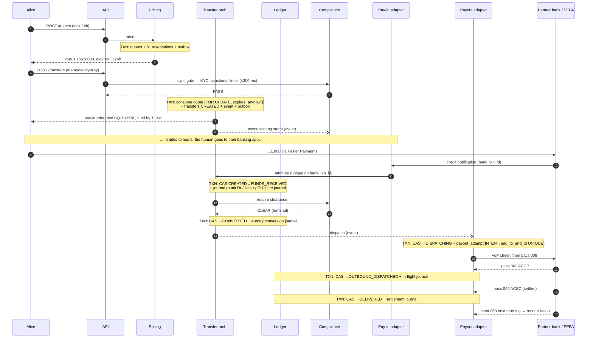
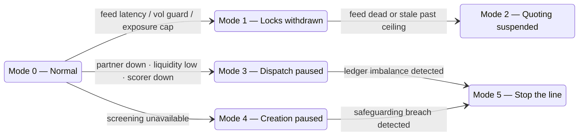

# The whole system, end to end, at staff level

Third document in the set. [`cross-border-payments.md`](./cross-border-payments.md) is the design;
[`cross-border-payments-explained.md`](./cross-border-payments-explained.md) explains it from zero.
This one is the layer above both: the complete end-to-end trace of a single payment through every
component, then the concerns that make it a *staff* answer rather than a senior one — the invariant
set and how each is proved in production, the failure domains and the degradation ladder, how the
system changes over three years without breaking, how you know it is correct, and who runs it.

The distinction I am drawing throughout:

> A senior answer designs the system. A staff answer designs the system, **plus how it changes, how
> it fails, how you prove it is right, and who owns each piece.** The first is a diagram. The second
> is something a company can still operate in four years.

---

# Part I · The end-to-end trace

One payment, every hop, with the exact write, message and guarantee at each step. £1,000 GBP from
Alice (London) to €1,151.00 for Ben (Berlin).



### I.1 Step by step, with the guarantee at each hop

**1 · Quote.** Pricing reads the rate cache (populated from liquidity-provider streams; a staleness
check rejects anything older than a few seconds), applies spread and lock premium, and writes three
rows in **one transaction**: the `quotes` row with `expires_at`, the `fx_reservations` row that
consumes risk capacity, and an outbox row. *Guarantee:* a quote and its risk reservation exist
together or not at all — treasury can never be blind to a price we have promised.

**2 · Transfer creation.** The idempotency key is inserted first (unique index); a duplicate insert
means this is a retry, and the stored response is replayed. Then the **synchronous compliance gate**
runs — outside any database transaction, because you never hold a row lock across a network call.
On PASS, one transaction consumes the quote (`FOR UPDATE` + `expires_at > now()`), inserts the
transfer as `CREATED`, allocates the pay-in reference, appends the event, and enqueues the outbox
row. *Guarantee:* one quote can back exactly one transfer, at a price that was live at the instant
of consumption, and a double-tap produces one transfer.

**3 · The human gap.** Nothing happens in our system for minutes or hours. This is where async
compliance scoring runs, entirely free of user-visible latency, and where the 24-hour clock is
ticking.

**4 · Funds arrive.** The bank notifies us (webhook, or statement polling as the backstop — you need
both, because notifications are lossy). Attribution is keyed on the bank's transaction ID with a
unique constraint, so a redelivered notification is a no-op. Then one transaction: CAS
`CREATED → FUNDS_RECEIVED`, the arrival journal, the fee journal, event, outbox. *Guarantee:* money
is recognised exactly once, and the state change and the journal are atomic.

**5 · Clearance.** The orchestrator reads the async verdict. Terminal and clean → proceed. Hit or
score above threshold → `COMPLIANCE_HOLD`. **Not yet terminal → bounded wait, then hold.** Never
dispatch on a timeout.

**6 · Conversion.** One transaction: CAS `FUNDS_RECEIVED → CONVERTED`, the four-entry conversion
journal, an event to treasury so the reservation becomes a realised position.

**7 · Dispatch — the only irreversible step, and therefore the one with a special protocol.**

```
TXN A:  CAS CONVERTED → DISPATCHING
        INSERT payout_attempts (end_to_end_id UNIQUE, status = 'INTENT')
        COMMIT                              ← intent is durable before anything leaves the building
   ↓
        VoP check → build pacs.008 → POST to partner
   ↓
TXN B:  UPDATE payout_attempts SET status = <response>
        CAS DISPATCHING → OUTBOUND_DISPATCHED (or DISPATCH_FAILED)
```

Crash anywhere in between and a recovery scan finds attempts stuck in `INTENT`, **queries the
partner by `EndToEndId`**, and resolves them to the real outcome. This is the general rule for every
irreversible external effect, and it is worth stating as a principle:

> **Record intent → act → record outcome.** Never perform a side effect inside a database
> transaction; never resolve an unknown outcome by retrying. Reconcile by query.

Note this introduces a `DISPATCHING` state that the base design's enum does not have — an explicit
in-flight state is the price of doing irreversible work safely, and it is worth paying.

**8 · Confirmation and settlement.** `pacs.002 ACCP` → accepted; `ACSC` → settled, which for SEPA
Instant is genuine delivery. The settlement journal moves money out of the in-flight liability and
off the bank asset. Next morning's `camt.053` reconciles the whole day.

### I.2 The latency budget

| Segment | Budget | Dominated by |
|---|---|---|
| Quote | 300 ms p99 | rate cache read + pricing; no external calls |
| Transfer creation | 800 ms p99 | the synchronous screening call (~300 ms) |
| Human gap | minutes → 24 h | not our problem, and our opportunity: all slow work hides here |
| Attribution → converted | < 5 s | event bus hop + clearance read |
| Converted → dispatched | < 60 s | VoP + partner API |
| Dispatched → delivered | ~10 s (Inst) / ≤ 1 business day (SCT) | the scheme |

The design intent is visible in this table: **every expensive thing has been moved into the human
gap.** That is the single highest-leverage latency decision in the system, and it came from the
product shape, not from optimisation.

---

# Part II · The invariant set

This is the artifact I would put on the whiteboard if I could only draw one thing. A system this
size is not defined by its services; it is defined by the statements that must never be false.

For each invariant: where it is **enforced** (so it cannot be violated), how it is **detected** in
production (because enforcement has bugs), and the **response** when detection fires.

| # | Invariant | Enforced by | Detected by | Response |
|---|---|---|---|---|
| I1 | Every ledger transaction sums to zero **per currency** | Deferred constraint trigger at `COMMIT` | Continuous query over recent transactions | Page; stop the line |
| I2 | Ledger entries are never updated or deleted | `REVOKE UPDATE, DELETE` on the table | Privilege audit + WAL-level audit of the entries relation | Security incident |
| I3 | One quote backs at most one transfer | `UNIQUE (transfer_id)` on `quotes` | — (structurally impossible) | — |
| I4 | No transfer is ever priced at an expired rate | `expires_at > now()` in the consuming `SELECT … FOR UPDATE` | Query: transfers whose quote's `expires_at` < the transfer's `created_at` | Page; pricing incident |
| I5 | Every recorded state transition is legal | FK from `transfer_events` to `transfer_transitions` | — (structurally impossible) | — |
| I6 | A transfer advances at most once per event | CAS on `(id, expected_state)` + row count | Duplicate-journal detector per transfer per kind | Page |
| I7 | Nothing is dispatched without a terminal clean compliance verdict | Guard read inside the dispatch transaction | Control query: dispatched transfers whose verdict is not clean — must be **0** | Page; regulatory escalation |
| I8 | At most one scheme payment exists per transfer | `UNIQUE (end_to_end_id)` + intent record | Partner-side count by `EndToEndId` in daily recon | Page; recall process |
| I9 | Customer liabilities ≤ safeguarded assets, per currency, at all times | — (emergent) | Continuous: `Σ liability.* ≤ Σ asset.bank.*` per currency | Page; this is a **regulatory** breach |
| I10 | Our ledger matches the bank's statement, per account, per day | — (emergent) | Daily three-way recon vs `camt.053` | Break case, ageing SLA |
| I11 | No money sits unattributed beyond N days | — (emergent) | Suspense-account ageing report | Ops queue with an SLA |
| I12 | Every irreversible external effect has a durable prior intent record | The dispatch protocol (I.1 step 7) | Recovery scan for `INTENT` older than N seconds | Automatic reconcile-by-query |

Three things about this table are the actual staff content:

**Enforcement lives in the schema wherever it possibly can.** I3 and I5 are not checked by anyone
because they cannot happen — a unique index and a foreign key removed the entire class. Invariants
in application code hold until the next hotfix at 3 a.m.; invariants in the database hold until
someone runs a migration, which is a reviewed event.

**Every invariant that cannot be structurally enforced has a production detector.** I9, I10 and I11
are emergent properties of thousands of correct operations, so there is no constraint to write —
which means the only honest alternative is a query that runs continuously and pages a human.
**An invariant with no detector is a hope**, and hopes are what audits find.

**I7 and I9 are the two that end careers.** I7 is "we paid a sanctioned party"; I9 is "we spent
customer money". Both have a control query whose correct answer is a constant, and both page rather
than open a ticket. When someone asks what the most important part of the system is, it is not the
state machine — it is these two queries.

---

# Part III · Failure domains and the degradation ladder

### III.1 Blast radius per dependency

| Dependency | If it fails | Blast radius | Degrades to |
|---|---|---|---|
| Rate feed / LP stream | Cannot price honestly | New quotes only; everything in flight is fine | Mode 1 → 2 |
| Sanctions screening | Cannot legally accept new business | New transfers only | Mode 4 |
| Async risk scorer | Cannot clear for dispatch | Funded transfers pile up in hold | Mode 3 (partial) |
| Partner bank / SEPA | Cannot pay out | Dispatch only; money is safe and accounted for | Mode 3 |
| Pay-in bank notifications | Cannot see arrivals | Attribution lags; statement polling backstop catches up | Degraded, self-healing |
| Event bus | Async steps stall | Nothing lost — the outbox is the durable record and drains | Degraded, self-healing |
| Redis rate cache | Slower quotes | Fall through to the source; no correctness impact | Degraded |
| PostgreSQL primary | Everything stops | Total | Failover; Mode 5 during |

The property worth pointing out explicitly: **no dependency failure maps to "silently do the wrong
thing".** Every row degrades into a named, communicated mode. Designing failure into modes rather
than leaving it to whichever `try/catch` runs first is most of what separates an operable system
from a demo.

### III.2 The degradation ladder



| Mode | Trigger | Who flips it | Customer sees | Exit criteria |
|---|---|---|---|---|
| 1 · Locks withdrawn | Vol guard, exposure cap, feed latency | Automatic | Live rates only, no 24 h lock | Feed healthy N minutes, exposure under cap |
| 2 · Quoting suspended | Feed stale past ceiling | Automatic | "Rates unavailable, try shortly" | Feed healthy, prices sanity-checked vs a second source |
| 3 · Dispatch paused | Partner outage, low liquidity, scorer down | Automatic, human to extend | Delivery estimates extended; money safe and visible | Dependency healthy, queue drained under supervision |
| 4 · Creation paused | Screening unavailable | Automatic | Cannot start new transfers; existing ones continue | Screening healthy |
| 5 · Stop the line | **I1, I7 or I9 detector fires** | Human, always | Everything paused | Root cause found, reconciled, sign-off by finance + compliance |

Two deliberate asymmetries: automation can *degrade* the system freely but only a human can enter or
leave Mode 5, and existing transfers keep moving in every mode except 5. Money already taken from a
customer is a promise; the last thing you strand is the payment you already have the funds for.

---

# Part IV · How this survives three years of change

Most designs are presented as if they were built once. The staff question is what happens on the
two-hundredth change.

### IV.1 Changing the ledger

An append-only ledger cannot be refactored the way a normal schema can — the rows are the historical
record, and rewriting them is the one thing the design exists to prevent.

- **Add accounts, never repurpose them.** Account IDs are semantic strings (`liability.frozen.EUR`),
  so a new product adds rows to a chart of accounts, not columns to a table.
- **Chart-of-accounts changes are versioned with an effective date and signed off by finance.**
  Engineering owns the mechanism; finance owns the meaning. If an engineer can silently change what
  an account means, your historical reporting is fiction.
- **Adding a column is fine; changing the meaning of one is not.** Backfilling a semantic change
  requires new entries, not `UPDATE`s.

### IV.2 Changing prices safely

The three-stage rollout, and the reason the ledger design pays for itself:

1. **Shadow.** Compute the new price alongside the live one, log both, serve the old one. Compare
   distributions.
2. **Canary.** Serve the new price to a small user bucket, bucketed deterministically by user ID so
   a customer never sees the price flicker.
3. **Ramp**, watching the guard metric.

The guard metric is **realised spread per corridor, read out of `income.fx_spread`** and compared
against what the pricing model predicted. Because conversions post to a real account, a pricing
change is measurable in the general ledger within a day, not inferred from application logs. This is
the concrete answer to "why bother with double entry" for anyone who thinks it is ceremony.

### IV.3 Changing the state machine

Transitions are data, which makes this tractable but not free:

- **Only add states and edges.** Removing an edge while transfers can still be in its `from` state
  strands them, and a stranded transfer is a customer's money sitting still.
- Removal is a **drain**: stop creating transfers that can reach the state, wait for the population
  to hit zero (there is a query for that), then remove.
- The orchestrator is stateless — all state is in the database — so rolling deploys are safe with
  in-flight sagas. What is *not* automatically safe is a message-schema change, which needs
  **expand/contract**: write both shapes, teach every consumer to read both, deploy, then drop the
  old shape. Skipping the middle deploy is the classic way to lose events during a rollout.

### IV.4 Adding a corridor

The test of whether the architecture was worth it. Adding GBP→PLN or EUR→USD needs:

| New | Free |
|---|---|
| A rail adapter (scheme messages, cut-offs, return codes) | The state machine |
| A liquidity account and treasury forecast | The ledger, with two new accounts |
| Licence/permission coverage | Quoting, locking, expiry |
| Screening lists and purpose codes for the corridor | Idempotency, outbox, reconciliation |
| Pricing calibration for a new pair | Ops tooling, holds, refunds |

If a new corridor requires a new *system*, the first one was built wrong. This table is how you show
it was not.

### IV.5 Rebuilding versus recovering

A distinction worth being crisp about: **projections are rebuildable, the ledger is not.** Anything
derived from `transfer_events` — the `transfers` table, read models, analytics — can be dropped and
replayed. The ledger and the event log are the only true sources, and they are backed up, verified
by restore drills, and never rewritten. Knowing exactly which of your data is recoverable and which
is precious is the difference between a two-hour incident and a two-week one.

---

# Part V · Data, finance and models

**The primary database is not for analytics.** CDC into a warehouse; no analyst query ever touches
the transactional primary. A payment system that falls over because someone ran a quarterly report
is a real and embarrassing outage.

**Finance's ledger is engineering's ledger.** Same rows, same accounts. The organisational failure
this prevents is the common one where finance maintains a parallel spreadsheet model because they do
not trust the system, and then two numbers exist and nobody knows which is real. Trial balance per
currency per day, P&L attributed across fee income, FX spread, hedge slippage, and return losses —
all queryable from the entries.

**Regulatory reporting** is a first-class consumer, not an export script: transaction reporting,
safeguarding attestation, and an audit trail export that can reconstruct any transfer's full history
from immutable records. Designing for this from the start costs little; retrofitting it means
recovering intent from logs that were rotated eleven months ago.

**The risk model** deserves one specific warning. Its features must be computed from the event log
with **point-in-time correctness** — the value as it was at scoring time, not as it is now.
Computing "number of prior transfers" from today's table when training on last year's data leaks the
future into the model, and it produces a model that scores brilliantly in evaluation and fails in
production. Alongside that: model governance, versioning, and the ability to explain why a customer
was blocked, because in most jurisdictions an automated decision that harms a customer must be
explicable.

---

# Part VI · How you know it is correct

Enumerating the invariants is only half the work; the other half is proving them continuously.

**Property-based tests on the ledger.** Generate random *valid* sequences of lifecycle events —
fund, partially fund, top up, hold, clear, convert, dispatch, return, refund — and after every step
assert the whole invariant set. Ledger invariants are close to a perfect property-testing target:
the properties are simple and total, and the space of event orderings is exactly where hand-written
tests do not go.

**Deterministic simulation** is the highest-value test in a payment system. A seeded clock, a
simulated bus and partner, and an adversary that injects duplicate messages, out-of-order delivery,
partner timeouts with unknown outcomes, and process crashes *specifically between intent and
outcome*. Run thousands of seeds in CI and assert: no double payment, no lost money, every transfer
terminal. A failing seed is a reproducible bug, which is the thing distributed-systems bugs
otherwise are not.

**Contract tests** against the ISO 20022 schemas plus golden message fixtures for every return code
you claim to handle — because `pacs.004` handling is written once and then exercised in production
by a customer whose rent bounced.

**Reconciliation fixtures**: known `camt.053` files with deliberately seeded breaks, asserting the
reconciler finds exactly those breaks. Test the detector, not just the happy path.

**Game days**, because ops procedures rot silently: kill the primary mid-dispatch and confirm
recovery-by-query resolves the in-flight attempts; run a `FROZEN` case end to end with a real
four-eyes approval; rehearse Mode 5 entry and exit, including who signs off.

**What cannot be tested** is real money at real scale, which is why the first production weeks run
with conservative limits and a daily manual reconciliation review before it is automated.

---

# Part VII · Capacity, cost and disaster recovery

**Capacity.** 40 writes/second peak; ~10 ledger entries per transfer → ~120 M entries a year, tens
of gigabytes. One primary, partitioned monthly, will do this for years. The point of saying this out
loud is to justify spending the complexity budget elsewhere: sharding a ledger is genuinely hard, and
buying that difficulty before the volume exists is a bad trade.

**Cost** is not dominated by compute. It is dominated by per-screen compliance vendor fees and
per-payment partner bank fees. That has a direct engineering consequence: how often you re-screen
in-flight transfers is a cost decision as much as a risk decision, and it should be an explicit,
reviewed parameter rather than an accident of how someone wrote a cron schedule. Knowing the unit
economics of your own design is a staff-level expectation.

**DR.** Synchronous replica in a second availability zone (RPO 0, RTO minutes), asynchronous replica
in a second region (RPO seconds). And the position I would defend hardest:

> **Do not run the ledger active-active across regions.** Two writers on a double-entry ledger means
> consensus, conflict resolution, and the possibility of two regions each dispatching the same
> payment. At 40 tps there is no availability argument that outweighs it.

Regional failover is therefore a deliberate, human-initiated procedure whose **first documented step
is pausing dispatch**, so nothing can be sent twice while the two sides are converging. Slower, and
correct.

---

# Part VIII · Who owns what

Architecture that ignores org structure gets rebuilt by the org structure. Conway's law applies
whether or not you invite it.

| Team | Owns | Interface it exposes |
|---|---|---|
| Pricing & FX | Quoting, rate feeds, lock tiers, reservations | Quote API, reservation events |
| Transfers | The state machine, orchestration, saga | Transfer API, state events |
| Ledger & finance engineering | Ledger, chart of accounts, reconciliation, close | Journal API, balance queries |
| Compliance engineering | Screening integration, scoring pipeline, case management | Verdict API, clearance events |
| Rails & partners | Scheme adapters, partner integrations, liquidity ops | Dispatch API, scheme events |
| Ops tooling | Holds, refunds, breaks, manual review UIs | The internal product |

Three ownership rules that matter more than the boxes:

1. **The ledger team owns the invariant set and holds a veto over schema changes that touch it.**
   Shared-nothing ownership of money invariants is how they erode.
2. **Compliance policy is owned by the financial-crime function, not by engineering.** Engineering
   owns the mechanism; the thresholds, list sources and escalation rules are theirs. A screening
   threshold sitting in a config file that an engineer can change without an approval trail is a
   finding waiting to be written up.
3. **Only money-impacting alerts page.** Per-state age, invariant detectors, reconciliation breaks,
   liquidity floor. Funnel conversion is a dashboard. Paging on everything trains people to ignore
   pages, and then I9 fires at 4 a.m. into a muted channel.

---

# Part IX · Sequencing, and what I would revisit

**Quarter by quarter**, because a staff answer sequences rather than presenting a finished cathedral:

| Q | Ship | Rationale |
|---|---|---|
| 1 | One corridor, live rates only (no 24 h lock), SCT Inst with manual fallback, **full double-entry ledger**, sync compliance gate, rules-only async layer, ops tooling for holds and refunds | The ledger and the state machine are the two things you cannot retrofit. The lock waits for a hedging function that does not exist yet |
| 2 | The 24-hour lock with reservations and probability-weighted hedging; drop-off flows; automated reconciliation | Now there is data to calibrate fill probability with |
| 3 | ML risk scoring replacing rules; classic SCT fallback automated; second corridor as a proof the adapter seam works | The second corridor validates the architecture claim in Part IV.4 |
| 4 | Regional DR drill, warehouse and finance close automation, self-serve ops | Operability debt, paid before it compounds |

**Open risks I would name unprompted**, because a design with no stated risks is a design that has
not been examined:

- **Fill-probability estimation is a model with no training data on day one.** Q1 ships without the
  lock precisely because of this, and the first version of the model should be deliberately
  conservative — over-hedging costs money, under-hedging costs more.
- **Partner bank concentration.** One partner in the euro area is a single point of failure for the
  entire payout leg. A second partner is expensive and duplicative and I would still plan for it in
  year two, because Mode 3 with no alternative is just an outage with a nicer name.
- **False-positive load on ops scales with volume, not with headcount.** The good-guy list helps;
  it does not solve it. This is the operational cost line most likely to surprise the business.
- **The `FROZEN` path is rare, legally sensitive, and therefore under-exercised.** Game days, not
  hope.

**What I would revisit** given real traffic: whether the 24-hour lock is worth its hedging cost at
all (the ledger will answer this precisely); whether dispatch should batch during scheme hours to
cut per-payment fees; and whether the transfer and ledger modules have diverged enough in write
volume or team ownership to justify separating their databases — which the module boundaries have
kept available as an option rather than a rewrite.

---

# Part X · What made this a staff answer

| Dimension | Senior | Staff |
|---|---|---|
| Scope | The system | The system, its evolution, its failure modes, its owners |
| Correctness | Handles the cases discussed | An enumerated invariant set, each enforced *and* detected in production |
| Failure | Retries and error handling | Named degradation modes with triggers, authority, and exit criteria |
| Change | Builds it | Rolls out pricing safely, drains a state, adds a corridor without a rewrite |
| Testing | Unit and integration tests | Property tests on invariants, deterministic simulation of the adversary, game days |
| Cost | Mentions infrastructure | Knows the unit economics, and that vendor fees dominate compute |
| Org | Draws services | Assigns ownership, and knows which ownership boundaries protect which invariant |
| Risk | Presents a design | Names what is unproven, sequences around it, and says what they would revisit |

If you take one thing into the room: **lead with the invariant set in Part II.** Almost everyone can
draw the boxes. Very few candidates can state the six sentences that must never be false, say where
each is structurally enforced, and then admit that the ones which cannot be enforced need a query
running in production that pages a human. That single move — enforcement, detection, response —
demonstrates system ownership more efficiently than any diagram, and every other part of this design
can be derived from it in conversation.
