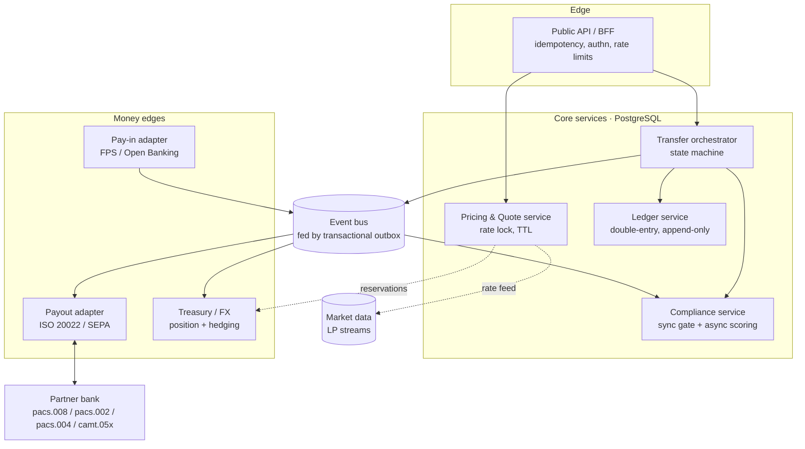
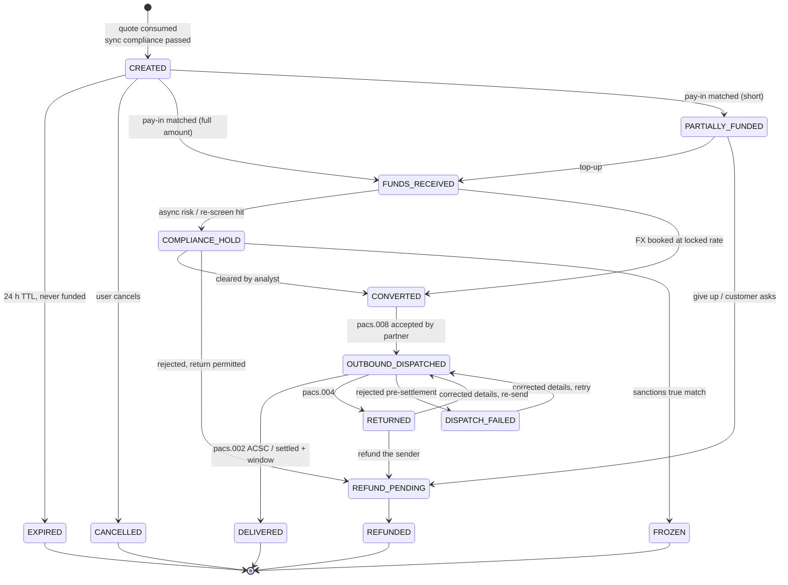
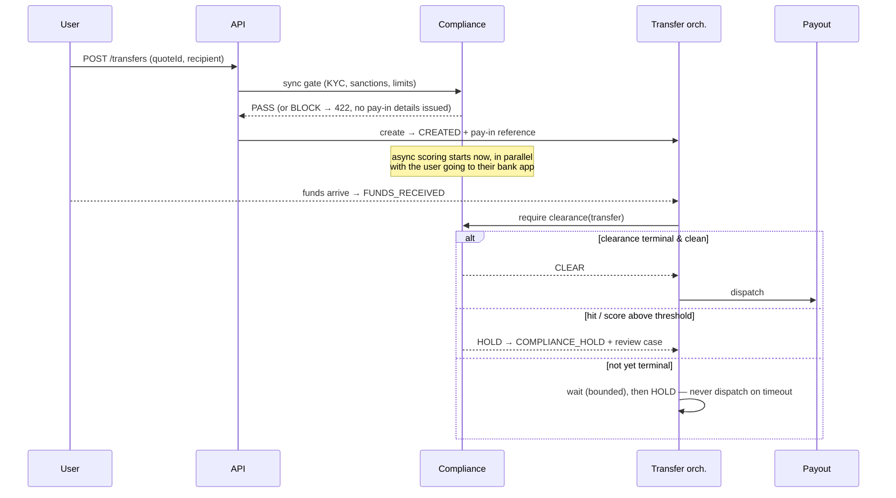

# Multi-Currency Cross-Border Payment Service

**Scenario** — a user in the UK sends GBP; a recipient in Germany receives EUR in their own bank
account via SEPA. The rate can be locked for 24 hours while the sender gets the money to us.

This document is the design I would present in a 45–60 minute system design interview: the money
model first, then the state machine, then the parts that actually go wrong in production (drop-offs,
returns, list hits, partial funding).

---

## 1. Framing

### 1.1 What is actually being built

We are not "moving money from the UK to Germany". Nothing crosses a border. We are:

1. **Collecting** GBP into our own GBP account in the UK (Faster Payments / Open Banking / card).
2. **Book-transferring** value from our GBP position to our EUR position at a rate we quoted.
3. **Paying out** EUR from our own pre-funded EUR account at a euro-area partner bank, over SEPA.

That is the single most important framing decision, and everything downstream follows from it:

- The customer's FX "trade" is an **internal ledger operation**, executed instantly at the locked
  rate. Treasury hedges the *aggregate* position separately, on its own schedule.
- The payout is made from **liquidity we already hold**, so payout speed is decoupled from
  settlement of the GBP leg (which lands T+0/T+1) and from the hedge (T+2 spot).
- A locked rate is therefore not a per-customer forward contract with a bank; it is **market risk we
  are warehousing on our own book**. Pricing has to pay for it.

### 1.2 Requirements

Functional:

| | |
|---|---|
| Quote | Price GBP→EUR, both `sourceAmount` and `targetAmount` driven, fee transparent, optional 24 h rate lock |
| Transfer | Create against a quote, issue pay-in instructions, track to delivery, expose status + webhooks |
| Compliance | KYC gate, sanctions screening, ongoing risk scoring, hold/review/report |
| Payout | SEPA SCT Inst preferred, SCT fallback; handle returns and recalls |
| Money | Double-entry ledger, per-currency balance, reconcilable to the penny against bank statements |

Non-functional:

- **Correctness over availability.** Money is a consistency problem. A quote API that 500s is an
  incident; a ledger that is 3 cents off is a regulatory finding.
- Scale assumption: 10 M transfers/month ≈ 4 tps average, ~40 tps peak, ~10× that in quote requests.
  This is *small*. A single well-tuned PostgreSQL primary handles it for years. Design for
  correctness and operability, not for sharding.
- Latency: quote p99 < 300 ms; transfer creation p99 < 800 ms (includes the synchronous compliance
  gate); payout dispatched within 60 s of funds being attributed, during scheme hours.
- Availability: quote/read 99.99 %; the async payout pipeline may lag without customer impact — it
  is a queue, and a queue that drains late is not an outage.
- Durability: zero tolerance for lost or duplicated money movement. Every external side effect is
  idempotent and replayable.

### 1.3 Out of scope (stated explicitly, because interviewers ask)

Card acquiring/PCI, the recipient-details validation UI, licensing and safeguarding topology,
multi-tenant partner APIs, and the treasury hedging execution algorithm itself (I describe its
*interface* to this system, not its internals).

---

## 2. Architecture



**Service boundaries follow ownership of state, not nouns.** The transfer orchestrator is the only
writer of `transfers`; the ledger service is the only writer of `ledger_entries`. Both live in the
same PostgreSQL cluster so a state transition and its journal entries commit in **one transaction** —
this removes an entire class of "we dispatched but never debited" bugs. They are separate *modules*
with separate APIs so they can be split later; they are not separate databases now, because a
distributed transaction between workflow state and money is a bad trade at 40 tps.

Everything crossing a process or network boundary is published via a **transactional outbox** in the
same commit, relayed to the bus by a poller / logical-decoding CDC. At-least-once delivery, so every
consumer is idempotent.

---

## 3. Rate reservation

### 3.1 Two products, not one

| Tier | TTL | Cost to customer | Who carries the risk |
|---|---|---|---|
| `LIVE` | 30 min (indicative, re-priced at funding) | free | nobody — we re-quote |
| `LOCKED_24H` | 24 h, guaranteed | fee or wider spread | **us**, on our own book |

The 24-hour lock is a written option the customer holds against us: they exercise it (fund) if the
market moved against them, and walk away if it moved in their favour. That adverse selection is real
and must be priced — the lock spread is not just volatility, it is volatility × the probability that
the *unfunded* quotes are exactly the ones where we lost.

### 3.2 Pricing

```
buy_amount = round_half_even((sell_amount − fee) × locked_rate, EUR minor units)
locked_rate = mid_rate × (1 − base_spread_bps − lock_premium_bps(pair, tenor, vol) )
```

Every quote persists `mid_rate`, `locked_rate`, `pricing_version`, `rate_source`,
`rate_captured_at`. Storing the mid separately means the spread earned per transfer is derivable
after the fact, which is what makes the revenue line auditable and the ledger's
`income.fx_spread` account provable.

Rates are `NUMERIC(18,8)`; amounts are `BIGINT` minor units. No floats anywhere, at any layer,
including JSON — amounts cross the API as integer minor units plus an ISO-4217 currency code.

### 3.3 What "reserving" a rate actually reserves

Two distinct things, and conflating them is the classic mistake:

1. **A price**, guaranteed to one customer for 24 h — a row in `quotes` with `expires_at`.
2. **Risk capacity**, consumed from a global budget — a row in `fx_reservations`.

The second exists because locked quotes are an open short/long position for treasury. Every locked
quote inserts a reservation; treasury nets reservations per pair on a schedule and hedges:

```
hedge_notional(pair) = Σ reserved_notional × P(fill | corridor, amount, tier, hour_of_day)
```

Hedging 100 % of locked notional over-hedges, because a material share of quotes never get funded —
so the hedge itself has to be probability-weighted and rebalanced as quotes convert or expire. When
a quote expires unfunded, the reservation is released and the hedge unwinds; the unwind P&L is a
real cost of the free 24-hour lock and belongs in the product's unit economics, not hidden in
treasury.

There is also a **circuit breaker**: if net reserved exposure on a pair exceeds a limit, or the rate
feed goes stale (`now() − rate_captured_at > 5 s`), or a volatility guard trips, the lock tier is
withdrawn and the API degrades to `LIVE` quotes only. Degrading the *product* is always better than
degrading the *price*.

### 3.4 Expiry: lazy first, sweeper second

The rule I would defend hardest in the interview:

> **Expiry must be enforced at the point of use, not by a background job.** The job is hygiene.

```sql
-- consuming a quote (inside the transfer-creation transaction)
SELECT * FROM quotes
 WHERE id = $1 AND state = 'LOCKED' AND expires_at > now()
   FOR UPDATE;
-- 0 rows  →  409 QUOTE_EXPIRED, deterministically, even if the sweeper is down for a day
```

Plus a `UNIQUE (transfer_id)` on `quotes` and a state transition `LOCKED → CONSUMED`, so one quote
can back exactly one transfer. A stale scheduler can then never cause a mispriced transfer; the
worst it can do is leave hedge reservations open slightly too long, which is a monitoring problem
with a dashboard, not a money problem.

The sweeper is a simple partitioned batch loop that also does the customer-facing part (release
reservation, emit `quote.expired`, trigger the re-engagement email):

```sql
WITH batch AS (
  SELECT id FROM quotes
   WHERE state = 'LOCKED' AND expires_at < now()
   ORDER BY expires_at
   FOR UPDATE SKIP LOCKED
   LIMIT 500)
UPDATE quotes q SET state = 'EXPIRED', expired_at = now()
  FROM batch b WHERE q.id = b.id
RETURNING q.id;
```

`FOR UPDATE SKIP LOCKED` gives safe concurrent workers with no distributed lock, and
`(state, expires_at)` is a partial index so the scan stays cheap as the table grows.

---

## 4. Payment state machine

### 4.1 States



The five states in the brief are the happy path. The states that earn their keep are the other
eight — `PARTIALLY_FUNDED`, `RETURNED`, `FROZEN` and `REFUND_PENDING` are where the ops cost and the
regulatory exposure live.

### 4.2 A note on `DELIVERED`

For **SCT Inst** we get a `pacs.002` with `ACSC` (settlement completed) within ~10 s — that is a real
delivery confirmation, and `DELIVERED` means delivered.

For **classic SCT** there is no positive confirmation that the beneficiary was credited. The honest
model is `SETTLED` (our account was debited, per `camt.053`) and then `DELIVERED` inferred once the
return window has passed with no `pacs.004`. I would keep both as distinct internal states and
collapse them for the customer-facing API — because pretending we know something we do not know is
how you end up telling a customer their rent payment arrived when it bounced two days later.

### 4.3 Enforcing transitions

Three layers, each catching what the one above misses:

**1. Declarative table.** Legal edges are data, not `if` statements:

```sql
CREATE TABLE transfer_transitions (   -- seeded, immutable
  from_state transfer_state NOT NULL,
  to_state   transfer_state NOT NULL,
  PRIMARY KEY (from_state, to_state));
```

`transfer_events` carries an FK to it, so an illegal transition cannot be *recorded* even by a
buggy service or a manual `UPDATE` at 3 a.m.

**2. Compare-and-swap on write.** No read-then-write races, no `SELECT ... FOR UPDATE` held across
an HTTP call:

```sql
UPDATE transfers
   SET state = $new, state_version = state_version + 1, updated_at = now()
 WHERE id = $id AND state = $expected;      -- 0 rows affected → concurrent transition, retry/ignore
```

**3. Event log.** Every transition appends to `transfer_events` (append-only, `REVOKE UPDATE,
DELETE`) with the actor, reason, and the external message ID that caused it. `transfers` is a
projection of that log for query convenience — the log is the audit trail a regulator asks for.

### 4.4 Orchestration, not choreography

Transitions are driven by a **saga orchestrator** (the transfer service reacting to events) rather
than services chaining off each other's events. Payments have compensations that are not symmetric —
you cannot "undo" a dispatched `pacs.008`, you can only request a recall and hope. Centralising that
knowledge in one component, with the compensation for each step written next to the step, is worth
the modest coupling. Choreography is lovely until you need to answer "why is this transfer stuck"
and the answer is spread across six services.

Every outbound side effect carries a deterministic idempotency key derived from
`(transfer_id, step, attempt_group)`, so retries at any layer collapse to one real action.

---

## 5. Data model

### 5.1 Why PostgreSQL

- A state transition and its journal entries must commit **atomically**. That is one `BEGIN`, not a
  two-phase commit across a document store and a queue.
- Money invariants are best expressed as **constraints the database enforces** — balanced journals,
  legal transitions, one-quote-one-transfer, unique scheme references. Application-level invariants
  are invariants until the first hotfix.
- `SERIALIZABLE`/`READ COMMITTED` + CAS covers the concurrency we have; `FOR UPDATE SKIP LOCKED`
  gives queue semantics without a queue; partitioning by month keeps the hot set small; logical
  decoding gives CDC for the outbox.
- Volume is trivial for one primary. Read replicas for reporting, and a documented shard key
  (`transfer_id` hash, ledger kept whole) for the day it is not.

Not chosen: a document store (no cross-document constraints, and money is inherently relational);
Kafka as a system of record (great transport, poor thing to query when a customer calls); Redis for
anything authoritative (it is a cache for rate feeds and idempotency lookups only, and both fall
back to Postgres).

### 5.2 Schema (abridged)

```sql
CREATE TYPE quote_state    AS ENUM ('LOCKED','CONSUMED','EXPIRED','CANCELLED');
CREATE TYPE transfer_state AS ENUM (
  'CREATED','PARTIALLY_FUNDED','FUNDS_RECEIVED','COMPLIANCE_HOLD','CONVERTED',
  'OUTBOUND_DISPATCHED','DELIVERED','RETURNED','DISPATCH_FAILED',
  'REFUND_PENDING','REFUNDED','EXPIRED','CANCELLED','FROZEN');

CREATE TABLE quotes (
  id               uuid PRIMARY KEY,
  user_id          uuid NOT NULL REFERENCES users(id),
  sell_currency    char(3) NOT NULL,
  buy_currency     char(3) NOT NULL,
  sell_amount_minor bigint NOT NULL CHECK (sell_amount_minor > 0),
  buy_amount_minor  bigint NOT NULL CHECK (buy_amount_minor  > 0),
  fee_minor         bigint NOT NULL CHECK (fee_minor >= 0),
  mid_rate         numeric(18,8) NOT NULL,
  locked_rate      numeric(18,8) NOT NULL,
  rate_source      text NOT NULL,
  rate_captured_at timestamptz NOT NULL,
  pricing_version  text NOT NULL,
  tier             text NOT NULL,                    -- LIVE | LOCKED_24H
  state            quote_state NOT NULL DEFAULT 'LOCKED',
  expires_at       timestamptz NOT NULL,
  transfer_id      uuid UNIQUE REFERENCES transfers(id) DEFERRABLE INITIALLY DEFERRED,
  created_at       timestamptz NOT NULL DEFAULT now());

CREATE INDEX quotes_expiry ON quotes (expires_at) WHERE state = 'LOCKED';

CREATE TABLE transfers (
  id                uuid PRIMARY KEY,
  user_id           uuid NOT NULL REFERENCES users(id),
  recipient_id      uuid NOT NULL REFERENCES recipients(id),
  quote_id          uuid NOT NULL REFERENCES quotes(id),
  state             transfer_state NOT NULL,
  state_version     int  NOT NULL DEFAULT 0,
  sell_currency     char(3) NOT NULL,
  buy_currency      char(3) NOT NULL,
  sell_amount_minor bigint NOT NULL,
  buy_amount_minor  bigint NOT NULL,
  funded_amount_minor bigint NOT NULL DEFAULT 0,
  payin_reference   text UNIQUE NOT NULL,            -- what the customer quotes on the FPS payment
  end_to_end_id     text UNIQUE,                     -- SEPA EndToEndId, one per dispatch attempt
  fund_by           timestamptz NOT NULL,            -- = quote.expires_at
  created_at        timestamptz NOT NULL DEFAULT now(),
  updated_at        timestamptz NOT NULL DEFAULT now());

CREATE INDEX transfers_unfunded ON transfers (fund_by)
  WHERE state IN ('CREATED','PARTIALLY_FUNDED');
CREATE INDEX transfers_stuck ON transfers (state, updated_at);

CREATE TABLE transfer_events (                        -- append-only
  id           bigserial PRIMARY KEY,
  transfer_id  uuid NOT NULL REFERENCES transfers(id),
  from_state   transfer_state,
  to_state     transfer_state NOT NULL,
  actor        text NOT NULL,                         -- system:payin | ops:u123 | scheme:pacs004
  reason_code  text,
  external_ref text,                                  -- bank msg id, screening case id
  payload      jsonb NOT NULL DEFAULT '{}',
  created_at   timestamptz NOT NULL DEFAULT now(),
  FOREIGN KEY (from_state, to_state) REFERENCES transfer_transitions);

CREATE TABLE idempotency_keys (
  key           text PRIMARY KEY,
  user_id       uuid NOT NULL,
  endpoint      text NOT NULL,
  request_hash  bytea NOT NULL,
  response_code int,
  response_body jsonb,
  created_at    timestamptz NOT NULL DEFAULT now());

CREATE TABLE outbox (
  id            bigserial PRIMARY KEY,
  aggregate_id  uuid NOT NULL,
  topic         text NOT NULL,
  payload       jsonb NOT NULL,
  published_at  timestamptz,
  created_at    timestamptz NOT NULL DEFAULT now());
CREATE INDEX outbox_unpublished ON outbox (id) WHERE published_at IS NULL;
```

---

## 6. Double-entry accounting

### 6.1 Model

Accounts are typed and **single-currency**. The taxonomy that matters:

| Account | Type | Meaning |
|---|---|---|
| `asset.bank.uk_fps.GBP` | asset | our GBP at the UK settlement bank |
| `asset.bank.partner_de.EUR` | asset | our pre-funded EUR at the partner bank |
| `liability.transfer_funds.GBP:{id}` | liability | customer money we hold for one transfer |
| `liability.transfer_funds.EUR:{id}` | liability | converted, not yet paid out |
| `liability.payouts_in_flight.EUR` | liability | dispatched, not yet settled |
| `liability.suspense.GBP` | liability | received money we cannot attribute yet |
| `position.fx.GBP` / `position.fx.EUR` | position | the two ends of every conversion |
| `income.fee.GBP`, `income.fx_spread.GBP` | income | revenue |

**The core rule: journals balance per currency, not across currencies.** A cross-currency
transaction is two balanced legs joined by the `position.fx.*` pair. Trying to make a GBP debit
equal a EUR credit is how ledgers end up with a fudge column.

```sql
CREATE TABLE ledger_transactions (
  id uuid PRIMARY KEY, transfer_id uuid, kind text NOT NULL,
  created_at timestamptz NOT NULL DEFAULT now());

CREATE TABLE ledger_entries (                  -- append-only, no UPDATE/DELETE grants
  id             bigserial PRIMARY KEY,
  transaction_id uuid NOT NULL REFERENCES ledger_transactions(id),
  account_id     text NOT NULL REFERENCES ledger_accounts(id),
  currency       char(3) NOT NULL,
  amount_minor   bigint NOT NULL,              -- signed: +debit, −credit
  created_at     timestamptz NOT NULL DEFAULT now(),
  CHECK (amount_minor <> 0));

-- the invariant, enforced by the database, checked at COMMIT
CREATE CONSTRAINT TRIGGER ledger_balanced
  AFTER INSERT ON ledger_entries DEFERRABLE INITIALLY DEFERRED
  FOR EACH ROW EXECUTE FUNCTION assert_transaction_balanced_per_currency();
```

Entries are immutable: a mistake is corrected by a **reversing entry**, never an `UPDATE`. That is
not fussiness — an auditable ledger is one where history cannot be rewritten, and it also makes
every read reproducible at a point in time.

Balances are derived. `account_balances` is a materialised rollup updated in the same transaction
(row lock per account) for hot accounts, with a nightly job re-deriving from entries and alerting on
any drift. The rollup is a cache; the entries are the truth.

### 6.2 The journals, end to end

£1,000.00 sent, £4.50 fee, locked rate 1.15620000 → €1,151.00.

**FUNDS_RECEIVED** — £1,000 lands and is attributed:

| Account | Dr | Cr |
|---|---|---|
| `asset.bank.uk_fps.GBP` | 1,000.00 | |
| `liability.transfer_funds.GBP:{id}` | | 1,000.00 |

Fee recognition (same transaction):

| Account | Dr | Cr |
|---|---|---|
| `liability.transfer_funds.GBP:{id}` | 4.50 | |
| `income.fee.GBP` | | 4.50 |

**CONVERTED** — two balanced legs:

| Account | Dr | Cr |
|---|---|---|
| `liability.transfer_funds.GBP:{id}` | 995.50 | |
| `position.fx.GBP` | | 995.50 |
| `position.fx.EUR` | 1,151.00 | |
| `liability.transfer_funds.EUR:{id}` | | 1,151.00 |

The GBP leg nets to zero; the EUR leg nets to zero. The `position.fx.*` pair now holds an open
position: −995.50 GBP against +1,151.00 EUR in the `+debit / −credit` convention — economically
**long GBP, short EUR**, because the desk took the pounds in and handed the euros out. Flattening it
means selling GBP and buying EUR in the market. Marked against the rate treasury actually dealt, the
difference is realised FX P&L, swept to `income.fx_spread`. **This is the account that proves the
spread we quoted is the spread we earned** — and it is exactly where hedge slippage from unfunded
locked quotes shows up.

**OUTBOUND_DISPATCHED** — money is committed to the scheme but our bank account is not yet debited:

| Account | Dr | Cr |
|---|---|---|
| `liability.transfer_funds.EUR:{id}` | 1,151.00 | |
| `liability.payouts_in_flight.EUR` | | 1,151.00 |

**Settlement** (`camt.053` shows the debit) → `DELIVERED`:

| Account | Dr | Cr |
|---|---|---|
| `liability.payouts_in_flight.EUR` | 1,151.00 | |
| `asset.bank.partner_de.EUR` | | 1,151.00 |

**RETURNED** (`pacs.004`) — reverse the settlement, re-open the transfer's EUR liability, then either
re-dispatch to corrected details or convert back for a refund. The return conversion happens at the
**live** rate, not the original one; who absorbs the difference is a policy decision (we absorb it
when the return was our fault, e.g. a bad payout instruction; the customer absorbs it when the
recipient details were wrong), and either way it posts to an explicit
`expense.fx_return_difference` account rather than being quietly netted.

### 6.3 Reconciliation

Daily, per bank account: sum of ledger entries for the account vs the `camt.053` closing balance.
Any break opens a case with the candidate unmatched items. Three-way reconciliation across
ledger ↔ bank statement ↔ scheme reports is the control that catches everything the state machine
missed — including the failure mode nobody plans for, which is the partner bank being wrong.

---

## 7. Compliance and fraud

### 7.1 Split by "can this block the user, and what does blocking cost?"

**Synchronous — before we accept money** (budget ~300 ms p99, at transfer creation):

| Check | Why sync |
|---|---|
| KYC status of sender | We must not take funds we are not permitted to move |
| Sanctions screening: sender, recipient name, recipient IBAN/BIC, both countries | Legal prohibition; a hit means we must not proceed at all |
| Corridor/embargo rules, licence limits | Deterministic, cheap, absolute |
| Velocity + limit checks (per user/day, per recipient) | Cheap, prevents obvious structuring |
| Duplicate detection (same recipient + amount within N minutes) | UX as much as risk |

Screening uses fuzzy matching (normalised transliteration + Jaro-Winkler/phonetic) against OFAC, EU,
UN, and UK HMT lists, with a score threshold. False positives are the dominant operational cost, so:
a **"good guy" list** of previously human-cleared entity-vs-list-entry pairs auto-clears repeat
matches, and the threshold is tuned per list with the ROC curve reviewed by the financial-crime team,
not by engineering.

The critical design property: **the sync gate runs before we give the customer pay-in details.**
Rejecting a transfer is cheap; returning money we should never have accepted is expensive, slow, and
sometimes legally impossible.

**Asynchronous — after funding, before dispatch** (seconds to minutes):

| Check | Why async |
|---|---|
| ML risk score (device, IP/geo mismatch, account age, corridor, amount z-score vs the user's history, recipient-sharing graph features) | Needs feature fetches and a model call; too slow and too noisy to gate creation |
| Transaction-monitoring typologies (structuring, mule fan-in/fan-out, rapid pass-through) | Needs windowed aggregates across many transfers |
| Re-screening on list refresh (delta screening) | Lists update daily; an in-flight transfer must be re-checked |
| Source-of-funds / EDD triggers above thresholds | Requires document collection, human loop |
| Travel-rule payload completeness (FATF R.16 / EU 2015/847 originator + beneficiary data) | Enrichment, then attach to `pacs.008` |

### 7.2 The gate that matters



**Dispatch is the point of no return**, so it is the hard gate: a transfer may not enter
`OUTBOUND_DISPATCHED` unless every async check has reached a terminal clean verdict. If scoring is
degraded or slow, we **fail closed into `COMPLIANCE_HOLD`** and let ops drain the queue. Failing open
on a compliance check to protect a latency SLO is the one trade I would refuse to make, and I would
say so plainly in the interview: the cost of a late transfer is a support ticket; the cost of paying
a sanctioned party is the licence.

Most of the user-perceived latency is hidden for free, because the async window overlaps the minutes
or hours the user spends actually sending the money.

### 7.3 Hits, holds, and money we cannot return

A true sanctions match after funding is the nastiest state in the system: we are holding customer
money that we may be legally required to freeze and report, and are typically **prohibited from
returning**. Hence `FROZEN` as a distinct terminal state with its own ledger treatment (the liability
moves to a `liability.frozen_funds` account and stays there), a mandatory case record, and
no automated path out — only an authorised human action with four-eyes approval, every step written
to the immutable event log. Ops tooling here is a first-class product, not an afterthought.

PII: screening payloads and KYC documents are encrypted at rest with per-subject keys, access is
logged, and the GDPR erasure path is reconciled against the AML five-year retention obligation by
retaining the minimum record set under a legal-hold flag rather than deleting it.

---

## 8. Pay-in, payout, and the SEPA leg

### 8.1 Pay-in and attribution

The customer gets a unique `payin_reference` and pays by Faster Payments (or authorises via Open
Banking, which is strictly better because we get the payment ID and a much higher match rate).
Matching, in order:

1. Exact `payin_reference` match → attribute, `FUNDS_RECEIVED`.
2. Amount + sender account fingerprint + open transfer within TTL → attribute with a confidence
   score; auto-attribute above a threshold.
3. Otherwise → `liability.suspense.GBP` and an ops queue. Never guess with money.

**Amount mismatches**, which happen constantly:

- *Underpaid within tolerance* (e.g. bank fee deducted, < 1 % or < £5): proceed, recompute
  `buy_amount` pro-rata at the locked rate.
- *Underpaid materially*: `PARTIALLY_FUNDED`, prompt for a top-up, TTL still applies to the quote.
- *Overpaid*: proceed at the quoted amount and refund the excess as a separate movement, or offer to
  increase the transfer (which requires a fresh quote — the locked rate covers a locked notional,
  not an unbounded one).

### 8.2 Payout

Preferred rail: **SEPA Instant (SCT Inst)** — 24/7, ≤10 s, and it gives us a positive `pacs.002`
confirmation, which is worth a great deal for both the customer experience and the state machine.
Fallback to classic **SCT** when the beneficiary PSP is not reachable for instant (EPC reachability
directory, refreshed daily) or the instant attempt is rejected for a retryable reason.

Message: `pacs.008` with

- `EndToEndId` = our transfer reference — this is the idempotency key **within the scheme**, and it
  is what lets us safely answer "did this send?" after a timeout;
- debtor = our entity, `UltimateDebtor` = the sender (travel-rule data);
- creditor IBAN + name, `UltimateCreditor` where relevant;
- remittance information = the sender's reference, passed through untouched.

**Verification of Payee** (mandatory in the EU since October 2025) runs before dispatch: we submit
the beneficiary name + IBAN and surface `MATCH` / `CLOSE_MATCH` (with the suggested name) /
`NO_MATCH` to the payer **before** they confirm, because after confirmation a mismatch shifts
liability. This belongs in the UX at recipient-creation time, not as a surprise at the end.

Dispatch is guarded by the same CAS pattern plus a unique constraint on `end_to_end_id`, so a retry
storm cannot produce two payments. When the partner API times out with an unknown outcome, we do
**not** retry blindly — we query by `EndToEndId` and reconcile. "Unknown" is a state to resolve, not
a failure to retry.

Inbound scheme messages we consume: `pacs.002` (accept/reject), `pacs.004` (return, with reason
codes such as `AC01` invalid account, `AC04` closed account, `RR04` regulatory), `camt.056`
(recall requests), `camt.054` (near-real-time debit/credit notifications), `camt.053` (EOD
statement, the reconciliation source of truth).

### 8.3 Liquidity

Payout comes from pre-funded EUR at the partner bank, so we need a treasury forecast and a low-water
alarm: if `asset.bank.partner_de.EUR` projected balance minus `liability.payouts_in_flight.EUR`
drops below the threshold, treasury tops up, and in the extreme the dispatcher throttles rather than
sending payments that will bounce for insufficient funds. Liquidity is a *system input*, and a
payment system that ignores it works perfectly until month-end.

---

## 9. Drop-offs: the quote nobody funds

This is the question in the brief that most designs get thin, and it is the one with real money
attached — a large share of quotes never convert.

**Lifecycle of an unfunded transfer:**

| T | Action |
|---|---|
| 0 | `CREATED`, pay-in instructions issued, `fund_by = now() + 24 h`, hedge reservation opened |
| +2 h | Reminder (push/email) with the deep link back to pay-in instructions |
| +20 h | "Your rate expires in 4 hours" — the highest-converting message in the funnel |
| +24 h | Quote `EXPIRED`; transfer `EXPIRED`; reservation released; hedge unwound |
| +24 h | Re-engagement: one tap to re-quote at the live rate, recipient and compliance work preserved |

Two deliberate choices:

1. **The transfer shell is kept, not deleted.** The recipient details, the passed KYC gate, the
   screening result and the travel-rule payload are expensive to reproduce and are exactly what
   makes the re-quote flow one tap instead of a re-onboarding.
2. **Expiry is not a failure.** `EXPIRED` is terminal for *this* quote but the object graph is
   reusable, and the metric that matters (`quote → funded` conversion by corridor, tier and hour) is
   a product metric, tracked on the same dashboard as hedge unwind cost. Those two numbers together
   tell you whether the free 24-hour lock is worth what it costs.

**Money that arrives after expiry** — the genuinely awkward case, because the funds are ours to hold
but the price is gone:

- Within a **tolerance band** (rate moved against us by less than N bps, amount under a cap):
  auto-re-quote at the live rate and continue. If the live rate is *better* for the customer, use
  the better one — cheap goodwill, and it removes any incentive to game the window.
- Outside the band: `AWAITING_CUSTOMER_ACTION` — hold the funds in the transfer's GBP liability
  account and ask the customer to accept the new rate or take a refund. Never silently re-price a
  transfer upward.
- No response in 5 days → automatic refund to the originating account (which we know, from the
  inbound payment) with the refund itself running through the state machine and the ledger like any
  other movement.

**Cleanup hygiene:** the sweeper is idempotent and batched, expired quotes are pruned to cold
storage after the retention window, and — worth saying explicitly — **nothing is hard-deleted**.
Financial records are retained for the regulatory period; "cleanup" means state transitions and
partition rotation, not `DELETE FROM`.

---

## 10. Failure modes

| Failure | Handling |
|---|---|
| Duplicate `POST /transfers` (user double-taps) | `Idempotency-Key` + unique index; replay stored response; `409` if the key is reused with a different body |
| Pay-in webhook delivered twice | Attribution keyed on bank transaction ID, unique constraint → second delivery is a no-op |
| Partner API times out on dispatch | Never blind-retry: query by `EndToEndId`, reconcile, then decide. Unique `end_to_end_id` is the backstop |
| Rate feed stale or LP disconnected | Withdraw the lock tier, serve `LIVE` only from the last-good feed with a widened spread; hard-stop quoting past a staleness ceiling |
| Async risk scorer down | Fail **closed** into `COMPLIANCE_HOLD`; ops drains the queue; alert on hold-queue depth and age |
| Sanctions hit after funding | `FROZEN`, funds ring-fenced in their own account, case opened, no automated exit |
| Return (`pacs.004`) after `DELIVERED` was inferred | State moves back to `RETURNED` — inferred delivery is revocable by design; customer notified, refund or re-send |
| Outbox relay lags | Consumers are idempotent and order-tolerant; alert on outbox age, not just depth |
| Ledger imbalance detected | Page immediately, halt dispatch for the affected account, reconcile before resuming — this is a stop-the-line event |
| Postgres primary failover | Sync replica, CAS updates make in-flight writes safe to retry, exactly-once preserved by the unique constraints rather than by the connection |

**Observability** that I would build on day one, in priority order: per-state age histograms with
SLO alerts (a transfer sitting in `CONVERTED` for 30 minutes is an incident before any customer
notices), stuck-transfer detector, ledger imbalance alarm, hold-queue depth and age, quote funnel
conversion, hedge slippage, and reconciliation break count. Every one of these is a question a
customer or a regulator will eventually ask; instrumenting them up front is cheaper than answering
from logs.

---

## 11. API sketch

```http
POST /v1/quotes
{ "sourceCurrency":"GBP", "targetCurrency":"EUR",
  "sourceAmountMinor":100000, "rateLock":"24h" }
→ 201 { "id":"qt_...", "targetAmountMinor":115100, "rate":"1.15620000",
        "feeMinor":450, "expiresAt":"2026-08-15T09:14:00Z" }

POST /v1/transfers        Idempotency-Key: <uuid>
{ "quoteId":"qt_...", "recipientId":"rc_...", "reference":"Rent August",
  "purposeCode":"GDDS" }
→ 201 { "id":"tr_...", "state":"CREATED",
        "payIn": { "accountNumber":"...", "sortCode":"...",
                   "reference":"BQ-7H3K9F", "amountMinor":100000 },
        "fundBy":"2026-08-15T09:14:00Z" }

GET  /v1/transfers/{id}      → state, timeline (from transfer_events), delivery estimate
POST /v1/transfers/{id}/cancel   (allowed pre-dispatch; refunds if funded)
```

Webhooks: `transfer.state_changed` with HMAC-SHA256 signature, timestamp, at-least-once delivery,
exponential backoff, and a replay endpoint. Consumers are told to treat them as hints and read back
the resource — because at-least-once plus out-of-order is the contract, and any integration that
assumes otherwise will break during our first retry storm.

---

## 12. Trade-offs I would defend

| Decision | Alternative | Why |
|---|---|---|
| One PostgreSQL cluster for state + ledger | Separate services/DBs with saga compensation | Atomic "transition + journal" removes a whole bug class at a volume where a single primary is not the constraint. Split when scale, not architecture fashion, demands it |
| Lazy expiry checked at use, sweeper for hygiene | Scheduler-driven expiry | Correctness must not depend on a cron job running |
| Orchestrated saga | Event choreography | Compensations in payments are asymmetric; centralising them makes "why is this stuck" answerable |
| Fail **closed** on compliance | Fail open to protect latency | The asymmetry is not close: a delayed transfer is a ticket, a sanctioned payout is the licence |
| Probability-weighted hedging of locked quotes | Hedge 100 % of locked notional | Drop-offs are large and predictable; hedging them fully is a systematic, measurable loss |
| Model `SETTLED` and `DELIVERED` separately | Call settlement "delivered" | For classic SCT we genuinely do not know; the model should not lie |
| Immutable entries + reversals | Correcting entries in place | Auditability, reproducibility, and it makes reconciliation tractable |

**If I had one quarter for v1:** GBP→EUR only, SCT Inst only with manual fallback, no 24-hour lock
(30-minute live quotes only — the lock needs a hedging function that does not exist yet), synchronous
compliance gate plus a rules-only async layer, full double-entry ledger from day one, and ops tooling
for holds and reconciliation. The ledger and the state machine are the two things that are painful
to retrofit; everything else can be added incrementally.
