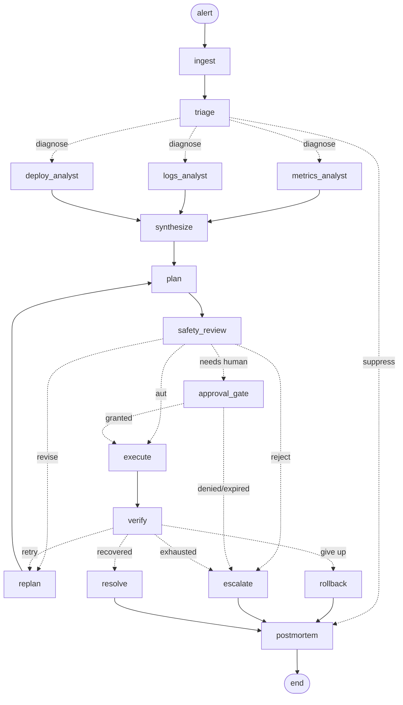

# Multi-Agent Collaboration & Memory

Interview-prep material and a working reference implementation, in Python. Every
topic below has runnable code in this directory, and the whole thing runs offline
with zero dependencies (`anthropic` is optional and only needed for live model
calls).

```
multi-agent-systems/
├── magents/                       the library
│   ├── graph.py                   Pregel-style StateGraph (the LangGraph model, hand-rolled)
│   ├── llm.py                     LLM seam: AnthropicLLM (Claude Opus 5) + ScriptedLLM
│   ├── observability.py           spans, decisions, token/cost accounting
│   ├── memory/
│   │   ├── types.py               MemoryRecord, tiers, scopes, provenance
│   │   ├── working.py             token budgeting, segments, eviction
│   │   ├── stores.py              episodic / semantic / procedural + SQLite
│   │   ├── summarizer.py          compression + write strategies
│   │   └── blackboard.py          shared state, CAS, scope isolation
│   ├── patterns/
│   │   ├── orchestrator.py        orchestrator + specialists
│   │   ├── critic_refiner.py      critic + refiner, bounded
│   │   └── moa.py                 mixture of agents
│   └── coordination/locks.py      deadlock prevention, detection, livelock
├── incident/                      the system design, implemented
│   ├── state.py  tools.py  policy.py  agents.py  graph.py  cli.py
├── demos/                         3 prototypes
└── tests/test_all.py              83 tests, all offline
```

**Run it:**

```bash
cd multi-agent-systems
python -m incident.cli              # all 5 incident scenarios end to end
python demos/demo1_memory.py        # memory architecture + budgeting
python demos/demo2_patterns.py      # the three collaboration patterns
python demos/demo3_deadlock.py      # deadlock, livelock, approval hangs
python -m pytest tests/ -q          # 83 tests

pip install anthropic               # optional
python -m incident.cli --live bad_deploy      # same code, Claude Opus 5
```

---

## Contents

1. [Memory architecture](#1-memory-architecture)
2. [Working memory management and budgeting](#2-working-memory-management-and-budgeting)
3. [Memory summarization and write strategies](#3-memory-summarization-and-write-strategies)
4. [Orchestrator + specialist](#4-orchestrator--specialist)
5. [Critic + refiner](#5-critic--refiner)
6. [Mixture of agents](#6-mixture-of-agents)
7. [Deadlocks in multi-agent systems](#7-deadlocks-in-multi-agent-systems)
8. [Prototypes](#8-prototypes-and-demonstrations)
9. [System design: incident auto-remediation](#9-system-design-incident-auto-remediation)
10. [Interview cheat sheet](#10-interview-cheat-sheet)

---

## 1. Memory architecture

> Code: [`magents/memory/types.py`](magents/memory/types.py),
> [`stores.py`](magents/memory/stores.py),
> [`blackboard.py`](magents/memory/blackboard.py)

### The four tiers

The mistake to avoid is treating "agent memory" as one vector store. Four tiers,
each with a different write path, retention, retrieval key, and consistency
requirement:

| Tier | Holds | Write | Retention | Retrieval | Consistency |
|---|---|---|---|---|---|
| **Working** | what is in the context window right now | every turn | seconds | positional | strong, single writer |
| **Episodic** | what happened — timestamped events | end of turn | months | recency + filter | append-only |
| **Semantic** | what is true — distilled facts | on reflection | indefinite | similarity | eventually consistent |
| **Procedural** | how to act — runbooks, policies, prompts | on promotion | versioned | exact by name | strongly versioned |

The asymmetry between the last three is the design, not an accident:

- **Episodic is a log.** It accepts anything, is never mutated, and a correction
  is a new entry. That is what makes replay and audit possible.
- **Semantic shapes future *diagnoses*,** so it takes a confidence floor and
  upserts by key. Without upsert you get 400 near-duplicate rows that then
  dominate retrieval.
- **Procedural shapes future *actions*,** so it takes a human. An agent that can
  rewrite its own runbook mid-run is one bad generation away from a self-inflicted
  outage. Writes land as candidates; a separate promotion step activates them.

### Every record carries provenance

```python
@dataclass
class Provenance:
    author: str          # which agent or human
    source: str          # tool name, URL, incident id, or "inference"
    confidence: float
    derived_from: list[str]
```

Without this you cannot answer "why did the agent believe that?", cannot expire
records when the source is retracted, and cannot stop a hallucination from being
written back as a fact. `source: "inference"` vs `source: "get_metrics"` is the
single most useful distinction in the whole store.

### Scope is a security boundary, not a filter

```python
class Scope(str, Enum):
    AGENT   # private to one agent
    THREAD  # shared within one task
    TENANT  # shared across tasks for one customer
    GLOBAL  # org-wide (runbooks, policies)
```

In a shared blackboard, tenant A's data appearing in an agent working on tenant
B's task is a privacy incident, not a quality bug. Scope is checked on read.

### Retrieval is a scoring problem, not a storage problem

The most common broken RAG design is `cosine_similarity(query, docs)[:5]`. Real
ranking needs at least four terms:

```python
score = lexical_or_semantic_similarity
      * (1 - recency_weight)
      + recency_decay(age, half_life)
      * recency_weight
score *= confidence
# then filter by scope, tags, and TTL
```

[`stores.py`](magents/memory/stores.py) implements a BM25-ish hybrid. Demo F in
prototype 1 shows three records that all mention "connection pool" being cleanly
separated by age and confidence — something pure top-k cannot express.

> **Why no vector DB here?** Because the architecture is the point, and lexical
> scoring is genuinely competitive on short jargon-heavy text (`OOMKilled`,
> `checkout-api`) where exact-term matching is a feature. `SemanticStore.search`
> is the only method a pgvector/Qdrant backend would need to reimplement.

### Shared memory between agents: the blackboard

> Code: [`blackboard.py`](magents/memory/blackboard.py) · Demo: prototype 1, part G

Once more than one agent writes to the same state you have a distributed systems
problem. Three concrete hazards and their fixes:

| Hazard | What happens | Fix |
|---|---|---|
| **Lost update** | two agents read v3, both write, one write vanishes | compare-and-set on a version number |
| **Context poisoning** | one agent writes a hallucination, every other agent reads it as fact | scope + provenance + confidence; never let an inference look like an observation |
| **Unbounded growth** | agents append full reasoning, blackboard exceeds any agent's window | publish conclusions not transcripts; enforce a per-key size cap |

```python
bb.update("findings", lambda old: (old or []) + [finding], author="logs_analyst")
# read-modify-write with automatic CAS retry — the safe default
```

**Message passing vs blackboard.** Messages give isolation and clear causality,
but N agents needing the same fact means N copies and N chances to diverge. A
blackboard gives one source of truth and cheap fan-out at the cost of concurrency
control. Most real systems use both: blackboard for shared task state, messages
for handoffs.

---

## 2. Working memory management and budgeting

> Code: [`magents/memory/working.py`](magents/memory/working.py) · Demo: prototype 1, parts B–D

**The core claim: context is a scarce, priced resource and must be allocated, not
accumulated.** An agent loop that appends every tool result until something breaks
fails in this order:

1. **Cost.** You resend the whole transcript every turn, so an N-turn task is
   O(N²) in tokens.
2. **Quality.** "Lost in the middle" — recall of facts buried in the centre of a
   long context is measurably worse than at the edges.
3. **Hard failure.** The request 400s, or `max_tokens` truncates mid-thought.

### Segment the window with reserved floors

```python
SYSTEM    0.10   # instructions, tool schemas — never evicted
PINNED    0.10   # task goal, constraints, approved plan — never evicted
RETRIEVED 0.25   # memory/RAG hits for this turn
HISTORY   0.45   # rolling conversation + tool results
SCRATCH   0.10   # this-turn intermediates, dropped first
```

Same shape as an OS memory allocator with per-zone reservations. A flood of tool
output cannot evict the system prompt or the user's actual question, because
those are pinned and admitted unconditionally — even if that pushes their
segment over cap. Better to overrun than to drop the task goal.

### Eviction scoring

```python
score = priority * 0.6 + recency * 0.4 - size_penalty * 0.2
```

Three signals, matching how a human triages notes: how important it was declared
to be, how recently it arrived, and how big it is. Size matters because evicting
one 8k-token tool dump beats evicting twenty useful one-liners.

Retrieved memories inherit their provenance confidence as eviction priority, so a
low-confidence inference is the first thing dropped.

### Compaction beats deletion

When a segment overflows, replace the N dropped items with one summary — as long
as the summary itself fits the remaining room. `BudgetReport.evicted` is returned
so the caller can log it: **silent context loss is the hardest agent bug to
debug**, because the agent simply starts behaving as if it never saw something.

### Ordering is load-bearing, twice

```python
def render(self) -> tuple[str, list[dict]]:
    # 1. SYSTEM first, byte-stable — anything volatile before it kills the cache.
    # 2. The task is repeated at the END, because instructions at the very end
    #    of a long context are followed most reliably.
```

### Token counting

`estimate_tokens = len(text) // 4` is fine for *accounting between* real counts.
It is not fine for deciding whether a request will fit. Get real counts from
`client.messages.count_tokens(model=..., messages=...)` — and never use `tiktoken`
for Claude, it is OpenAI's tokenizer and undercounts by 15–20% on prose and much
more on code.

### The cost lever people miss

The system prefix is resent every single turn of an agent loop. Put
`cache_control: {"type": "ephemeral"}` on it and cache reads cost ~0.1× input.
Verify with `usage.cache_read_input_tokens` — if it's zero across repeated calls,
something in the prefix is changing. Usual culprits: `datetime.now()` in the
system prompt, a UUID, unsorted JSON, or a tool list built per-user.

---

## 3. Memory summarization and write strategies

> Code: [`magents/memory/summarizer.py`](magents/memory/summarizer.py)

Two questions people conflate:

### 3a. When and how do we compress the transcript?

| Strategy | What it does | Loses | Use when |
|---|---|---|---|
| truncate | drop oldest turns | everything old | cheap chat |
| rolling | summarize the oldest N, keep the tail verbatim | detail | long dialogue |
| hierarchical | summaries of summaries | fine detail | multi-day runs |
| extractive | keep only high-salience spans | narrative flow | tool-heavy loops |
| **structured** | fold turns into a typed state document | free-form nuance | **agentic workflows** |

**Keep the tail verbatim.** The agent has to act on the exact text of the most
recent tool result; "the API returned an error" is not something you can retry
against.

**`structured` is the under-used one and the best fit for agents.** Instead of
prose, maintain a typed document and rewrite it each turn:

```
GOAL: Restore checkout-api to its error-rate SLO
KNOWN:      - error rate 0.24 (240x baseline), began 14:02
            - deploy v1.1.0 shipped 7 min before onset
TRIED:      - restart_pods x2 — no effect
RULED OUT:  - transient pod state
OPEN:       - is the null discount code reachable from the API?
```

Rendering this is **O(state), not O(turns)** — a 50-turn incident and a 5-turn
incident produce the same size context. It also compresses better than prose, is
diffable, and cannot silently drop a field the way a prose rewrite can.

> Server-side option: the Claude API has compaction (beta `compact-2026-01-12`).
> One critical detail — append the whole `response.content` back to your
> messages, not just the text, or you drop the compaction block and lose the state.

### 3b. When do we persist a durable memory?

Borrowed from cache design, and the analogy holds:

| Strategy | Behaviour | Trade-off |
|---|---|---|
| **write-through** | persist on every observation | durable, no loss on crash; noisy store, high write cost |
| **write-back** | buffer in working memory, flush at end of turn | cheap and clean; loses the buffer if the process dies |
| **write-around** | persist only what passes a salience filter | small store; risks dropping something needed later |
| **reflective** | a separate pass distils the episode into facts | highest quality, highest latency — run it off the hot path |

**The production answer:** write-back for episodic (flush at turn end), reflective
for semantic (async), write-around for anything expensive to store.

**Never write-through from inside the agent loop into semantic memory.** That is
how a knowledge base fills with the model's own hallucinations. In this repo the
scribe applies a confidence floor of 0.6 and attaches provenance to every write,
so a fact can be traced to its episode and revoked if the episode turns out wrong.

**Flushes must be idempotent.** `WriteBackBuffer` dedupes by content hash, so a
retried turn does not log the same incident four times. Retries are certain.

---

## 4. Orchestrator + specialist

> Code: [`magents/patterns/orchestrator.py`](magents/patterns/orchestrator.py) · Demo: prototype 2, part A

One coordinator decomposes a task, routes each piece to a narrow specialist, and
synthesizes the results. The default topology — and worth defending honestly,
including when *not* to use it.

```
                orchestrator
      ┌──────────────┼──────────────┐
   metrics         logs          deploys      ← different questions, parallel,
   (haiku)        (haiku)        (haiku)        isolated contexts, few tools each
      └──────────────┼──────────────┘
                 synthesis (opus)
```

**Why it works**

- **Context isolation.** Each specialist gets a fresh window with only its
  sub-task. A task that would blow one agent's window fits comfortably; the
  orchestrator holds plans and conclusions, not raw material.
- **Narrow prompts + narrow tool sets.** A specialist with 4 tools picks
  correctly far more often than a generalist with 40.
- **Cost tiering.** Reading-heavy specialists run on Haiku; planning and
  synthesis run on Opus. Usually the biggest cost lever in a fan-out topology.
- **Parallelism.** Independent sub-tasks run concurrently.

**What it costs**

- **Every handoff is a re-briefing.** Specialists share no conversation history.
  Under-specified handoffs are the #1 cause of "the sub-agent did the wrong
  thing" — the task spec must carry every path, id, and constraint.
- **Round trips.** A sub-task you could finish in two tool calls is cheaper
  inline. Delegate for isolation or parallelism, not for tidiness.
- **Error amplification.** A confidently wrong specialist result reaches
  synthesis stripped of the caveats it had in its own reasoning. Hence
  `confidence` on every result, and a synthesis prompt that is told to surface
  disagreement rather than average it away.

**Reach for something else when:** the work is sequential with no fan-out (use a
pipeline); sub-tasks need to negotiate (peer messaging or a blackboard); or the
task is well-scoped for one agent — which is most of the time.

**Failure policy is partial success.** One specialist blowing up degrades the
answer; it does not fail the task. Synthesis is told what is missing.

**Don't pay a model call to rediscover a known plan.** `static_plan()` exists for
exactly that — model-generated decomposition is for genuinely open-ended tasks.

---

## 5. Critic + refiner

> Code: [`magents/patterns/critic_refiner.py`](magents/patterns/critic_refiner.py) · Demo: prototype 2, part B

Generate → critique → revise, bounded. The pattern that most reliably improves
quality, and the one most often implemented wrongly. Three rules decide whether
it works:

**1. The critic must have something the generator lacks.** Separate context, a
rubric, tool access, ground truth, or a different model. A critic that is the
same model, looking at the same context, prompted "find problems", mostly
produces plausible-sounding nitpicks — self-critique without new information has
a well-documented ceiling.

**2. The loop must be bounded and you must keep the best, not the last.**

```python
if critique.score > best_score:
    best_draft, best_score = current, critique.score
...
return RefineResult(best_draft, rounds, reason)   # best, NOT last
```

Refinement is not monotone. v2 fixes A and breaks B; v3 fixes B and reintroduces
A. There is a test for exactly this trajectory (`[7.0, 2.0, 3.0] → returns v1`).
Also stop early when the gain falls below `min_improvement` — further rounds burn
tokens for noise.

**3. The critic must be able to say "ship it".** A critic rewarded for finding
problems will always find problems. Give it an explicit pass threshold and an
explicit "no blocking issues" output.

### Verifier beats critic whenever correctness is checkable

```python
CriticRefiner(llm, rubric=..., verifiers=[
    json_verifier(required_keys=("action", "target")),
    predicate_verifier("action in catalog", lambda d: any(t in d for t in CATALOG)),
])
```

Deterministic verifiers run **first** and short-circuit the model call. If the
JSON is malformed there is nothing for an LLM critic to have an opinion about.
Tests pass / schema validates / the plan only touches allow-listed resources —
run the check. Reserve the LLM critic for the judgment residue.

> Related, and worth knowing: current Claude models follow severity filters
> *literally*. A review prompt saying "only report high-severity issues" makes
> measured recall drop even when bug-finding improved. Ask for coverage with
> confidence + severity per finding, and filter in a separate pass.

---

## 6. Mixture of agents

> Code: [`magents/patterns/moa.py`](magents/patterns/moa.py) · Demo: prototype 2, part C

N proposers answer the **same** question independently; an aggregator synthesizes
one answer. Optionally stack layers, where each layer sees the previous layer's
(anonymized) proposals.

```
layer 0:   P1    P2    P3        independent, same question, different personas/models
             \   |   /
layer 1:   P1'  P2'  P3'         each sees all layer-0 proposals
             \   |   /
aggregator:   final answer + an explicit agreement note
```

### Distinguish it from its neighbours — interviewers probe this

| | Fan-out shape | Intent |
|---|---|---|
| **Orchestrator + specialists** | different sub-questions | decomposition, for **coverage** |
| **Mixture of agents** | the *same* question | redundancy, for **reliability** |
| **Self-consistency** | same model sampled N times, majority vote | variance reduction, one model |
| **MoA proper** | heterogeneous proposers + a *synthesizing* aggregator | can **combine** complementary partial answers, not just pick one |

The fan-out looks identical on a diagram; the intent is opposite.

### The failure mode to design against: correlated error

Three proposers on the same model with the same prompt produce three copies of
the same mistake, and the aggregator reads that as consensus. Force diversity
(different models, personas, evidence) and make the aggregator report agreement
explicitly so you can tell consensus from groupthink.

`agreement_score()` is a **diversity alarm**, not a quality metric: near 1.0
means your proposers are not independent and MoA is buying latency and nothing
else.

### Use the free aggregator when the answer space is discrete

```python
winner, distribution = moa.vote(question, extract=parse_severity)
```

A weighted majority vote costs nothing, is deterministic, and is auditable — three
properties an LLM aggregator does not have. Use the LLM aggregator only when the
proposals need to be *combined* rather than picked between.

**The honest objection is cost:** N+1 calls for one answer. It earns that when
errors are plausibly independent and a confident wrong answer is expensive —
diagnosis, risk assessment. It does not earn it on routine generation.

---

## 7. Deadlocks in multi-agent systems

> Code: [`magents/coordination/locks.py`](magents/coordination/locks.py) · Demo: prototype 3

### The classical picture

Deadlock requires all four Coffman conditions simultaneously. Break any one and
it becomes impossible:

| # | Condition | Break it with | In this repo |
|---|---|---|---|
| 1 | mutual exclusion | shard resources, use immutable data | (design-level) |
| 2 | hold and wait | all-or-nothing acquisition | `hold_all()` |
| 3 | no preemption | timeouts | `acquire(timeout=…)` |
| 4 | circular wait | **global lock ordering** | `ResourceManager(ordered=True)` |

**Lead with ordering.** It is the cheapest and strongest, and it is the answer to
give first: if every agent acquires in the same total order, a cycle cannot form.
`hold_all()` sorts the resource set before acquiring, so two agents that *asked*
in opposite order still acquire in canonical order and simply serialize. Add a
timeout anyway as a backstop — ordering protects you from the agents you wrote,
not from a stuck tool call or a crashed holder.

When ordering isn't knowable up front, **detect**: `WaitForGraph` records
"A is blocked on B" edges and finds the cycle the moment it closes, returning the
cycle itself so you can pick a victim to abort.

### But the deadlocks that actually bite an LLM system are different

**Semantic deadlock — no locks involved at all.**

```
planner ──waits on──▶ risk_assessor ──waits on──▶ cost_analyst
   ▲                                                     │
   └─────────────────────waits on───────────────────────┘
```

Three agents, zero mutexes, system wedged. Structurally identical to lock
deadlock and detected by the same algorithm — but the *fix* is different: make
the dependency graph explicit and topologically sort it **before** dispatch. If
it doesn't sort, the decomposition itself is wrong and retrying cannot help.

**Approval deadlock — the one that actually pages you.** The agent pauses for a
human who never comes back. Every gate needs a deadline and a default:

| Default | When it's right |
|---|---|
| `abort` | anything destructive. The incident stays broken but automation didn't make it worse. |
| `escalate` | usually correct for remediation: something must happen |
| `proceed` | **only** read-only or trivially reversible actions |

Waiting forever is not a safety feature; it is a hang with good intentions, and
it happens exactly when everyone has stopped watching.

**Livelock — busy, unblocked, not progressing.** A cost agent scales down, a
latency agent scales up, forever. No agent is waiting on another, so a wait-for
graph sees a perfectly healthy system. What *is* observable is that state keeps
returning to values it has already visited — that's what `LivelockDetector`
watches. Fixes: a single owner per resource, a monotone progress measure, bounded
iterations, and **jittered** backoff.

> Jitter is not a nicety. Without it, agents that collide once retry in lockstep
> and collide again forever — you have replaced a deadlock with a livelock.

**Starvation.** A low-priority agent never gets the lock. Fix: FIFO queueing
(what `ResourceManager` does) or aging.

**Cheapest guard of all:** a recursion/superstep limit on the graph. It won't
diagnose anything, but it turns "hangs forever in production" into "raises with a
frontier you can read".

---

## 8. Prototypes and demonstrations

### Prototype 1 — `demos/demo1_memory.py`

Memory architecture end to end. Four tiers and their different write paths; a
token budget under real pressure showing reservation, eviction and compaction;
rolling compaction keeping the tail verbatim; structured state as O(state)
compression; three write strategies side by side with timings; retrieval ranking
that separates three lexically-identical records by recency and confidence; and
the blackboard demonstrating a genuine lost update, then CAS catching it, then
CAS-with-retry fixing it, plus scope isolation and the size cap.

### Prototype 2 — `demos/demo2_patterns.py`

The three collaboration patterns on one shared task, so the differences are
structural rather than about the model. Includes a critic/refiner run that starts
from a deliberately wrong draft (`restart_pods` for a code defect), gets a
3.0/10, and converges — plus a deterministic verifier catching malformed output
before any model call. MoA shows both the LLM aggregator and the free weighted
vote, with the agreement score printed.

### Prototype 3 — `demos/demo3_deadlock.py`

Seven sections, each producing a real failure then a real fix: a genuine circular
wait between two threads detected via the wait-for graph; ordering preventing it;
all-or-nothing acquisition proving no partial-lock leak; timeout + jittered
backoff; semantic deadlock with no locks at all; livelock detection; and the
approval deadline with its three possible defaults.

---

## 9. System design: incident auto-remediation

> Code: [`incident/`](incident/) · Run: `python -m incident.cli`

### The problem

Production alerts fire. Today a human reads dashboards, forms a hypothesis, picks
a remediation, applies it, and watches. Automate the loop **without** giving a
language model unsupervised write access to production.

**Requirements**
- Ingest alerts, dedupe storms, triage severity.
- Diagnose root cause from metrics, logs, deploys, and dependency health.
- Propose and execute a remediation — or correctly decline to.
- Verify recovery; roll back or escalate when it didn't work.
- Full audit trail. Learn from each incident.

**Non-functional**
- p95 alert→action under 60s for auto-remediable classes.
- **A wrong action must be cheaper than no action.** This constraint drives the
  entire design.
- Every production write attributable to a decision and its evidence.

### Architecture



Every pattern from sections 4–7 appears here, doing real work:

| Stage | Pattern | Why |
|---|---|---|
| triage | cheap model + dedupe | runs on every alert; its main job is to *stop* work |
| 3 analysts | orchestrator + specialists | different questions, parallel, read-only tools, isolated context |
| synthesize | MoA-style aggregation | independent evidence → ranked hypotheses, agreement made explicit |
| plan | constrained generation | may only emit catalog actions |
| safety review | critic + refiner (bounded) | policy first, then an LLM critic on the judgment residue |
| approval gate | graph interrupt + deadline | durable pause; the process can exit and resume hours later |
| execute | ordered locks + idempotency | no two incidents remediate the same service; retries don't double-apply |
| verify | deterministic, multi-signal | did the SLO actually recover? |
| postmortem | write strategies | episodic always, semantic filtered, procedural proposed |

### The five design decisions that matter

**1. Policy is deterministic Python, not a prompt.**

A model *proposes*; [`policy.py`](incident/policy.py) *disposes*. A
prompt-injected or simply confused agent still cannot exceed the action catalog,
and that property survives any model upgrade.

```python
ACTION_CATALOG = {
    "restart_pods":  ActionSpec(risk=LOW,      reversible=False, max_blast_radius=20_000),
    "scale":         ActionSpec(risk=MEDIUM,   reversible=True,  max_blast_radius=30_000),
    "rollback_deploy": ActionSpec(risk=HIGH,   reversible=True,  max_blast_radius=40_000),
    "drain_and_failover": ActionSpec(risk=CRITICAL, reversible=False, ...),
    "page_oncall":   ActionSpec(risk=READ_ONLY, ...),   # always allowed
}
```

An action outside the catalog cannot execute. That is the hard bound on the
system's worst case, and it is what makes auto-remediation defensible to a risk
team.

**2. Risk × confidence, not risk alone.**

```
                     required confidence to auto-execute
    LOW risk         0.45
    MEDIUM risk      0.65
    HIGH risk        0.85
    CRITICAL risk    never
```

A low-risk action on a shaky hypothesis is still a bad idea; a medium-risk action
on an obvious, well-evidenced cause is fine. The gate is a 2-D matrix, not a
threshold. On top of it: SEV1 never auto-executes (a total outage is when a wrong
action does most damage, and a human is already awake), change freezes gate
everything, and escalation is never blocked by policy.

**3. Blast radius is computed by us, not claimed by the planner.**

Derived from the target's traffic share plus its dependency fan-in. The planner
does not get a field where it asserts its change is small.

**4. Idempotency and inverses, captured before mutating.**

```python
@property
def idempotency_key(self) -> str:
    return f"{self.tool}|{self.target}|{sorted_params}"
```

The executor refuses to run a key twice. Retries — of a node, a superstep, or the
whole graph after a crash — are certain, so this is not optional. Inverses are
computed from **live cluster state** immediately before execution, not from the
plan: the planner's idea of the current replica count may be stale, and rolling
back to the wrong number is its own incident.

**5. Every LLM agent has a deterministic fallback.**

Not a testing convenience — the answer to "what happens when the model is down,
rate limited, or refuses?" An auto-remediation system that stops working when the
model does is *worse* than no automation, because the on-call has stopped
watching. Triage falls back to a threshold ratio, synthesis to tag-driven rules,
planning to runbook mappings, and critique to policy alone.

### The scenarios, and what each proves

```
$ python -m incident.cli

bad_deploy           -> resolved     rollback is HIGH risk at 0.82 confidence,
                                     so it PAUSES, resumes on approval, resolves
resource_exhaustion  -> resolved     MEDIUM risk, confidence clears the bar,
                                     fully autonomous, no human involved
connection_pool      -> resolved     fully autonomous
downstream           -> escalated    THE TRAP: symptoms in checkout-api, cause in
                                     ledger-db-proxy. Declines to act, pages,
                                     verification confirms nothing recovered,
                                     bounded retry exhausts, escalates
change_freeze        -> resolved     identical incident to resource_exhaustion,
                                     but a freeze is on — same plan, now gated
```

The `downstream` and `change_freeze` scenarios are the two worth walking an
interviewer through. The first shows the system correctly *not* acting on the
service that alerted. The second is a controlled pair: same incident, same plan,
different policy — proving that **policy, not the model, makes the decision**.

### Trace output

```
- triage [0ms]
- decision:triage  -> SEV2 (value is 24.0x threshold)
- analyst:metrics_analyst / logs_analyst / deploy_analyst   [parallel]
- synthesize
- decision:root_cause -> the recent deploy introduced a regression (confidence 0.82)
- plan
- safety_review
- decision:safety  -> pass (policy: rollback_deploy: confidence 0.82 below 0.85 required)
- execute:rollback_deploy
- decision:verify  -> recovered (all checks pass)
- postmortem
```

Decision spans are the thing to add that people forget. Most "why did the agent
do that?" investigations are really "which branch did it take, on what evidence?"

### Scaling and operations

| Concern | Approach |
|---|---|
| **Alert storms** | fingerprint dedupe *before* the model call; suppression is triage's main job |
| **Concurrent incidents** | one lock per service, acquired in canonical order; `hold_all` is all-or-nothing |
| **Durability** | checkpoint after every superstep; swap `InMemoryCheckpointer` for Postgres and the graph resumes across process restarts |
| **Cost** | Haiku for analysts, Opus for synthesis/planning/critique; `cache_control` on the stable system prefix; policy short-circuits before expensive calls |
| **Blast radius of the system itself** | catalog allow-list, per-action hard caps, attempt limits, change freeze, SEV1 exclusion |
| **Learning** | postmortem writes episodic always, semantic above a confidence floor, procedural as a *candidate* requiring human promotion |

### What I would build next, in order

1. **Shadow mode.** Run the full pipeline, execute nothing, and diff the proposed
   action against what the human actually did. That dataset is the only honest
   way to calibrate the confidence thresholds — right now they are guesses.
2. **Time-windowed verification.** Verification currently reads metrics
   immediately. Real metrics lag the action; it needs a settle window and a
   re-check, or you will record "fixed" for a restart that regresses in ten
   minutes (the simulator deliberately models exactly that).
3. **Cross-incident correlation.** Five services alerting at once is one
   incident, not five, and the current fingerprint dedupe only catches repeats of
   the same signal.
4. **Per-tenant policy.** `Guardrails` is global. Different customers will want
   different automation appetites.

### Honest limitations

- The cluster is simulated. Real telemetry is noisier, laggier, and the
  dependency graph is not a clean DAG.
- Confidence numbers from the heuristic path are hand-tuned constants. With a
  live model they are model-generated, which is worse — they need calibration
  against shadow-mode outcomes before anyone should trust the 0.85 threshold.
- The idempotency ledger is in-process. Production needs it in the same durable
  store as the checkpoints, or a crash mid-plan re-applies actions on resume.
- Verification checks four metrics on the alerting service. It should also check
  that nothing *else* got worse — a scale-up that fixes latency and exhausts a
  downstream connection pool would pass today.

---

## 10. Interview cheat sheet

**"How do you stop an agent's context from blowing up?"**
Segment the window with reserved floors so system and task can never be evicted;
score eviction by priority × recency − size; compact rather than delete and log
what was dropped; keep the tail verbatim; and prefer a structured state document
(O(state)) over prose summaries (O(turns)).

**"When do you use multiple agents?"**
Three legitimate reasons: context isolation (the task won't fit in one window),
parallelism (independent sub-tasks), and specialization (narrow prompt + narrow
tool set picks better than a generalist with 40 tools). If none applies, one agent
is faster, cheaper, and easier to debug. Most "multi-agent" systems should be one
agent.

**"Orchestrator vs MoA?"**
Same fan-out shape, opposite intent. Specialists answer *different* sub-questions
(decomposition, for coverage). MoA proposers answer the *same* question
(redundancy, for reliability).

**"How do you know the critic is helping?"**
Only if it has information the generator lacks. Otherwise you are paying for
plausible nitpicks. And if correctness is checkable, run the check instead — a
deterministic verifier beats an LLM critic on cost, speed, and arguability.

**"Deadlock in a multi-agent system?"**
Four Coffman conditions; break circular wait with global lock ordering first,
add timeouts as a backstop, use all-or-nothing acquisition for sets. Then the
part that matters in practice: the real hangs are semantic (a cycle in the task
graph), approval gates with no deadline, and livelock — none of which a lock
manager sees.

**"Two agents write to the same state. What breaks?"**
Lost updates. Fix with CAS on a version and retry. Also scope reads and attach
provenance, or one agent's hallucination becomes every agent's premise.

**"How do you make any of this testable?"**
Put an interface between agents and the model. Everything structural —
orchestration, budgeting, routing, policy, locking, verification — becomes
assertable offline and deterministically. This repo has 83 such tests and zero
network calls. Reserve live model calls for evals, not for unit tests.

**"How do you deploy an agent that writes to production?"**
Deterministic policy in code, not in a prompt. An allow-listed action catalog.
Risk × confidence gating. Computed blast radius. Idempotency keys and captured
inverses. A durable approval interrupt with a deadline and a safe default.
Verification with real exits including rollback. And a deterministic fallback for
every model call, because the automation must not disappear at the moment the
model does.
